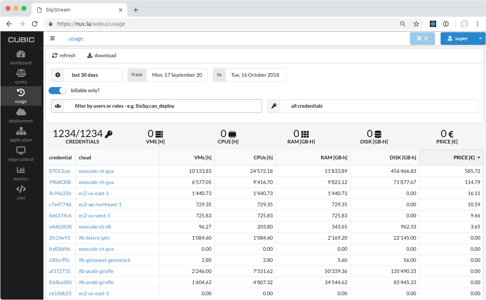
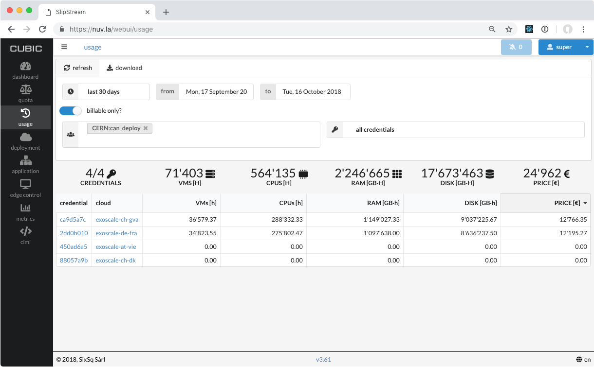

.. _accounting:

Accounting
==========

Browser Dashboard
-----------------

Nuvla provides a convenient dashboard to show your resource usage.  If
you are a tenant administrator, you will also be able to see the usage
for your tenant.  To access the dashboard, go to the new `Nuvla
browser interface <https://nuv.la/webui>`_ and login with your
federated identity. 

Once logged in you can click on the "Usage" icon on the left or go
directly to the URL for the `usage dashboard
<https://nuv.la/webui/usage>`_.

When you first visit the page, the usage information will be collected
and shown for all of your credentials for the last 30 days.  The page
should look similar to the following screenshot.

Your dashboard will only include your credentials, or your tenant's
credentials, if you are a tenant manager.

You can use the filter to select the usage for certain users or roles.
For the HNSciCloud tenants, the role takes the form
"tenant:can_deploy", for example, the role for the SixSq tenant is
"SixSq:can_deploy".  After filtering and clicking the "refresh"
button, the dashboard should look like this screenshot.

You may not see a difference in the filtering if you only have access
to the accounting information for a single group.

You can also filter by specific users.  However, this will only work
for virtual machines that have been deployed through Nuvla.  Virtual
machines deployed directly on the cloud can only be attributed to a
tenant, not individual users.

You can also change the time period for the dashboard.  You can select
one of the predefined time periods:

 - Today
 - Yesterday
 - Last 7 days
 - Last 30 days

or set specific "from/to" dates via the date picker widget.  Again,
click the "refresh" button to update the displayed information.  This
screenshot shows the usage information for the CERN tenant over the
last 7 days.

Note that the "from" date always starts just after midnight and the
"to" date goes to just before midnight.

The "billable only?" toggle limits the results to virtual machine
states that incur charges.  You can turn this off to include
information for virtual machines in, for example, the "stopped"
state.  Note that the pricing information in this case, will be
inaccurate.

The table is interactive and you can click on the column headers to
reorder the results by the values in the column.

REST API
--------

The usage dashboard is driven entirely by the Nuvla API.  You can also
use this API directly to obtain custom views of the usage information.

Nuvla provides a new `dedicated API`_ resource for monitoring and
accounting information. The CIMI resources of interest are:

 - "VirtualMachine": Provides information on all active virtual
   machine.  Together, these resources show the global current state
   of the hybrid cloud infrastructure.
 - "Metering": These are snapshots of the "virtual-machine" resources
   that are take every minute.  These provide historical usage
   information and are the basis of the usage dashboard.
 - "StorageBucket": These provide information on the usage of S3
   resources on the cloud. This information is not include in the
   browser interface, but can be obtained from the API. 

The new feature regularly snapshots the global state of deployed
resources provided by the :ref:`monitoring` resource, to build a
historical view of usage. In the process, it also pulls other valuable
information such as pricing from the corresponding service offers.

This functionality, coupled with the extensive CIMI query and
filtering capabilities, provides together a powerful, yet simple, way
to extract accounting information from Nuvla.

The `dedicated API`_ documentation provides several examples of
queries in order to extract useful information, such as pricing or
vCPUs, for a given group and time period.  This feature can also be
used to plot trends, trigger alerts and much more.

.. _`dedicated API`: https://ssapi.sixsq.com/#metering-(cimi)
