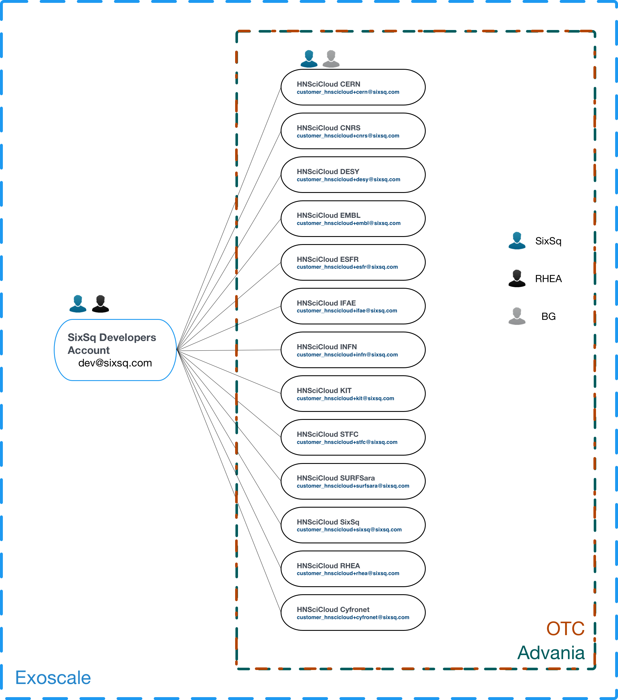
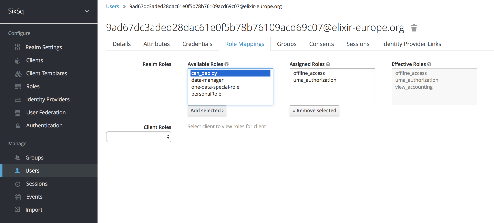

Cloud Provider Configuration
============================

Cloud accounts for each organization (tenant) have been created on the
three cloud infrastructures that provide resources to the Rhea
Consortium's hybrid cloud platform--Advania, Exoscale, and OTC.  An
organization's users share access to these accounts via Nuvla.  The
organization's (tenant's) administrator decides who has access to
these credentials.

Cloud Accounts
--------------

The general configuration of the cloud accounts follow a hierarchical
approach, as shown in the diagram below.

For Exoscale, there is a top-level organization that owns and manages
all the Buyers Group tenants. On each tenant then, the respective
organization administrator is also given ownership.

For OTC and Advania, this top-level organization does not exist but
the Buyers Group tenants are structured the same way - with the
respective tenant administrator as owner and a SixSq (monitoring)
account as a technical user.

With this setup, it is ensured that all the cloud accounts will be
automatically setup in Nuvla, given that users have the necessary
rights to provision resources.

Granting Access
---------------

To grant access to the shared credentials and to allow users to deploy
applications on the clouds, each account manager should:

 1. Login to `SixSq's Federated Identity Portal`_
 2. Select the users (or groups of users) who need provisioning
    access, and assign them with the role **can_deploy** (which has
    already been created).

Once this is done, the affected users will automatically get access to
the cloud credentials for Exoscale, OTC and Advania in Nuvla.  The
assignment of groups or roles is done during the login process, so
users may have to logout and login again to have access to new groups
or roles.

.. _`SixSq's Federated Identity Portal`: https://fed-id.nuv.la/auth
