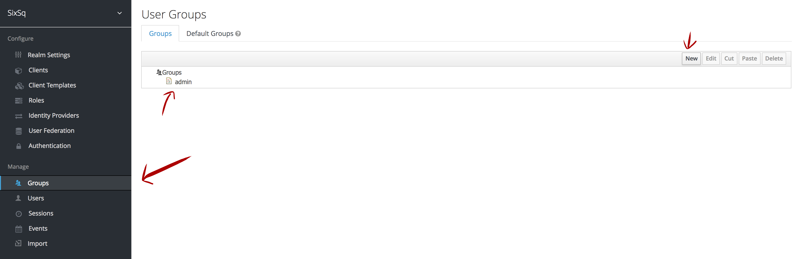
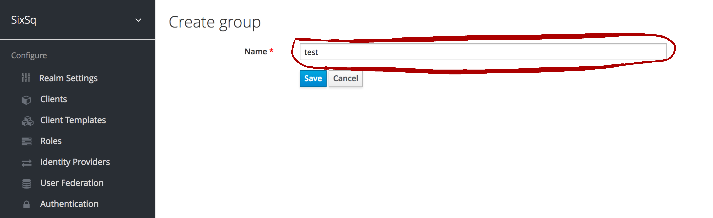
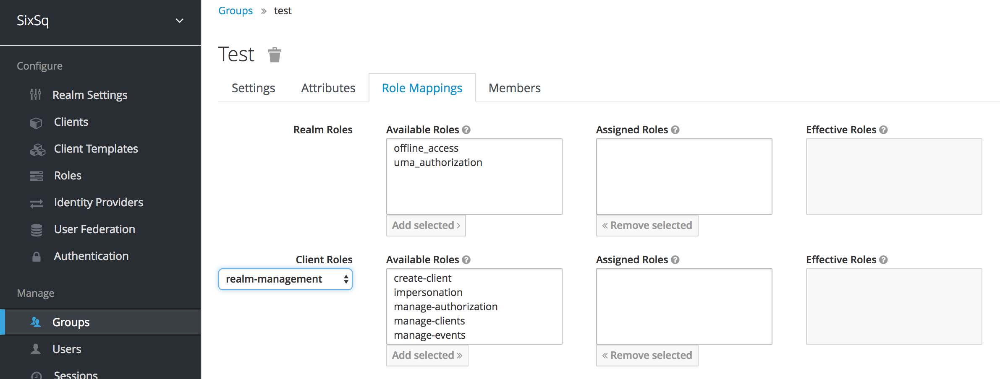
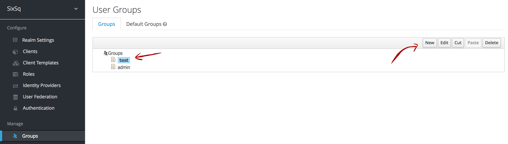
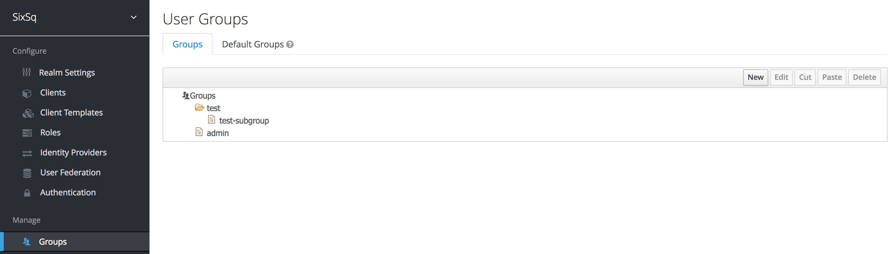
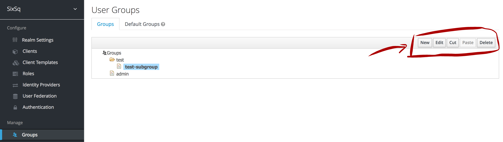
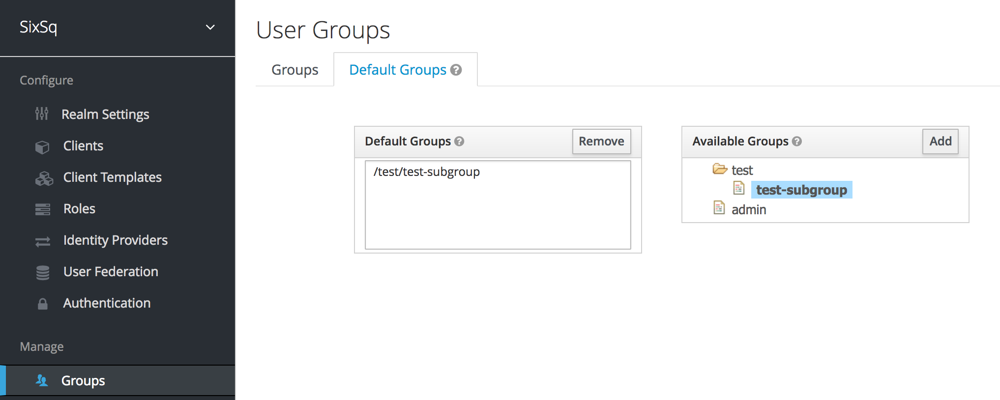

Manage Groups
=============

*To simplify, groups are to be considered the same as sub-tenants, as they provide the required isolation level.*

Groups can be managed through the Keycloak's UI within `SixSq's Federated Identity Portal`_.

Upon registration in Nuvla, account managers will be given (if requested) *admin* privileges in their respective tenant. Tenant account managers belong to the **admin** group in Keycloak, and have full management privileges within that realm.

Below follows a comprehensive list of actions that can be performed group-wise.

Create New Group
----------------

Groups can be nested within each other which allows account managers to define hierarchies. Here we refer to **top level group** and **subgroup** as being the main group and the ones within it, respectively.

Top Level Group
~~~~~~~~~~~~~~~

Without selecting any group (as shown on the figure above), click *New* and enter your group name.

Upon creation, a new page will show up with the group settings, as shown below:

Here is where the account managers can rename the group, assign custom attributes, see the group members (empty by default), and map the group roles.

Subgroup
~~~~~~~~

To create a group that belongs to a top level one, the creation process is exactly the same as above, but the account manager **has** to select the respective top level group before clicking on *New*:

Once created:

**NOTE:** please note that subgroups will by default inherit the role mappings from the parent top level groups

Edit, Cut, Paste and Delete Groups
----------------------------------

The button panel on the right corner of the groups' interface allows all the basic group operations:

Default Groups
--------------

*"Set of groups that new users will automatically join"*

As the above figure shows, new users will now automatically be assigned to the subgroup *test-subgroup*.

.. _`SixSq's Federated Identity Portal`: https://fed-id.nuv.la/auth
