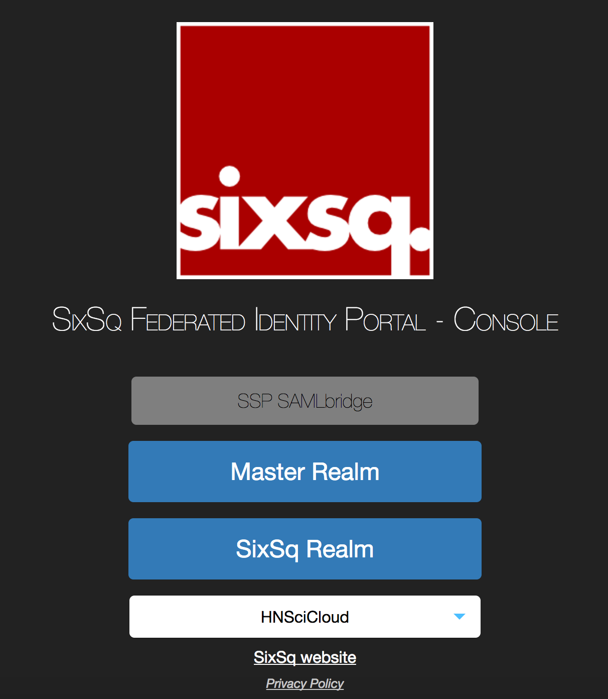

Administrators
==============

This section contains howtos for common tasks that will be carried out
by account administrators.

These account administrators are supposed to have followed the `Account Activation`_ steps, and already have been granted the *admin* privileges to their tenant/realm in `SixSq's Federated Identity Portal`_.

To access the account management portal in Keycloak, users need to select their tenant (same as realm) in `SixSq's Federated Identity Portal`_

and login.

.. _`Account Activation`: ../getting-started/activation.html

.. _`SixSq's Federated Identity Portal`: https://fed-id.nuv.la/auth

.. toctree::
   :maxdepth: 1
   :hidden:

   groups
   roles
   management-api
   blacklisting
   whitelisting
   block-new-users
