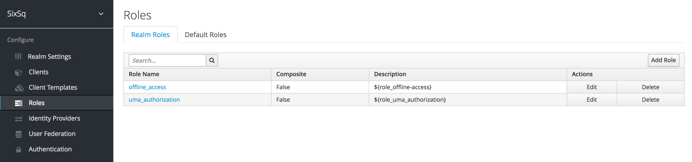
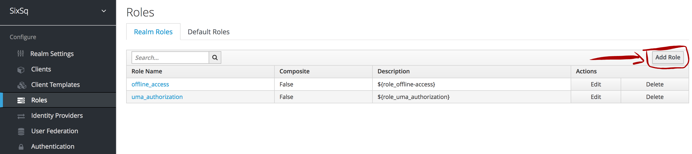
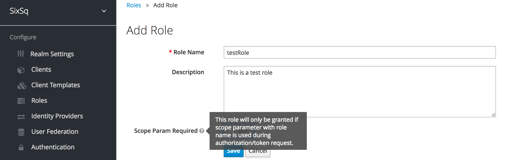
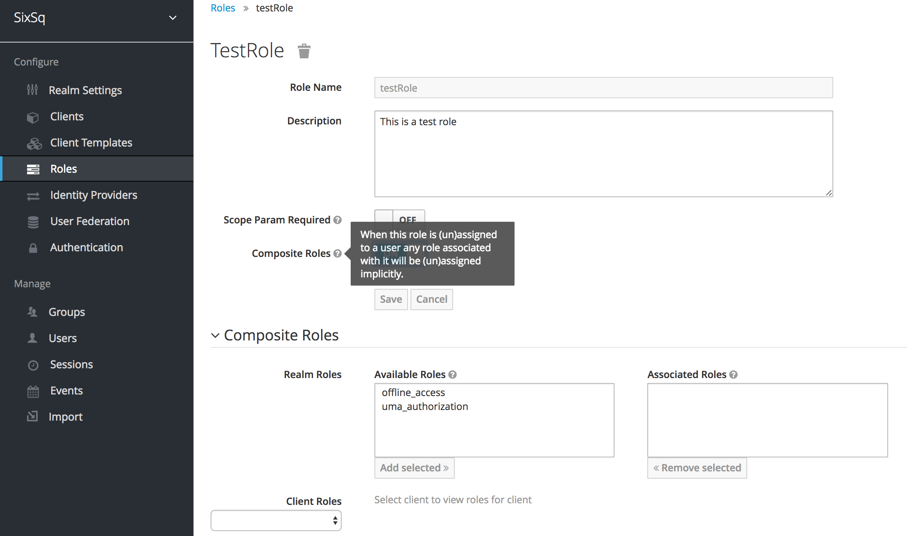
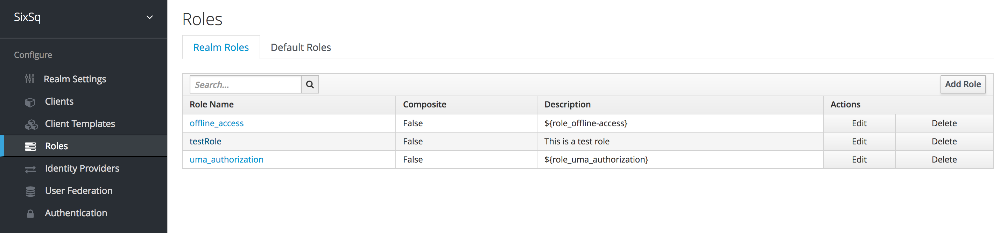
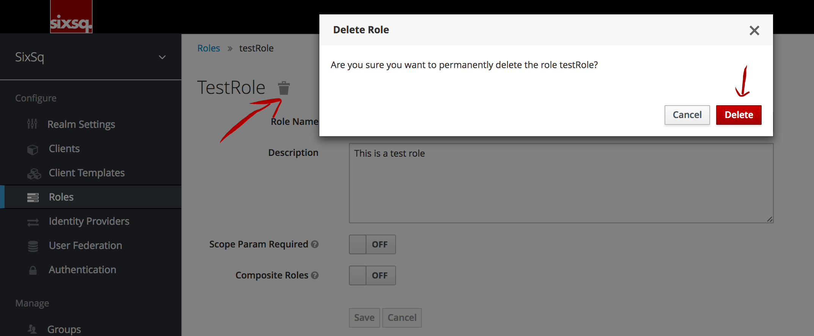
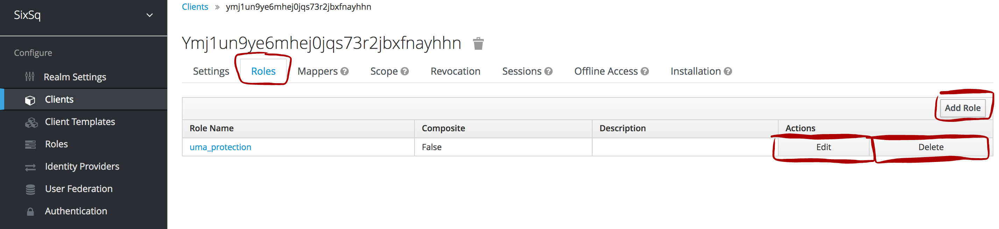
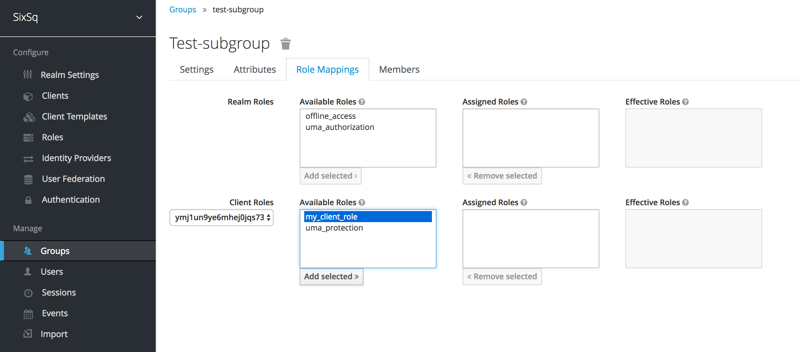

Managing Roles
==============

Roles can be managed through the Keycloak's UI within `SixSq's Federated Identity Portal`_.

There are different type of roles and actions that can be performed to manage them:

Realm Roles
-----------

Roles that are applied on the tenant level.

Default Roles
~~~~~~~~~~~~~

If selected, default roles will automatically be assigned to new users.

Create Roles
~~~~~~~~~~~~

To create a new role, simply click on *Add Role*:

This will open a new form where the account manager can define the role's name, description and whether the role will only be granted if scope parameter with role name is used during authentication/token request:

Once created, account managers will then also have the option to assign composite roles:

**NOTE:** by default, new rules do not become "Default Roles" for that realm.

Edit and Delete Roles
~~~~~~~~~~~~~~~~~~~~~

To edit, simply click on the role name (from the list of roles). To delete, once inside the role edition page, click on the bin icon next to the role name:

Client Roles
------------

Keycloak clients are trusted browser apps and web services in a realm. These clients can request a login.

Account managers can also define client specific roles. IT IS NOT RECOMMENDED that account managers change the roles of already existing clients.

Manage Client Roles
~~~~~~~~~~~~~~~~~~~

To manage client roles, account manager should first select the desired client from the list

.. image:: ../images/kc-clients.png
  :alt: Clients list
  :align: center

and then click on the *Roles* tab. Here, the account managers will get a list of the client roles and the chance to add new ones as well as edit and delete existing ones:

To add and modify client roles, the interface is exactly the same as stated above for Realm roles.

Mapping Realm and Client Roles to Groups
----------------------------------------

The instructions on how to map a role to a group can be found in `here`_. Once in the group page, switch to the "Role Mappings" tab and select the desired roles, as shown below.

.. _`SixSq's Federated Identity Portal`: https://fed-id.nuv.la/auth

.. _`here`: ./groups.html
