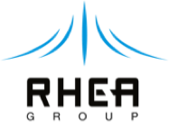

Consortium
==========

The consortium consists of five organizations that have experience
working together to deliver computing solutions.  The following table
summarizes the key roles, responsibilities and unique capabilities of
each consortium member.

 |logo-rhea|       
                   Experienced leader of large frame contracts in 
                   the Space and Defence sectors, including software centric     
                   systems and software products. Majority shareholder of SixSq, 
                   RHEA has developed a solid relationship with the cloud        
                   specialist and supports spin-in of its technologies into the  
                   space & defence sectors. RHEA will act as the prime for the   
                   project and perform much of the system testing.
                   [`more info <https://www.rheagroup.com>`_]

 |logo-sixsq|      
                   Responsible for technical coordination, SixSq brings   
                   its knowledge in cloud research and innovation from its       
                   SlipStream open source technology and Nuvla service, focussing
                   on integration of hybrid-cloud management functions with high 
                   performance data management solutions.
                   [`more info <http://sixsq.com>`_]

 |logo-t-systems|  
                   European leader in IT service delivery, including several
                   cloud services, both public and private. Open Telekom Cloud
                   will form the foundation of its contribution to the project.
                   The company’s experience will also be key in contributing to
                   the business model proposed for the resulting service of this
                   project. [`more info <https://www.t-systems.com/de/en>`_]

 |logo-exoscale|   
                   Exoscale is the cloud computing platform for cloud native
                   teams. Relying only on pure as-a-service components, Exoscale
                   is built by DevOps for DevOps. Currently based in Switzerland
                   and Germany, the company is expanding rapidly its pure public
                   cloud service business. [`more info <https://exoscale.ch>`_]

 |logo-cyfronet|  
                  Will provide support to the Onedata data management solution,
                  allowing it to be seamlessly integrated into the
                  Nuvla/SlipStream solution proposed by the RHEA consortium.
                  Academic Computer Centre CYFRONET AGH is based in Krakow,
                  Poland. [`more info <http://www.cyfronet.krakow.pl/en/4421,main.html>`_]

