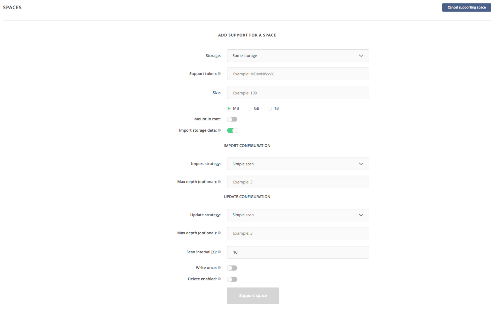
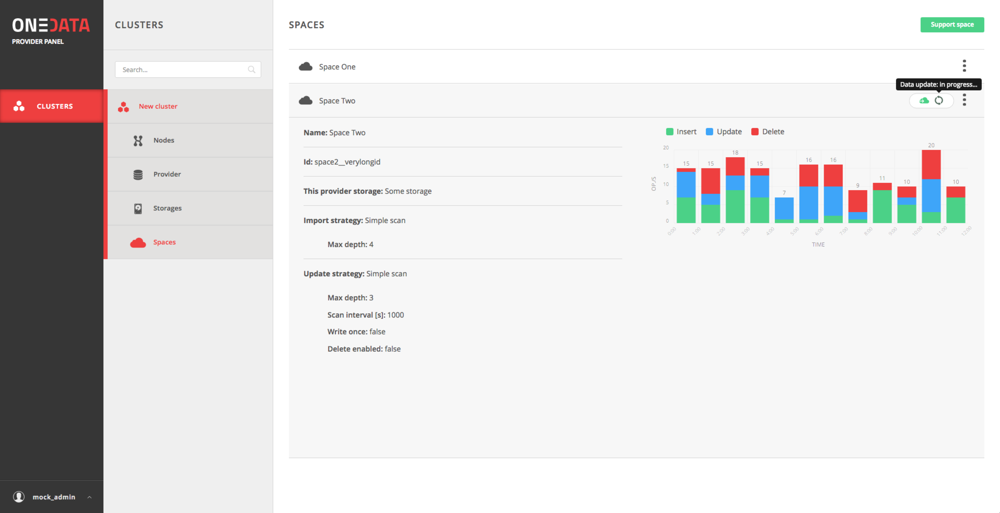

Import and Export Data
======================

POSIX
-----

First of all, POSIX protocol can be used to import or export data to/from
Onedata virtual filesystem using standard tools, such as ‘cp’ or ‘rsync’. It is
necessary to run the Oneclient command line tool on an access machine where the
target data set is available (ingress) or where it should be exported to
(egress). In case the storage managed by Onedata is available directly from the
machine running Oneclient, this situation is detected automatically and the
transfer between Onedata managed storage and external storage is performed
directly and transparently without going via Oneprovider service, which is only
called for metadata operations.

CDMI and REST
-------------

Furthermore, Onedata implements full CDMI v1.1.1 protocol specification,
including data download/upload requests, and thus provides object storage system
interface for all data in parallel to the POSIX protocol. This enables
integration with custom user services such as portals.

For batch data transfer management, Onedata provides REST API giving
programmatic access to data replication and transfer control and monitoring
between the data sites.

GUI
---

Finally for small files or data sets, they can be uploaded and downloaded
directly using the Web Graphical User Interface, available on all major browser
and mobile devices. In order to import data using web browser, simply open a
directory within a space where the files should be uploaded, and move the files
from your desktop or file browser to the Onedata Internet browser window. The
upload progress will be displayed until all files are successfully uploaded.

.. image:: images/gui-data-upload.png

Legacy data import
------------------

In use cases where there is a need to provision large legacy datasets, it is
possible to configure Oneprovider service to expose such data set directly from
the legacy storage without any data migration to another storage. Oneprovider
service will run periodically synchronization of files on such storage, and will
detect automatically new or updated files and will update its metadata database
automatically. This option can be selected when adding new storage to the
Oneprovider and has to performed by Oneprovider administrators:

Once the storage is configured for the legacy data import it will be continuously
monitored for changes in the data collection (new files, modified files, deleted
files) and basic statistics on the scan process will be displayed.

For more details, check the `official documentation
<https://beta.onedata.org/#/home/documentation/doc/administering_onedata/oneprovider_tutorial[add-storage-with-existing-data].html>`_
