Deploying Data Management Services
==================================

Data management service are based on Onedata technology. For general
overview of Onedata and it's core concepts including zones, providers
and spaces please refer to the `official documentation
<https://onedata.org/#/home/documentation/doc/getting_started/what_is_onedata.html>`_.

Onezone
-------

**Deploying Onezone via Nuvla**

Data managers are provided a possibility to automatically deploy Onezone
service for their Buyer Group via Nuvla.  The Onezone component definition can
be found under https://nuv.la/module/HNSciCloud-RHEA/onedata/onezone.  To
deploy Onezone component one needs to provide a number of input parameters to
properly configure the service.  The required parameters are related to the
connection of the Onezone with the project's Federated Identity Provider
(FedIdP) service located at https://fed-id.nuv.la.  It is assumed that the data
manager has access to the Buyer's Group realm in the FedIdP service (see `here
</getting-started/index>`) to obtain values for the following required Onezone
deployment parameters:

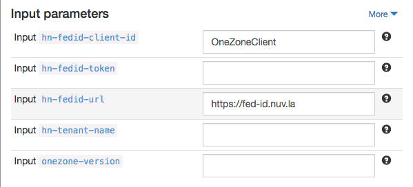

.
  * **hn-tenant-name** - Buyer tenant name, which should correspond to the
    realm name in FedIdP service;
  * **hn-fedid-token** - client registration token to register the deployed
    Onezone instance with FedIdP service.  The token should be generated by the
    data manager in FedIdP service right before attempting the deployment.
    This should be done the following way:

    1. Login to your realm on https://fed-id.nuv.la.
    2. Go to Realm Settings -> Client Registration -> Initial Access Tokens.

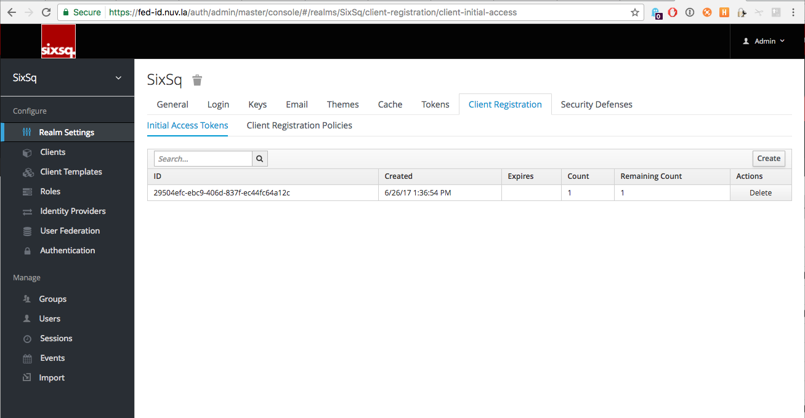

.
    3. Click on `Create`.
    4. Select defaults and click `Save`.
    5. Copy the generated token.
    6. Go to onezone deployment dialog and paste the token to
       **hn-fedid-token** edit field.

  * **onezone-version** - the default production version will be used if the
    value is not provided.

When parameters are set, click on *Deploy Application Component* button.  After
the successful deployment of Onezone, click on the URL defined by
``ss:url.service`` and you will be redirected to the running Onezone service.

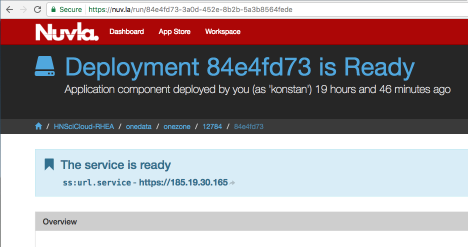

On the front page of the Onezone you should see two login options.  For login
in to the deployed instance of Onezone you should select the second option
identified with the arrow on the image below - it uses FedIdP based
authentication.

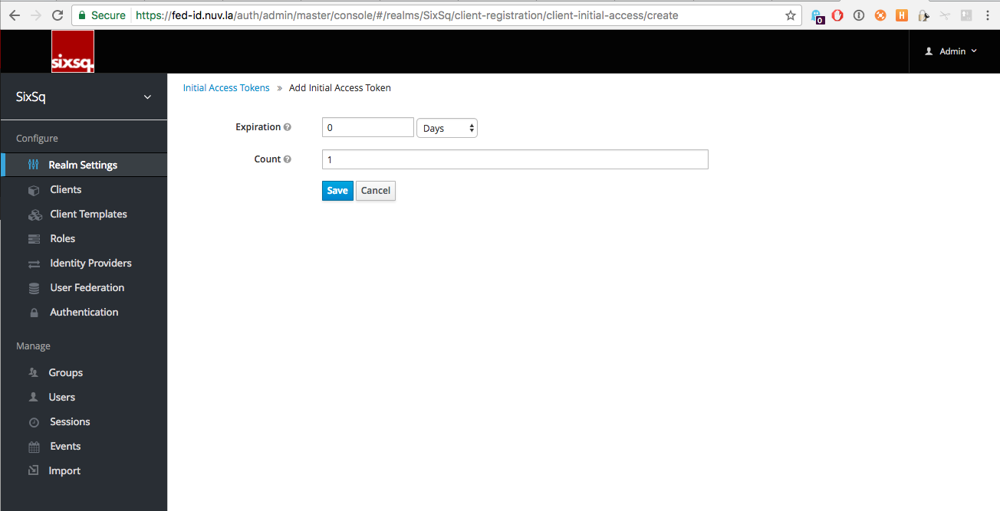

In the case above, the configuration of the integration between Onezone and
project's FedIdP (https://fed-id.nuv.la) was done automatically.  More
information on setting up of various IdPs with Onezone can be found in the
Onedata's `official documentation
<https://onedata.org/#/home/documentation/doc/administering_onedata/openid_configuration.html>`_.

In case extra service configuration is required, the administrator credentials
can be found on the Nuvla deployment that provisioned the service under
`admin-username` and autogenerated `admin-password` parameters.

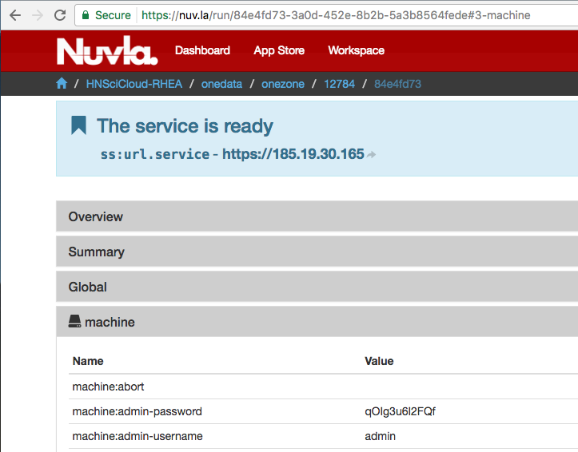

GlusterFS cluster deployment from Nuvla
---------------------------------------

According to the platform architecture, Buyers are expected to be running
GlusterFS based cluster on the Clouds.  It is advised to deploy the respective
clusters in advance before deploying Oneproviders on the Clouds.

The GlusterFS application deployment can found Nuvla under
https://nuv.la/module/HNSciCloud-RHEA/GlusterFS/glusterfs-cluster

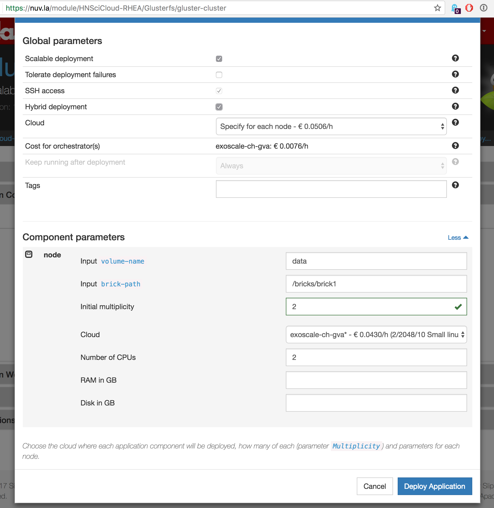

To be able to manage the capacity of the cluster during its run-time it needs
to be deployed as scalable application.  For that, data manager should select
**Scalable deployment** option.  Later the number of cluster nodes can be
managed by adding and removing them via API / `ss-node-{add,remove}` CLI.  More
information on scalable applications in Nuvla can be found under
http://ssdocs.sixsq.com/en/latest/tutorials/ss/scalable-applications.html.
Data manager should only be concerted with scaling up/down of the provisioned
GlusterFS cluster.  All the scalability workflow hooks for actually scaling the
cluster are already in place the components definitions.

After that select **Cloud** - `exoscale-ch-gva` or `open-telekom-de1`.
Finally, click on `Deploy Application`.

We are looking for an appropriate web GUI for monitoring and management of
GlusterFS cluster that will be deployed along with the cluster to facilitate
its management.

..
  TODO: find a cluster GUI manager.

    * oVirt as cluster GUI manager. http://www.ovirt.org/download/ oVirt is a way
      too heavy: it's a cluster manager and installs in 10 min.  Consider
      something else.
    * https://github.com/aravindavk/glusterfs-web doesn't work out-of-the-box and
      it's not for production.
    * find another one!

Oneprovider
-----------

According to the platform deployment model, data manager should deploy one
Oneprovider instance per Cloud (i.e., one in OTC and one in Exoscale).

**Oneprovider on Cloud via Nuvla**

After startup, Oneprovider service needs to register with Onezone instance.
This is the reason why it should be deployed after deployment of Onezone.

On Nuvla, Oneprovider component definition can be found under
https://nuv.la/module/HNSciCloud-RHEA/onedata/oneprovider.  Below is the
component deployment dialog after clicking on **Deploy** in the component
definition.

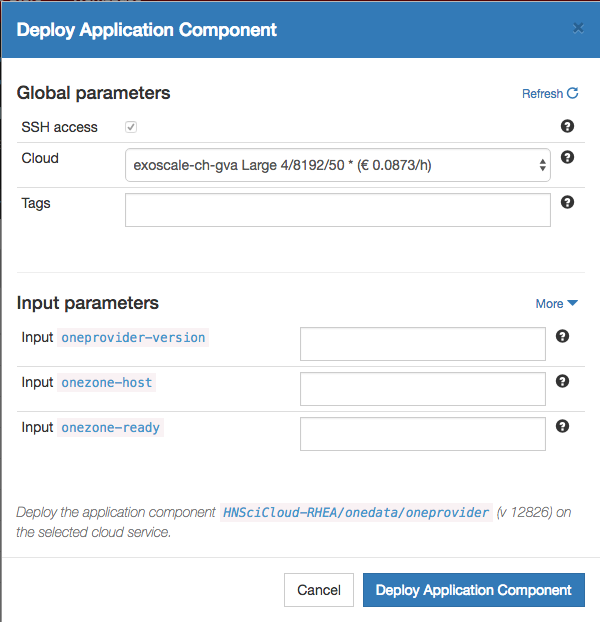

First select the Cloud: `exoscale-ch-gva` or `open-telekom-de1`. Then, provide
values for the input parameters.

  * **onezone-host** - should be set to the IP/DNS name of the previously
    deployed instance of Onezone.
  * **onezone-ready** - set it to ``true``.
  * **oneprovider-version** - leave this blank.

When parameters are set, click on *Deploy Application Component* button.  After
the successful deployment of Oneprovider, click on the URL defined by
``ss:url.service`` and you will be redirected to the running Oneprovider
service.

The Oneprovider service administrator credentials can be found on the Nuvla
deployment that provisioned the service under `admin-username` and
autogenerated `admin-password` parameters.

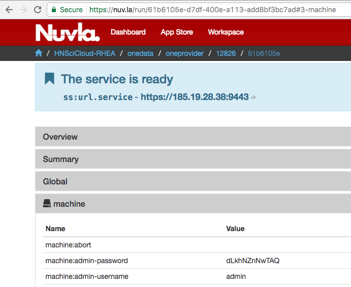

**Configure Oneprovider with S3 storage type**

After deploying Oneprovider VM via Nuvla, it is necessary to add an S3
storage to the Oneprovider using Onepanel administration service,
running on the same host as Oneprovider. In order to open Onepanel
service go to: ``https://ONEPROVIDER_IP:9443`` and login using
administrator credentials.

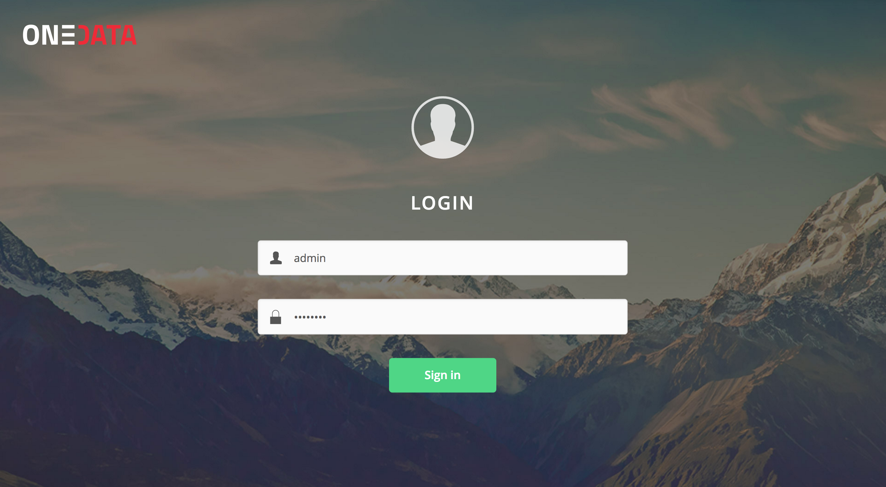

After login, go to **Storages** tab and press **Add storage**
button. Depending on whether the S3 bucket is on Exoscale or OTC,
different configuration options must be specified:

- **Exoscale S3**

 * **Hostname** - `https://sos.exo.io`
 * **Signature Version** - NB! select 2 for Exoscale.

.. image:: images/exoscale-s3-storage.png

- **OTC OBS**

 * **Hostname** - `https://obs.eu-de.otc.t-systems.com`
 * **Signature Version** - NB! select 4 for OTC.

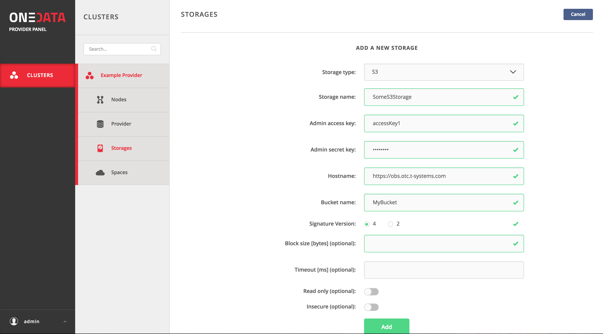

NB!  You need to select `Signature Version` 4 for OTC.

**GlusterFS Oneprovider on cloud via Nuvla**

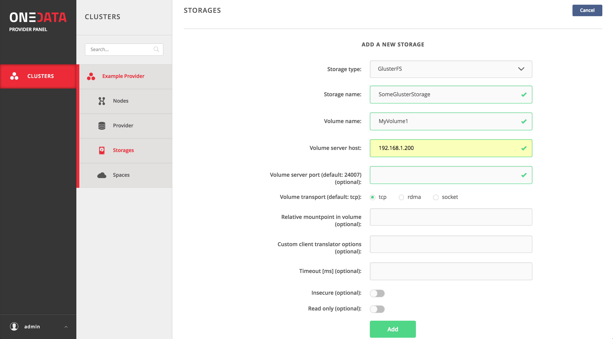

**Oneprovider in BG organization via Nuvla**

TODO

**Oneprovider in BG organization manually**

When deploying Oneprovider on custom storage resources it is necessary
to add the storage using Onepanel administrative interface.

Currently the following storage backends are supported:

- POSIX (this includes any storage which can be mounted to Oneprovider
  VM such as Lustre or NFS)

- GlusterFS

- S3

- Ceph

- Openstack Swift

Each of the storage types requires different parameters to be
configured properly, which can be found in the `official documentation
<https://onedata.org/#/home/documentation/doc/administering_onedata/storage_configuration.html>`_.

One-click Deployment of Onezone and Oneproviders on Exoscale and OTC
--------------------------------------------------------------------

Data manager has an option to deploy Onezone and Oneproviders on Exoscale and
OTC with one button click using the following application deployment definition
https://nuv.la/module/HNSciCloud-RHEA/onedata/onedata.

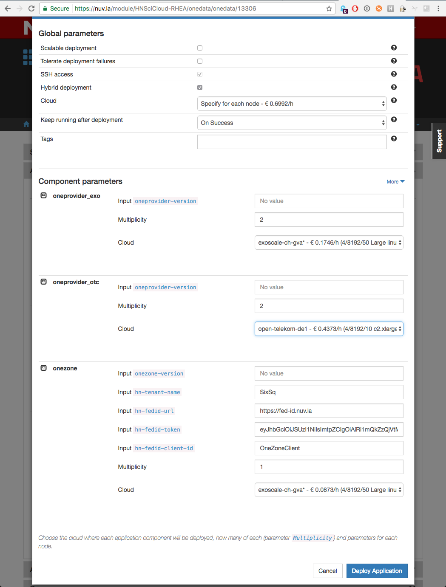

When choosing **Cloud**, select `Specify for each node`. Then, select
`exoscale-ch-gva` for **oneprovider_exo** and `open-telekom-de1` for
**oneprovider_otc**.  For **onezone** component, please see `Onezone` section
above for providing **hn-*** parameters. The selection of the placement of the
**onezone** instance into a Cloud is up to data manager.  ***-version**
parameters should be left blank.  Keep **Multiplicity** of the components equal
to 1.

Managing Spaces
---------------

Space can be seen as a virtual directory, which contents are stored on
distributed storage resources provisioned by storage providers. Each
space must have at least one provider supporting it with a non-zero
storage space (quota). The effective quota available to a single space
is the sum of storage quotas dedicated to this space by all storage
providers supporting it.

Creating spaces
~~~~~~~~~~~~~~~

Spaces in Onedata can be seen as virtual volumes or buckets, where an arbitrary
directory and file hierarchy can be created.

To create a new data space follow these steps:

- In the Onezone Web Interface unfold Data space management tab
  located on the left menubar

.. image:: images/spacestabhome.png
   :scale: 50 %

- Click Create new space button

- Provide new space name in the text edit field and confirm

New space will appear in the list of spaces designated with a unique ID.

Supporting spaces with Oneprovider instances
~~~~~~~~~~~~~~~~~~~~~~~~~~~~~~~~~~~~~~~~~~~~

By default new space has no storage resources associated with it. In
order to add storage quota to a space, generate a space support token
by clicking on `Get support` option under space name, copy the
presented token and send the token to the administrator of the
Oneprovider instance whose the storage resources should be assigned to
this space.

