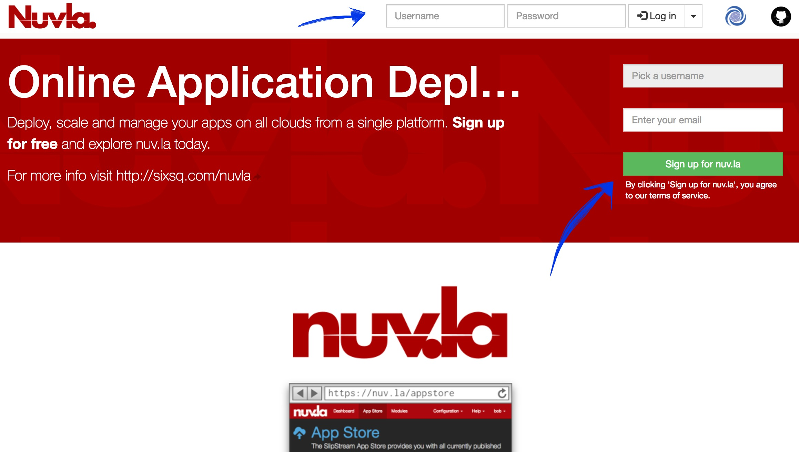
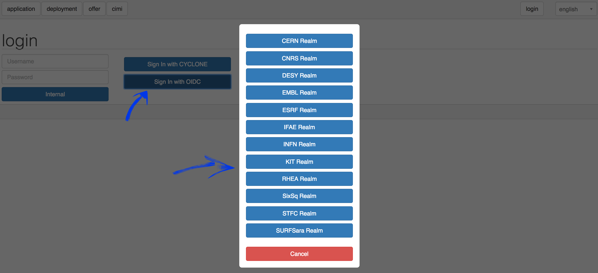
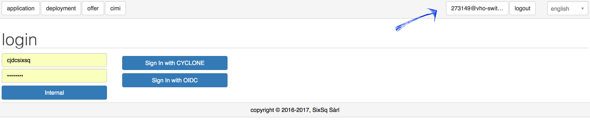

Account Activation
==================

The main interface for managing cloud resources is [Nuvla](https://nuv.la). Existing users should already have their accounts setup and thus be able to login. New users may as well create their own internal Nuvla accounts through the sign up form available on the website.

For new users who would like to follow a registration process whilst using their home institute credentials, a new authentication flow has been created and can be found at [https://nuv.la/webui/login](https://nuv.la/webui/login), providing a single sign-on functionality between the cloud management portal (Nuvla) and HNSciCloud users, through external identity providers (IdP) via the eduGAIN and ELIXIR AAI federations. The procedure to active an account in Nuvla using external credential is as follows:

1. On the web UI, HNSciCloud users shall select *"Sign In with OIDC"* (which stands for OpenID Connect) and select their tenant (or Realm), as shown in the figure below.

This will redirect users to their respective login realm in [SixSq's Federated Identity Portal](https://fed-id.nuv.la). This portal is SixSq's authentication and authorization infrastructure (AAI) and it uses [Keycloak](http://www.keycloak.org/) and [simpleSAMLphp](https://simplesamlphp.org/) underneath in order to make the authentication bridge between client applications (like Nuvla) and identity federations like eduGAIN and ELIXIR AAI (using SAML2.0).

2. Users shall then select which federation they want to sign in with.

.. image:: ../images/kcLogin.png
   :alt: Login view and federation selection in Keycloak
   :align: center

3. For both eduGAIN and ELIXIR, users will then be presented with a comprehensive list of IdPs and a search field.
eduGAIN:
.. image:: ../images/edugain.png
   :alt: List of IdPs in eduGAIN
   :align: center

ELIXIR:
.. image:: ../images/elixir.png
   :alt: List of IdPs in ELIXIR
   :align: center

Upon selection of the IdP, users will be redirected to their institute's login page.

4. If users already have an active session, then they'll be automatically redirected to Nuvla, without going to the IdP's login page.

5. At this point, new users have been automatically registered in Nuvla and their accounts are now active.

---

6. **IF USER IS AN ACCOUNT MANAGER**, then he/she must send an email to [support@sixsq.com](support@sixsq.com) asking *admin* rights to the tenant, which shall be granted by SixSq, in [SixSq Federated Identity Portal](https://fed-id.nuv.la/auth), where the account managers can then manage users, groups and roles (as described in [here](../administrator/index.rst))
