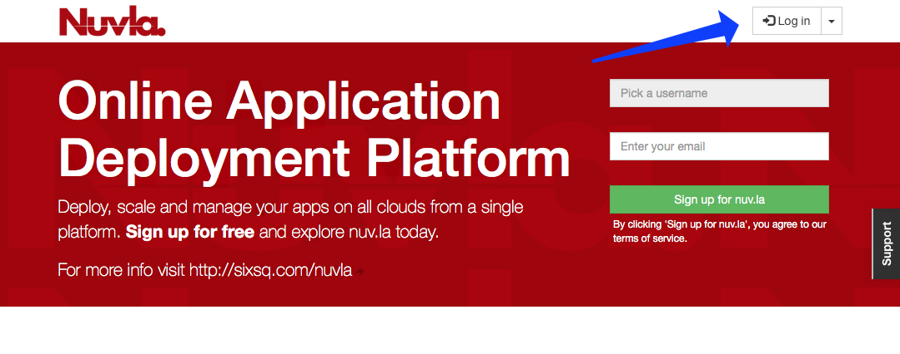
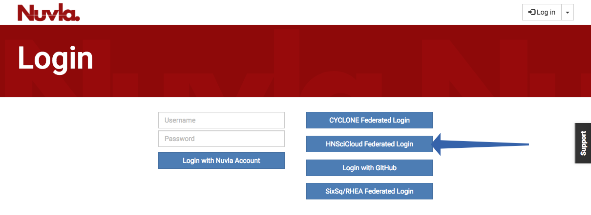
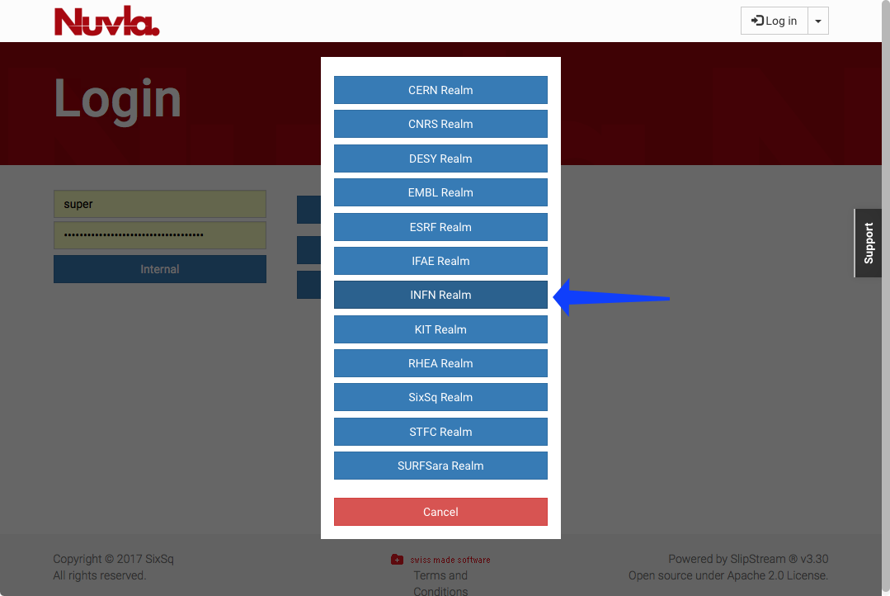
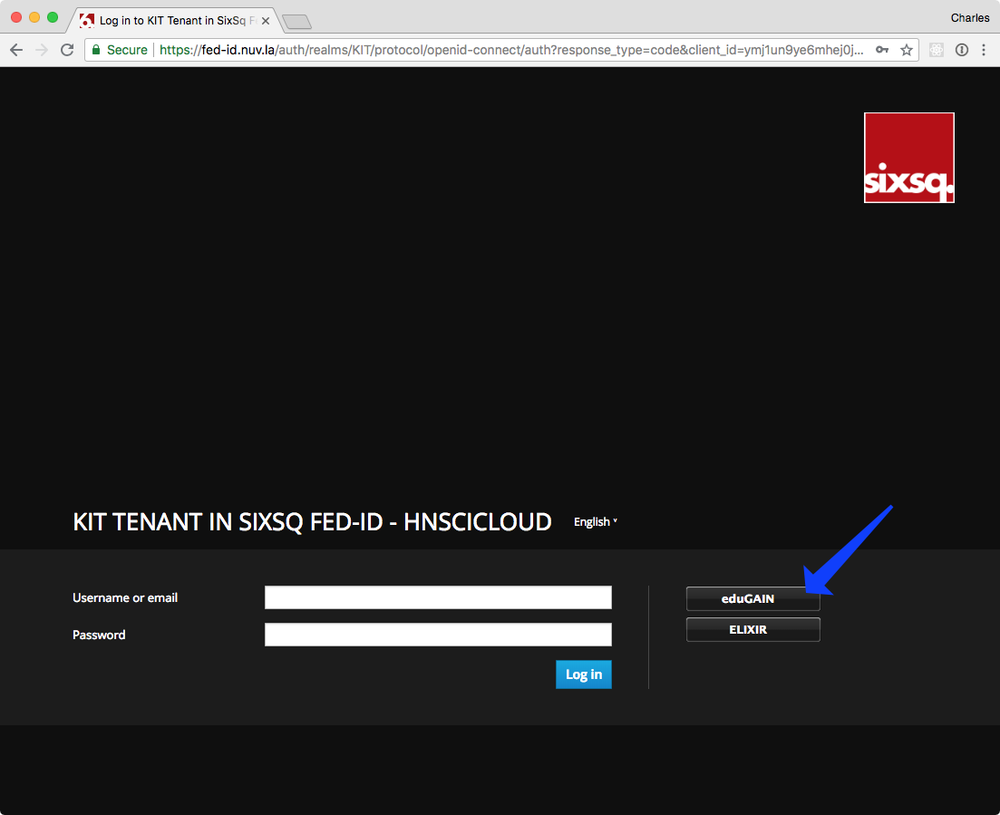
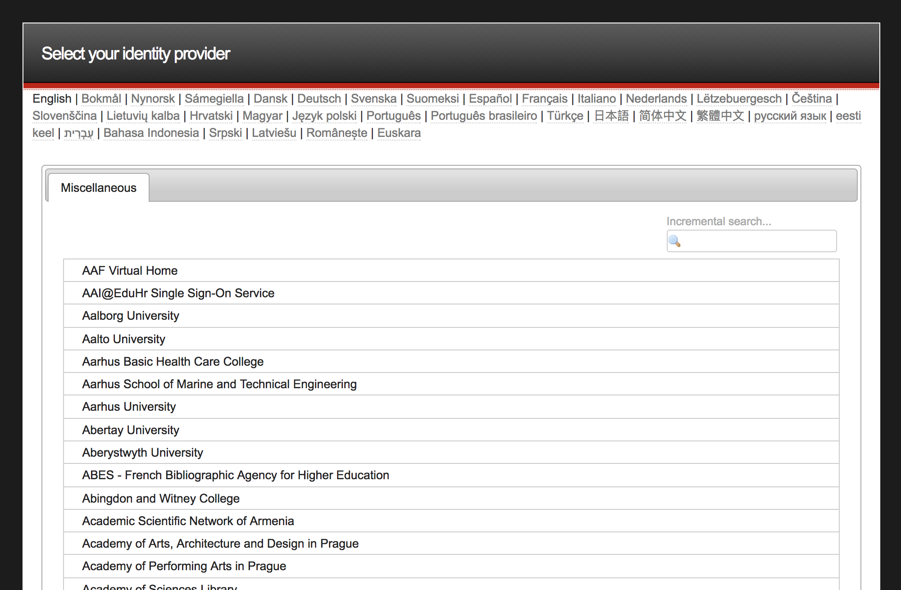
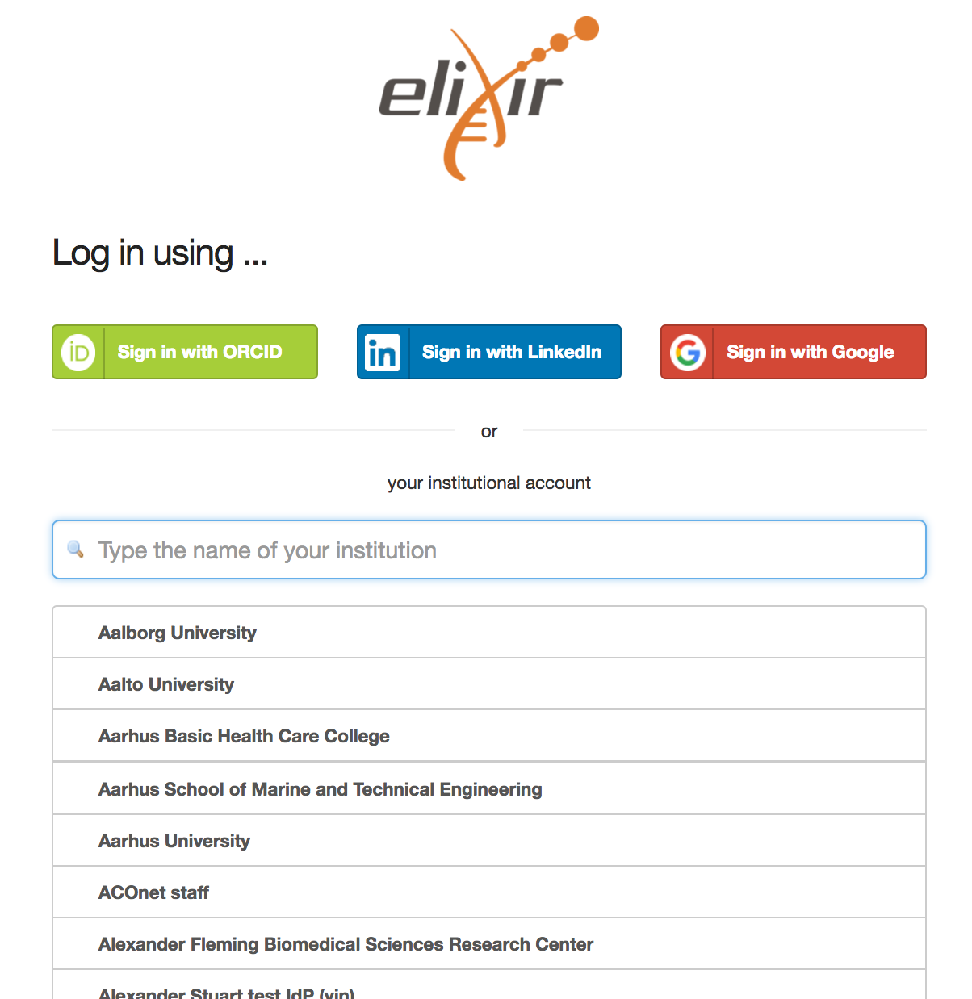
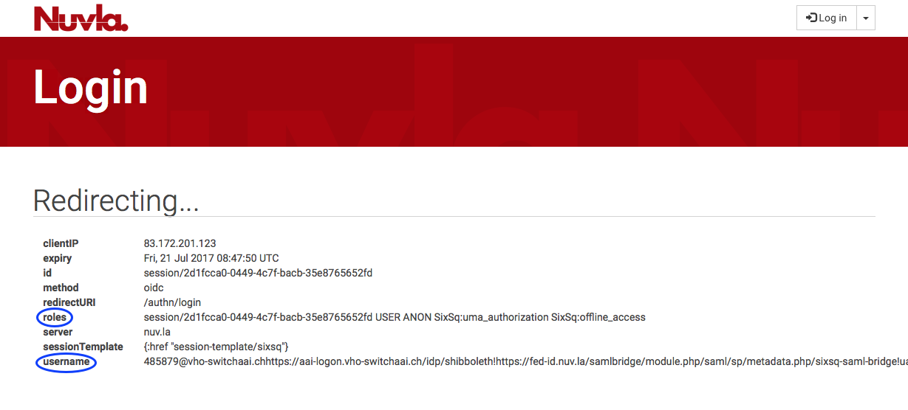
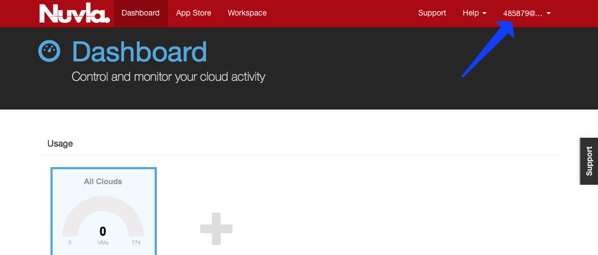

Account Activation
==================

The main interface for managing cloud resources is `Nuvla`_. New users
may create their accounts by simply signing into Nuvla with their
institutional credentials (through the eduGAIN and Elixir AAI identity
federations). The full procedure to activate an account in Nuvla using
your institutional credentials is as follows:

1. Click on the login button which will then take you to a page to
   select your login method.

2. On this page, HNSciCloud users shall select *"HNSciCloud Federated
   Login"* and select their realm (or tenant), as shown in the figure
   below.

This will redirect users to their respective login realm in `SixSq's
Federated Identity Portal`_. This portal is SixSq's authentication and
authorization infrastructure (AAI) and it uses `Keycloak`_ and
`simpleSAMLphp`_ underneath in order to make the authentication bridge
between client applications (like Nuvla) and identity federations like
eduGAIN and ELIXIR AAI (using SAML2.0).

3. Users shall then select which identity federation they want to use,
   either eduGAIN or ELIXIR.

4. For both eduGAIN and ELIXIR, users will then be presented with a
   comprehensive list of identity providers and a search field.

eduGAIN:

ELIXIR:

Upon selection of the identity provider, users will be redirected to
their institute's login page.

5. When successfully authenticating with the identity provider, the
   user will then be redirected back to Nuvla, which will show the
   active session parameters, including the user's full username and
   roles.  `This page <https://nuv.la/authn/login>`_ can be viewed at
   anytime to show this information.

6. The user will then be automatically redirect to the Nuvla
   dashboard.

7. If users already have an active session, then they'll be
   automatically redirected to Nuvla, without going to the identity
   provider's login page.

8. At this point, new users have been automatically registered in
   Nuvla and their accounts are now active.

------------

9. Users that are an **ACCOUNT MANAGER** must send an email to
   `support@sixsq.com`_ asking *admin* rights to the tenant, which
   shall be granted by SixSq, in `SixSq's Federated Identity Portal`_,
   where the account managers can then manage users, groups and roles
   (as described in `here`_).

10. All **OTHER USERS** must contact the account manager for the realm
    so that the manager can assign roles to them or add them to a
    group.

Exoscale voucher redeem
------------------------

To redeem an `Exoscale`_ voucher, open the provided voucher link
within a web browser. A typical link looks like:

https://portal.exoscale.com/register?coupon=XXXXXXX

1. Enter your email address and password you wish to use. Accept the
   terms and hit sign up.

.. image:: ../images/exoscale-voucher-redeem.png
   :alt: Exoscale sign up page
   :align: center

2. A validation email has been sent. Check out your mailbox and click
   on verify link.

.. image:: ../images/exoscale-account-validation.png
   :alt: Exoscale email validation
   :align: center

3. Choose "for team projects" and fill your details. Choose your
   `Exoscale`_ organization name and submit:

.. image:: ../images/exoscale-account-details.png
   :alt: Exoscale account details
   :align: center

4. You're in and you may now spawn new instances.

.. _`Nuvla`: https://nuv.la

.. _`https://nuv.la/webui/login`: https://nuv.la/webui/login

.. _`SixSq's Federated Identity Portal`: https://fed-id.nuv.la/auth

.. _`Keycloak`: http://www.keycloak.org/

.. _`simpleSAMLphp`: https://simplesamlphp.org/

.. _`support@sixsq.com`: support@sixsq.com

.. _`here`: ../administrator/index.html

.. _`Exoscale`: https://www.exoscale.com
