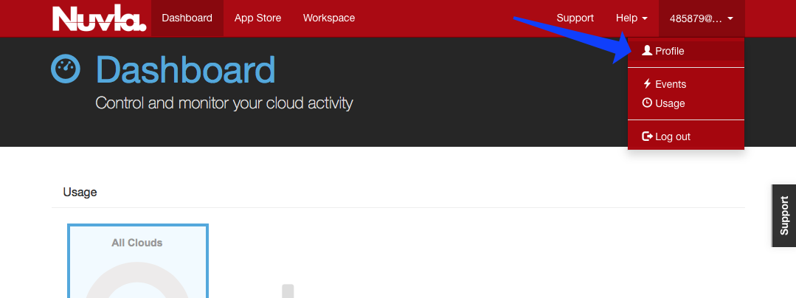

Account Configuration
=====================

To use Nuvla to provision the data management services or cloud
applications on the IaaS cloud infrastructures, you must configure
your Nuvla account.  To access your user profile, click on "Profile"
link under your username.

To update your user profile, click on the "Edit..." on the right side
below the page header.

Remote Machine Access
---------------------

To allow you have remote access to the (Linux) virtual machines that
you deploy, you should provide a public SSH key. Once this key has
been added to your profile, Nuvla will automatically configure all
deployed virtual machines with this key, giving you 'root' access to
your deployed machines. The instructions for creating an SSH key pair
and configuring your profile can be found in the `Remote Machine
Access`_ section of the SlipStream documentation.  This documentation
also describes the installation of a "Remote Desktop Connection"
client for accessing Windows machines.

Cloud Credentials
-----------------

In order to be granted access to the OTC, Exoscale and Advania cloud 
credentials, technical users must contact their account managers, asking 
for a specific user role (**can_deploy**) to be given to them, as 
described in :doc:`../administrator/cloud-configuration`.
