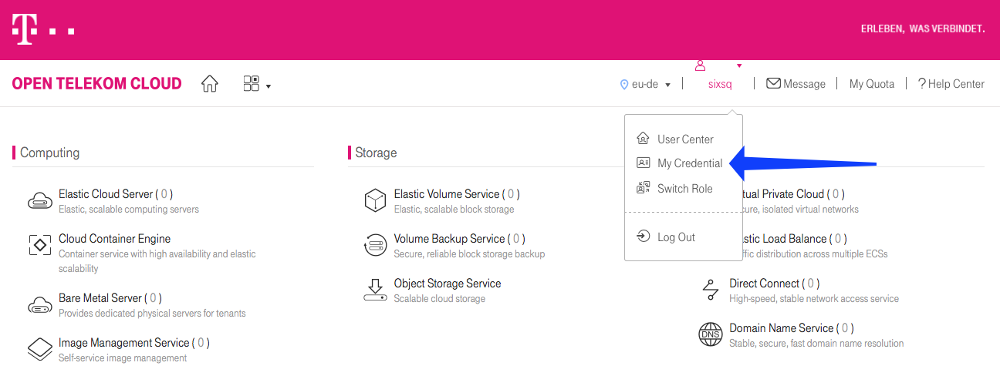
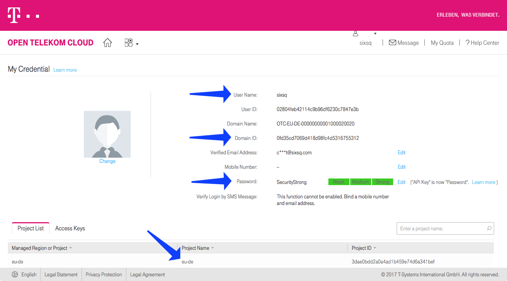
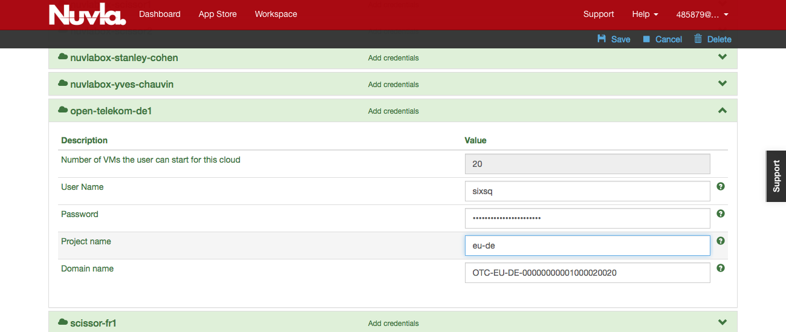

Account Configuration
=====================

To use Nuvla to provision the data management services or cloud
applications on the IaaS cloud infrastructures, you must configure
your Nuvla account.  To access your user profile, click on "Profile"
link under your username.

.. figure:: ../images/nuvlaUserProfile.png
   :alt: Accessing Your User Profile
   :width: 100%
   :align: center

To update your user profile, click on the "Edit..." on the right side
below the page header.

Remote Machine Access
---------------------

To allow you have remote access to the (Linux) virtual machines that
you deploy, you should provide a public SSH key. Once this key has
been added to your profile, Nuvla will automatically configure all
deployed virtual machines with this key, giving you 'root' access to
your deployed machines. The instructions for creating an SSH key pair
and configuring your profile can be found in the `Remote Machine
Access`_ section of the SlipStream documentation.  This documentation
also describes the installation of a "Remote Desktop Connection"
client for accessing Windows machines.

Cloud Provider Configuration
----------------------------

Exoscale
~~~~~~~~

The configuration of your account for Exoscale should have been done
for you, when you initially contacted SixSq support or your realm
administrator.  If this is not the case but you have your Exoscale
credentials, you can follow the `Exoscale Cloud Configuration`_
instructions.  If you do not have credentials, contact the SixSq
support.

Open Telekom Cloud
~~~~~~~~~~~~~~~~~~

The account manager for each Buyers Group organization is responsible
for creating user accounts.  If you don't have one, then contact your
account manager.

Once you have your account, you'll have to configure your Nuvla
account with your credentials.  To find them:

1. Log in to your OTC account.

2. On your home page, click on the "My Credential" link.

3. On the credential page, you can find all of the information that
   you will need to configure your Nuvla account.  The fields on shown
   on the figure and listed below.

The fields that you need are:

 - User name
 - Domain Name
 - Password
 - Project name

Using these values, you can then configure your Nuvla account.

To configure your Nuvla account for OTC, go to your profile page and
click on "Edit...".  Find the section "open-telekom-de1" and open that
section. It should look similar to the following figure.

Provide the values of the fields from the information on your OTC
credential page and then save your profile.  You should be able to use
OTC cloud resources now.

.. _`Remote Machine Access`: http://ssdocs.sixsq.com/en/latest/tutorials/ss/appendix.html#remote-machine-access

.. _`Exoscale Cloud Configuration`: http://ssdocs.sixsq.com/en/latest/tutorials/ss/prerequisites.html#exoscale
