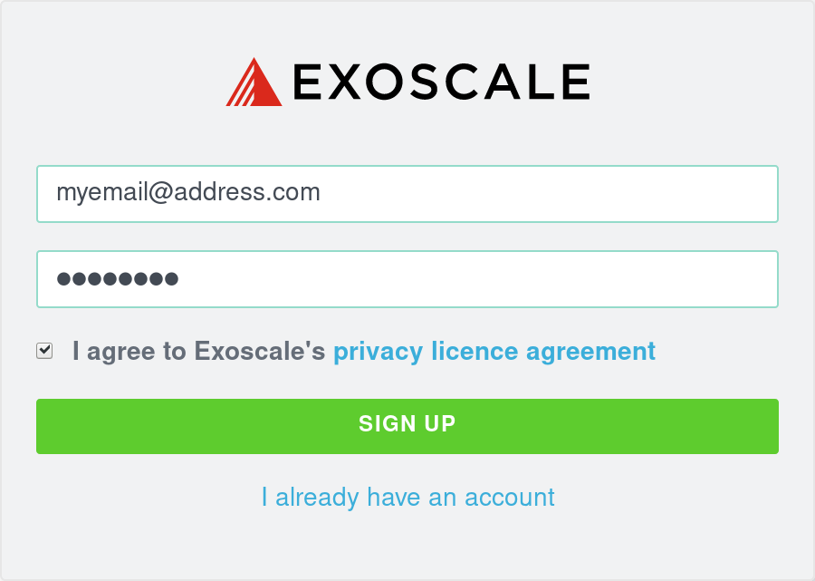
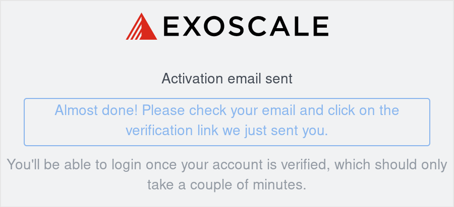
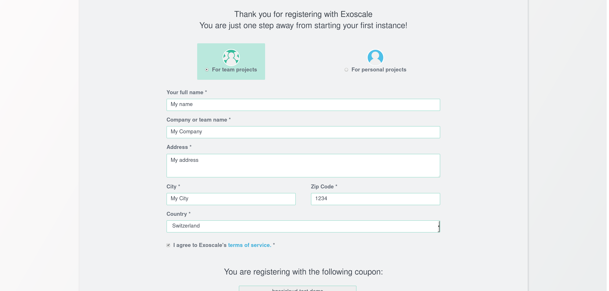
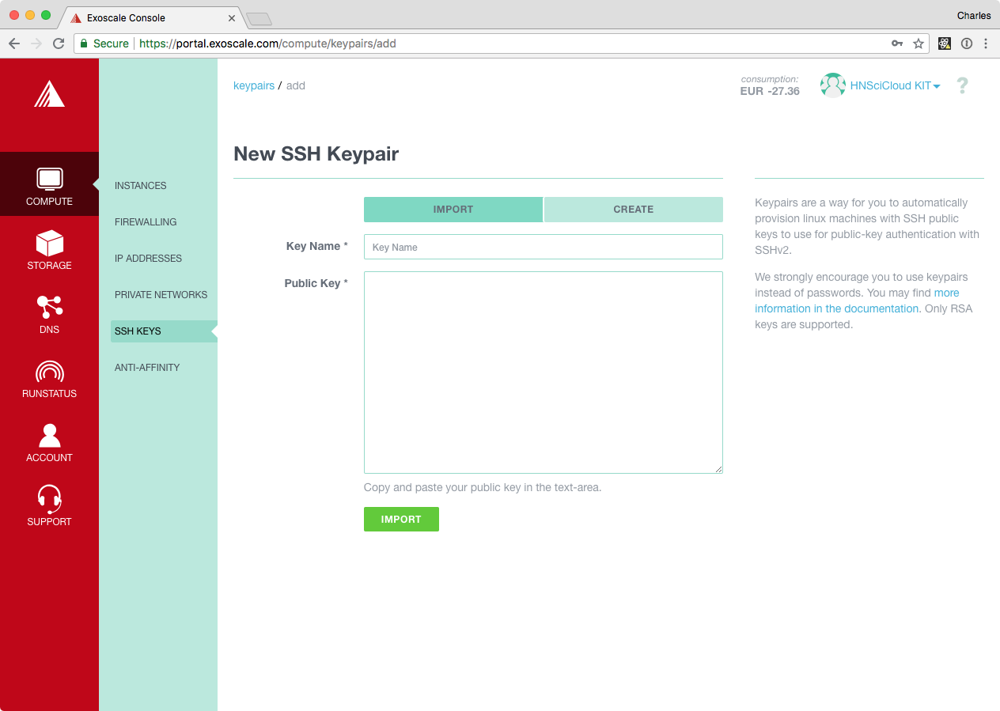

.. _exoscale-account:

Exoscale Account
================

Exoscale_ provides the IaaS computing resources for the RHEA Cloud
Platform.  The Frankfurt and Geneva Exoscale regions are connected to
Géant and can provide high bandwidth to academic sites also connected
to Géant.  To use the platform, you must have an Exoscale account. 

Buyers Group Account
--------------------

The RHEA Consortium has already defined "organizations" within
Exoscale to allow the administrator of each Buyers Group tenant to
manage its users.  Contact your administrator directly to obtain an
account.  If you don't know your administrator, you can contact the
Support HelpDesk (`support@sixsq.com`_).

.. _voucher-redemption:

Voucher Redemption
------------------

You may have been given a voucher for HNSciCloud credit on Exoscale.
You can either create a new account using the voucher or add the
credit to an existing account.

Create Account
~~~~~~~~~~~~~~

To redeem an Exoscale_ voucher and **create a new account**, open the
provided voucher link within a web browser. A typical link looks
like::

    https://portal.exoscale.com/register?coupon=XXXXXXX

1. Enter the email address and password you wish to use. Accept the
   terms and hit sign up.

2. A validation email has been sent. Check out your mailbox and click
   on the verification link.

3. Choose "for team projects" and fill your details. Choose your
   `Exoscale`_ organization name and submit:

4. You're in and you may now spawn new instances.

Credit an Existing Account
~~~~~~~~~~~~~~~~~~~~~~~~~~

If you **already have an Exoscale account**, you can add the voucher
credit to it.  Simply make sure that you are logged into the `Exoscale
portal`_ and then visit the link:

    https://portal.exoscale.com/account/funds/redeem-coupon

Just enter the code and the amount of the voucher will be credited to
your account.

.. _exoscale-ssh-config:

SSH Configuration
-----------------

It is very strongly recommended that you **use SSH keys to access your
running virtual machines.**

To add your public SSH key to your account, navigate to the "Compute"
tab and then the "SSH Keys" panel in the `Exoscale portal`_.  From
here, click on the "ADD" button to upload your public SSH key.  You
should see a dialog similar to the following screenshot.

Provide a descriptive name for the key, paste your **public** key into
the textbox, and then click on "IMPORT".  After the import, click on
the "Set as default" link below the key to make it the default.

You can also use this interface to create a new SSH key pair.  If you
do this, be sure to save the generated private key and configure your
laptop to use this key.

GPUs and Large Flavors
----------------------

To request access to the Exoscale GPU instance flavor, just submit a
support ticket to `support@sixsq.com`_.  You can do the same if you
need access to the "Mega" or "Titan" flavors. 

If you have registered using a voucher, please specify that it's
related to the HNSciCloud project in order to speedup the request.

.. _`support@sixsq.com`: support@sixsq.com

.. _`Exoscale`: https://www.exoscale.com

.. _`Exoscale Portal`: https://portal.exoscale.com

