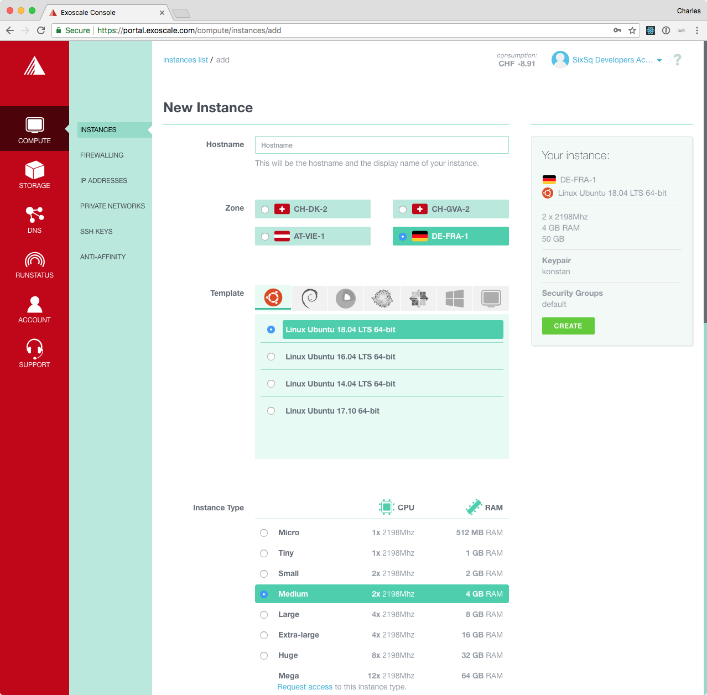

Exoscale Account
================

Exoscale_ provides the IaaS computing resources for the RHEA Cloud
Platform.  The Frankfurt and Geneva Exoscale regions are connected to
Géant and can provide high bandwidth to academic sites also connected
to Géant.  To use the platform, you must have an Exoscale account. 

Buyers Group Account
--------------------

The RHEA Consortium has already defined "organizations" within
Exoscale to allow the administrator of each Buyers Group tenant to
manage its users.  Contact your administrator directly to obtain an
account.  If you don't know your administrator, you can contact the
Support HelpDesk (`support@sixsq.com`_).

Voucher Redemption
------------------

You may have been given a voucher for HNSciCloud credit on Exoscale.
To redeem an Exoscale_ voucher, open the provided voucher link
within a web browser. A typical link looks like::

    https://portal.exoscale.com/register?coupon=XXXXXXX

1. Enter the email address and password you wish to use. Accept the
   terms and hit sign up.

.. image:: ../images/exoscale-voucher-redeem.png
   :alt: Exoscale Sign Up Page
   :width: 80%
   :align: center

2. A validation email has been sent. Check out your mailbox and click
   on the verification link.

.. image:: ../images/exoscale-account-validation.png
   :alt: Exoscale Email Validation
   :width: 80%
   :align: center

3. Choose "for team projects" and fill your details. Choose your
   `Exoscale`_ organization name and submit:

.. image:: ../images/exoscale-account-details.png
   :alt: Exoscale Account Details
   :width: 80%
   :align: center

4. You're in and you may now spawn new instances.

Access to GPUs
--------------

To request access to the Exoscale GPU instance flavor, just submit a
support ticket to `support@sixsq.com`_.

If you have registered using a voucher, please specify that it's
related to the HNSciCloud project in order to speedup the request.

Starting Virtual Machines
-------------------------

Once you have logged into the `Exoscale portal`_, you can start new
virtual machine instances by clicking on the "Compute" tab on the
left, clicking the "ADD" button, and then filling in the form to
define the characteristics of you new virtual machine instance.

.. _`support@sixsq.com`: support@sixsq.com

.. _`Exoscale`: https://www.exoscale.com

.. _`Exoscale Portal`: https://portal.exoscale.com

