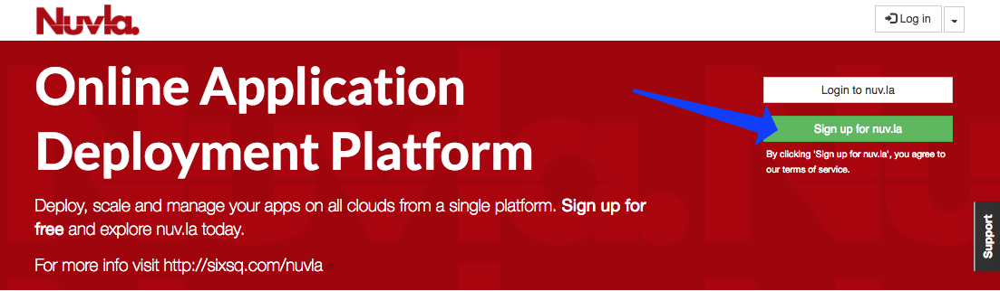
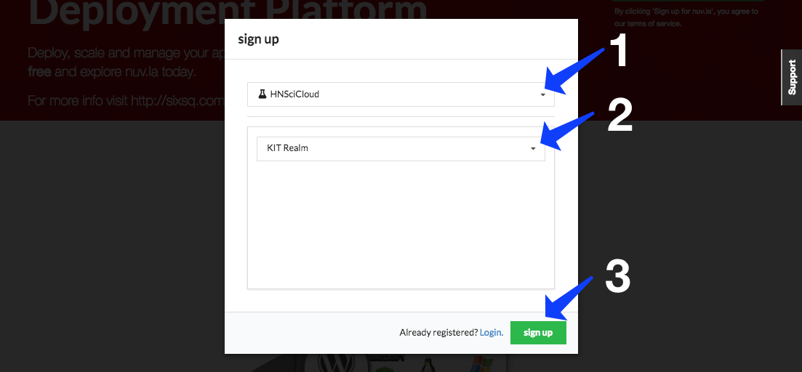
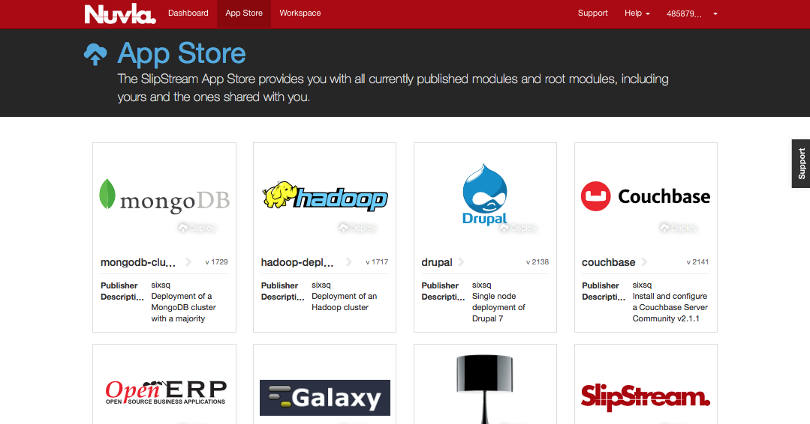

.. _nuvla-account:

Nuvla Account
=============

Orchestration features are implemented by `Nuvla`_.  Use of Nuvla is
entirely optional, although some automated deployment of systems
(e.g. SLURM) will not be available otherwise.

.. _nuvla-registration:

Registration
------------

New users may create their accounts by registering with Nuvla with
their institutional credentials through the eduGAIN and Elixir AAI
identity federations.

The full procedure to activate an account in Nuvla using
your institutional credentials is as follows:

1. Click on the login button which will then take you to a page to
   select your login method.

2. In this dialog, HNSciCloud should select "HNSciCloud" and then
   select their realm (or tenant) as shown in the figure below.  Then
   click on the "sign up" button.

This will redirect users to their respective login realm in `SixSq's
Federated Identity Portal`_. This portal is SixSq's authentication and
authorization infrastructure (AAI) and it uses `Keycloak`_ and
`simpleSAMLphp`_ underneath in order to make the authentication bridge
between client applications (like Nuvla) and identity federations like
eduGAIN and ELIXIR AAI (using SAML2.0).

3. Users shall then select which identity federation they want to use,
   either eduGAIN or ELIXIR.

.. image:: ../images/kcLogin.png
   :alt: Login view and federation selection in Keycloak
   :align: center

4. For both eduGAIN and ELIXIR, users will then be presented with a
   comprehensive list of identity providers and a search field.

eduGAIN:

.. image:: ../images/edugain.png
   :alt: List of identity providers in eduGAIN
   :align: center

ELIXIR:

.. image:: ../images/elixir.png
   :alt: List of identity providers in ELIXIR
   :align: center

Upon selection of the identity provider, users will be redirected to
their institute's login page.

5. When successfully authenticating with the identity provider, the
   user will then be redirected back to Nuvla. The
   active session parameters, including the user's full username and
   roles can be browsed from `this page <https://nuv.la/webui/profile>`_.

.. image:: ../images/nuvlaSessionInfo.png
   :alt: User's session information
   :align: center

6. The user will then be automatically redirect to the Nuvla
   dashboard.

.. image:: ../images/nuvlaDashboardRedirect.png
   :alt: Nuvla Dashboard after Redirect
   :align: center

7. If users already have an active session, then they'll be
   automatically redirected to Nuvla, without going to the identity
   provider's login page.

8. At this point, new users have been automatically registered in
   Nuvla and their accounts are now active.

9. Users that are an **ACCOUNT MANAGER** must send an email to
   `support@sixsq.com`_ asking *admin* rights to the tenant, which
   shall be granted by SixSq, in `SixSq's Federated Identity Portal`_,
   where the account managers can then manage users, groups and roles
   (as described in `here`_).

10. All **OTHER USERS** must contact the account manager for the realm
    so that the manager can assign roles to them or add them to a
    group.
    

Account Configuration
---------------------

To use Nuvla to provision the data management services or cloud
applications on the IaaS cloud infrastructures, you must configure
your Nuvla account.  To access your user profile, click on "Profile"
link under your username.

.. figure:: ../images/nuvlaUserProfile.png
   :alt: Accessing Your User Profile
   :width: 100%
   :align: center

To update your user profile, click on the "Edit..." on the right side
below the page header.

Remote Machine Access
~~~~~~~~~~~~~~~~~~~~~

To allow you have remote access to the (Linux) virtual machines that
you deploy, you should provide a public SSH key. Once this key has
been added to your profile, Nuvla will automatically configure all
deployed virtual machines with this key, giving you 'root' access to
your deployed machines. The instructions for creating an SSH key pair
and configuring your profile can be found in the `Remote Machine Access`_ 
section of the SlipStream documentation.  This documentation
also describes the installation of a "Remote Desktop Connection"
client for accessing Windows machines.

Cloud Credentials
~~~~~~~~~~~~~~~~~

In order to be granted access to the Exoscale cloud credentials,
technical users must contact their account managers, asking for a
specific user role (**can_deploy**) to be given to them, as described
in :doc:`../administrator/cloud-configuration`.

.. _`Portal`: https://portal.exoscale.com
.. _`support@sixsq.com`: support@sixsq.com

Components and Applications
---------------------------

The first place to look for interesting components (single virtual
machine services) and applications (multiple machine services) is the
`Nuvla App Store`_.

Within the `Nuvla Workspace`_, there are other applications of interest:

 - ``examples/images``: Minimal distributions of common operating
   systems. Usually used as the basis for other components.
 - ``apps``: Curated list of applications that can be used as examples
   for your own applications.
 - ``HNSciCloud``: `This`_ workspace contains several prearranged components and applications to facilitate the testing and evaluation process, including for example:

    - ``HNSciCloud/Benchmarking``: Both generic and HNSciCloud-specific benchmarks for evaluating the system. Relevant for Test Cases 2.2, 5.1 and 11.4.3.
    - ``HNSciCloud/Images``: A subset of ``examples/images``, containing only the HNSciCloud specific operating systems.
    - ``HNSciCloud/VMProvisioningPersonalisation``: An App for testing the provisioning and contextualization of a VM, according to Test Case 2.5.
    - ``HNSciCloud/S3EndpointTest-Exoscale_OTC``: An App for testing S3 in both Exoscale and OTC, according to Test Case 2.3.
    - ``HNSciCloud/HDF5_IO``: An App for verifying HDF5 compliance with the VMs' local storage in the cloud, according to Test Case 4.1.

Other application definitions will appear over time.  If you have
specific needs, contact SixSq support to request new ones.

.. _`Nuvla App Store`:  https://nuv.la/appstore
.. _`This`: https://nuv.la/module/HNSciCloud
.. _`Nuvla Workspace`: https://nuv.la/module

.. _`Nuvla`: https://nuv.la

.. _`https://nuv.la/webui/login`: https://nuv.la/webui/login

.. _`SixSq's Federated Identity Portal`: https://fed-id.nuv.la/auth

.. _`Keycloak`: http://www.keycloak.org/

.. _`simpleSAMLphp`: https://simplesamlphp.org/

.. _`support@sixsq.com`: support@sixsq.com

.. _`here`: ../administrator/index.html

.. _`Remote Machine Access`: http://ssdocs.sixsq.com/en/latest/tutorials/ss/appendix.html?highlight=Remote%20Machine%20access#remote-machine-access
