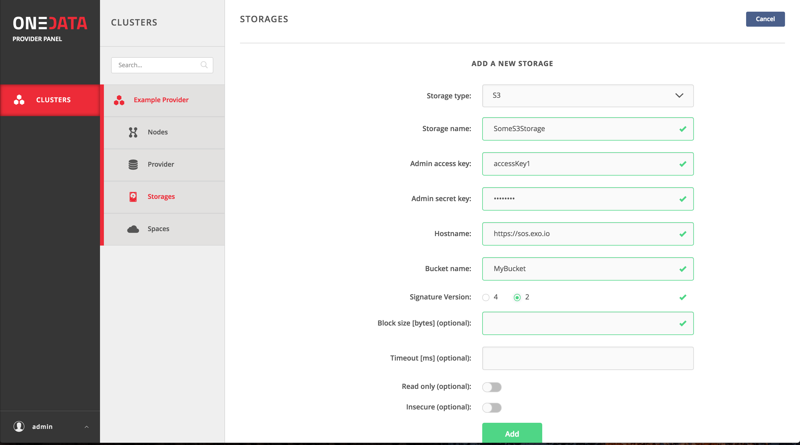
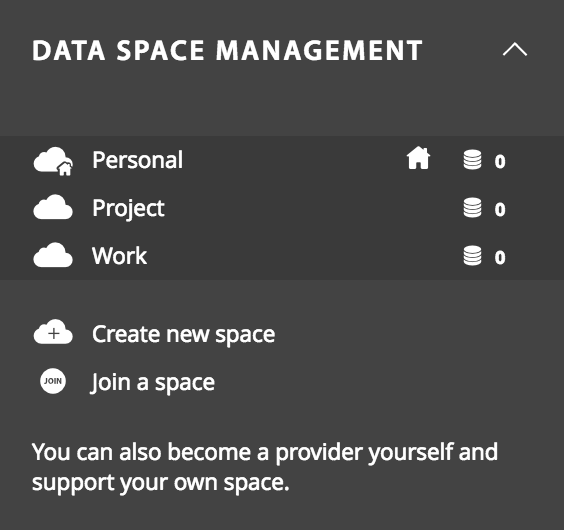
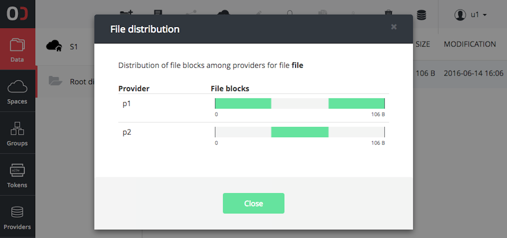
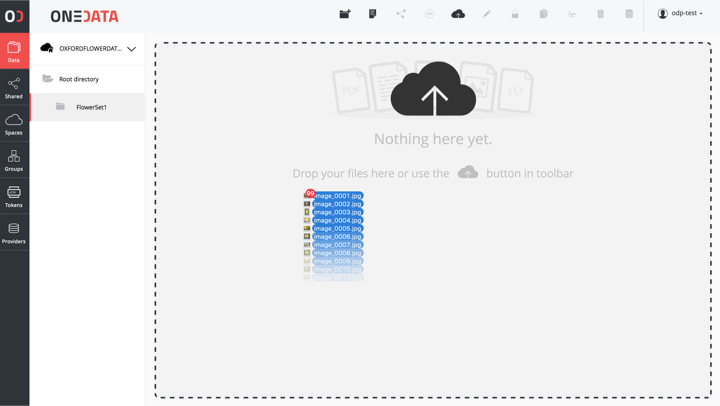

Data Managers
=============

Setup data management services?
-------------------------------

Data management service are based on Onedata technology. For general
overview of Onedata and it's core concepts including zones, providers and
spaces plese refer to the `official documentation <https://onedata.org/#/home/documentation/doc/getting_started/what_is_onedata.html>`_.

Onezone
~~~~~~~

**Deploying Onezone via Nuvla**

TODO

**Configuration with Keycloak**

In order to enable federated identity management for users it is necessary
to enable KeyCloak IdP in Onezone configuration. In order to do this, an entry
has to be added to the ``auth.config`` file in ``/opt/onedata/onezone`` folder.

.. code-block:: erlang

   [
    {basicAuth, []},

    {rhea, [
        % Standard config
        {auth_module, auth_keycloak},
        {app_id, <<"OnezoneTest">>},
        {app_secret, <<"8712ed65- ... -270a30291e76">>},
        % Provider specific config
        {xrds_endpoint, <<"https://fed-id.nuv.la/auth/realms/onedata/.well-known/openid-configuration">>}
     ]}
   ]

More information on setup of various IdP's with Onezone can be found in the
`official documentation <https://onedata.org/#/home/documentation/doc/administering_onedata/openid_configuration.html>`_.

Oneprovider
~~~~~~~~~~~

**S3 Oneprovider on cloud via Nuvla**

After deploying Oneprovider VM via Nuvla, it is necessary to add an S3 storage
to the Oneprovider using Onepanel administration service, running on the
same host as Oneprovider. In order to open Onepanel service go to:
``https://ONEPROVIDER_IP:9443`` and login using administrator credentials.

.. image:: images/onepanel-admin-login.png

After login, go to **Storages** tab and press **Add storage** button. Depending on whether
the S3 bucket is on Exoscale or OTC, different configuration options must be specified:

- **Exoscale**

- **OBS**

.. image:: images/obs-s3-storage.png

**GlusterFS Oneprovider on cloud via Nuvla**

.. image:: images/gluster-storage.png

**Oneprovider in BG organization via Nuvla**

TODO

**Oneprovider in BG organization manually**

When deploying Oneprovider on custom storage resources it is necessary to add the storage
using Onepanel administrative interface.

Currently the following storage backends are supported:

- POSIX (this includes any storage which can be mounted to Oneprovider VM such as Lustre or NFS)

- GlusterFS

- S3

- Ceph

- Openstack Swift

Each of the storage types requires different parameters to be configured properly, which can be
found in the `official documentation <https://onedata.org/#/home/documentation/doc/administering_onedata/storage_configuration.html>`_.

Managing Spaces
~~~~~~~~~~~~~~~

Space can be seen as a virtual directory, which contents are stored on distributed
storage resources provisioned by storage providers. Each space must have at least
one provider supporting it with a non-zero storage space (quota). The effective
quota available to a single space is the sum of storage quotas dedicated to this
space by all storage providers supporting it.

**Creating spaces**
Spaces in Onedata can be seen as virtual volumes or buckets, where an arbitrary
directory and file hierarchy can be created.

To create a new data space follow these steps:
- In the Onezone Web Interface unfold Data space management tab located on the left menubar

- Click Create new space button

- Provide new space name in the text edit field and confirm

New space will appear in the list of spaces designated with a unique ID.

**Supporting spaces with Oneprovider instances**
By default new space has no storage resources associated with it. In order to add storage quota
to a space, generate a space support token by clicking on `Get support` option under space name,
copy the presented token and send the token to the administrator of the Oneprovider instance
whose the storage resources should be assigned to this space.

Replicate data?
---------------

Onedata allows for full or partial replication of datasets between storage resources managed by
Oneprovider instances. The replication can be on the level of entire spaces or specific file blocks.

Onedata web interface provides visual information on the current replication of each file among the storage providers supporting the user space in which this file is located. Sample replication visualization is presented in the image below:

REST interface
~~~~~~~~~~~~~~

For full control over transfer and replication users can directly invoke REST API of Oneprovider service.
The documentation for this API can be found in the `official documentation <https://onedata.org/#/home/documentation/doc/using_onedata/replication_management.html>`_.

Data import and export methods?
-------------------------------

POSIX
~~~~~

First of all, POSIX protocol can be used to import or export data to/from Onedata virtual filesystem using standard tools, such as ‘cp’ or ‘rsync’. It is necessary to run the Oneclient command line tool on an access machine where the target data set is available (ingress) or where it should be exported to (egress). In case the storage managed by Onedata is available directly from the machine running Oneclient, this situation is detected automatically and the transfer between Onedata managed storage and external storage is performed directly and transparently without going via Oneprovider service, which is only called for metadata operations.

CDMI and REST
~~~~~~~~~~~~~

Furthermore, Onedata implements full CDMI v1.1.1 protocol specification, including data download/upload requests, and thus provides object storage system interface for all data in parallel to the POSIX protocol. This enables integration with custom user services such as portals.

For batch data transfer management, Onedata provides REST API giving programmatic access to data replication and transfer control and monitoring between the data sites.

GUI
~~~

Finally for small files or data sets, they can be uploaded and downloaded directly using the Web Graphical User Interface, available on all major browser and mobile devices. In order to import data using web browser, simply open a directory within a space where the files should be uploaded, and move the files from your desktop or file browser to the Onedata Internet browser window. The upload progress will be displayed until all files are successfully uploaded.

Legacy data import
~~~~~~~~~~~~~~~~~~

In use cases where there is a need to provision large legacy datasets, it is possible to configure Oneprovider service to expose such data set directly from the legacy storage without any data migration to another storage. Oneprovider service will run periodically synchronization of files on such storage, and will detect automatically new or updated files and will update its metadata database automatically. This option can be selected when adding new storage to the Oneprovider and has to performed by Oneprovider administrators:

.. image:: images/import-legacy-data-setup.png

Once the storage is configure for the legacy data import it will be continuously monitored for changes in the data collection (new files, modified files, deleted files) and basic statistics on the scan process will be displayed.

.. image:: images/import-legacy-data-monitoring.png

