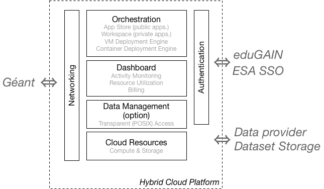

Introduction
============

HNSciCloud
----------

Ten of Europe’s leading public research organisations launched the
Helix Nebula Science Cloud (HNSciCloud) Pre-Commercial Procurement
(PCP) to establish a European hybrid cloud platform that will support
the high-performance, data-intensive scientific use-cases of this
“Buyers Group” and of the research sector at large.

This PCP calls for the design and implementation of hybrid innovative
Infrastructure as a Service (IaaS) solutions for compute, storage,
network connectivity, Federated Identity Management and Service
Payment Models, to augment and to enhance the science community’s
existing systems.

The RHEA Group consortium’s HNSciCloud design builds on a solid
foundation of engineering expertise, existing open source software &
commercial services:

- RHEA System Engineering & Cyber Security expertise
- SixSq’s Nuvla, a SlipStream-based hybrid-cloud management service
- Cyfronet’s OneData for Data Management
- Open Telekom Cloud, T-Systems’ IaaS Cloud Service (OpenStack)
- Exoscale IaaS Cloud Service (CloudStack)

The R&D innovations will be incorporated into these services as part
of our commercial offerings, with minimum intrusion into the buyers’
infrastructure, including:

- Peta-scale data management solution, portable to any cloud
- Flexible container management
- Single dashboard to better manage hybrid resources, including SLA
  compliance monitoring
- Unified accounting, integrating multi-cloud provider charges and
  billing
- Authentication from user to cloud providers

The Phase 1 design is being implemented, deployed, and tested in Phase
2, incorporating any refinements necessary to meet the needs of the
Buyers Group organizations.

Functional Overview
-------------------

The hybrid cloud platform coming from the design phase provides
cost-effective access to large-scale compute and storage resources
from multiple providers.  The solution brings together three
commercial services, an authentication infrastructure that supports
federated identities, and a data management infrastructure that can
handle the large data sets of the Buyers Group. All the components are
based on open source software released under the Apache 2.0 license,
which allows liberal academic and commercial reuse.

Our solution includes the following main components:

- Authentication (KeyCloak): federates external identity providers,
  allowing users to use their “home” credentials to access the hybrid
  cloud platform
- Orchestration (Nuvla): allows users to manage the full lifecycle of
  cloud applications with a high degree of automation
- Data Management (Onedata + GlusterFS/S3): allows users to access and
  to manage large datasets hosted in hybrid cloud infrastructures
  and/or at a Buyers Group organization with minimum intrusion
- Networking (peering with GÉANT): allows access to all the platform
  services from anywhere with enhanced access from sites connected to
  GÉANT
- Cloud Resources (OTC + Exoscale): IaaS and HPC computing and storage
  services accessible from the hybrid cloud platform
- Dashboard (Nuvla): provides an overview of Users’ current
  activities, resource utilisation, and costs.

The integration of these key components was demonstrated during the
design phase. The focus of the prototype phase is therefore to close
the gap on the identified missing features and focus on scaling. To
facilitate testing the system at scale, we will also work with buyers
to connect their data sources to the data management solution via a
Oneprovider service deployed near the source. This will allow users
from buyer organisations to test their applications, in the clouds, at
scale, with their own data.

Actors
------

The primary users of the hybrid cloud platform will be researchers who
want to analyze large datasets. However, there are many other actors
involved to make the platform useful. To be as exact as possible when
describing interactions with the platform, we have identified the full
set of actors:

Researcher
    A person from a Buyers Group organization who analyzes scientific
    data by deploying instances of cloud applications (defined by
    Application Developers) for himself.

Application Operator
    A person from a Buyers Group organization who deploys and manages
    instances of cloud applications (defined by Application
    Developers) for others.

Data Service Operator
    A person from a Buyers Group organization or the Consortium who is
    responsible for deploying and maintaining the data services
    specific to an organization, project, or experiment.

Application Developer
    A person from a Buyers Group organization, Consortium or other
    organization who develops generalized software or services for use
    by others that use the platform's services, including data sets
    maintained by a Buyers Group organization. Defines (scalable)
    applications on the platform that can be deployed by a Researcher
    or Application Operator.

Data Coordinator
    A person from a Buyers Group organization who is responsible for
    managing the data (publishing, replicating, validating, archiving,
    etc.) for a specific organization, project, or experiment.

Account Coordinator
    A person from a Buyers Group organization who is responsible for
    managing the accounts (including credentials and quotas),
    monitoring resource utilization, and tracking costs.

Platform User or User
    A Researcher, Application Operator, Data Service Operator,
    Application Developer, Data Coordinator, Account Coordinator.

Broker Service Provider
    The organization that provides the cloud application management
    and brokering services for the platform, i.e. Nuvla.

Service Provider
    A "broker service provider" or "IaaS service provider".

Consortium
    The organizations that together provide the hybrid cloud platform for HNSciCloud.

    
Scope and Coverage
------------------

This documentation covers the essentials for learning about and
getting started with the HNSciCloud platform from the RHEA
collaboration.  It contains only information specific to the platform
as a whole.  Documentation for the individual services that comprise
the platform are available elsewhere and may need to be consulted for
anything other than simple use cases.  Links to that documentation are
provided in the :ref:`platform-services` section.
