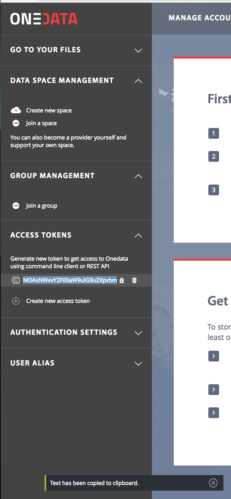
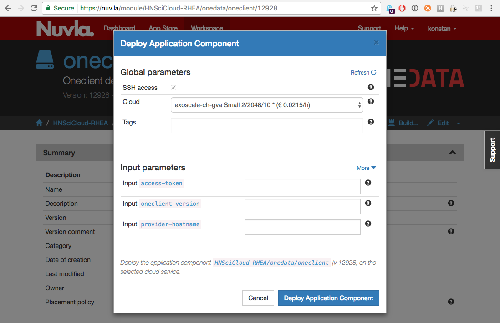

Data Access
===========

To facilitate a seamless access to the Buyers' distributed data sets, the
project uses `Onedata <https://onedata.org>`_ global data management system.

Onedata infrastructure, spanning multiple clouds, consists of two components -
Onezone and Oneprovider, and user level Oneclient tool for the data access.
Each Buyer Group has a single Onezone instance and per cloud instance of
Oneprovider.  Oneproviders attach to the Cloud's data stores and connect to
Onezone, with the latter being the main entry point and enabling the global
authentication and metadata management.

At this time, it is assumed that the distributed Onedata infrastructure is
already deployed by the Buyer's Group Data Managers and the endpoints of
Onezone and Oneproviders are publicly available.

Using Nuvla to provision data access client
-------------------------------------------

Users access their data on VMs using POSIX.  The data becomes available on the
VMs via mounting the required data sources with the help of `Oneclient tool
<https://onedata.org/#/home/documentation/doc/using_onedata/oneclient.html>`_.
When deploying VMs via `Nuvla <https://nuv.la>`_ service, users should use or,
when building their own components, inherit from `oneclient` component, which
is available at https://nuv.la/module/HNSciCloud-RHEA/onedata/oneclient.

At the moment, for oneclinet to mount the data volumes on VMs and enable POSIX
access to the data, users need to provide it with a data access token and the
Cloud local Oneprovider endpoint.

Next versions of the platform will be extended to contain the auto-discovery of
the Cloud local Oneprovider as well as auto-generation of the data access
token.

Obtaining Onedata data Access Token
~~~~~~~~~~~~~~~~~~~~~~~~~~~~~~~~~~~

The following steps are required to get the data access token

 * obtain the Buyer's Group Onezone endpoint
 * in Onezone, authenticate via FedIdP

.. image:: /images/onezone-login.png
.

 * when loged in Onezone web user interface, press `Access Tokens` in the top
   menu and press `Create new access token` button, then click on the `copy`
   pictogram

The copied data access token should be used with the **access-token** parameter
in the `oneclient` component deployment.

Obtaining Oneprovider endpoint
~~~~~~~~~~~~~~~~~~~~~~~~~~~~~~

Check with your Data Manger for the IP/DNS name of the Oneprovider endpoint on
the Cloud of your choice.

Provision VM for data access
~~~~~~~~~~~~~~~~~~~~~~~~~~~~

Go to https://nuv.la/module/HNSciCloud-RHEA/onedata/oneclient and click on
`Deploy`.

Select the Cloud on which you want to deploy the client via `Cloud` drop-down.
Provide **access-token** and **provider-hostname** parameters.  Leave
**oneclient-version** blank.  Then, click `Deploy Application Compnent` button.

Accessing data on VM
--------------------

After the VM with the data access client is deployed, users should be able to
access their data via the predefined mount point on the VM.

External documentation
----------------------

More information on how to

 * access, manage and share your data;
 * create groups of users with fine grained access rights;
 * share and collaborate on your data

can be found in Onedata `User quickstart
<https://onedata.org/#/home/documentation/doc/getting_started/user_onedata_101.html>`_
and the `User guide
<https://onedata.org/#/home/documentation/doc/user_guide.html>`_.
