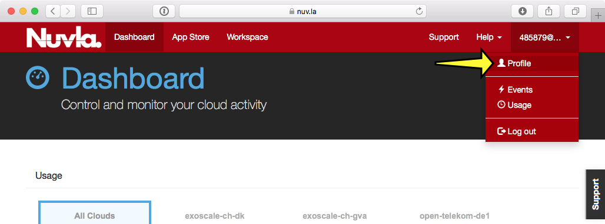
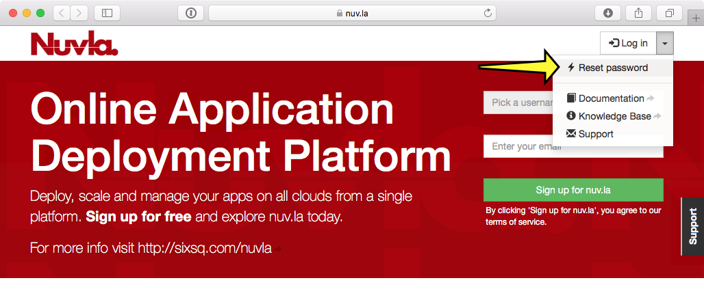
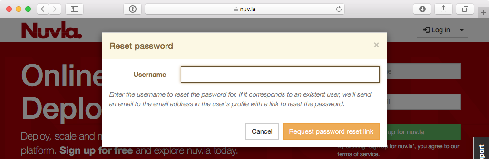

Create API Key/Secret
=====================

Nuvla supports the use of generated API key/secret pairs for
accessing the service.  Compared to other authentication methods,
they provide more control over
access granted to clients accessing Nuvla via the API and command
line.

The API key/secret pairs have the following advantages over using
other authentication mechanisms:

 - Many independent pairs can be created allowing fine-grained control
   over programmatic access by clients.
 - API key/secret pairs created with a predefined lifetime
   (time-to-live, TTL), disallow access after the TTL has expired.
 - Long-lived clients can use API key/secret pairs with an unlimited
   lifetime to simplify credential management.
 - **Any API key/secret can be revoked at any time and independently of
   any other credentials.**

The internal process for handling authentication when using API
key/secrets is the following:

 1. Create an API key/secret pair, saving the secret provided in the
    response.
 2. Use the API key/secret to authenticate against the Nuvla service.
 3. The server responds with a time-limited session cookie that must
    be used with subsequent requests to the server.
 4. When the session cookie expires, the client must use the API
    key/secret pair to re-authenticate with the server.

While the API key/secret can be revoked, the session cookie is an
**irrevocable access token** with limited lifetime. Consequently,
after an API key/secret has been revoked, there is a window of time
where active session cookies will still allow access.  **The maximum
lifetime of a session cookie is fixed at 24 hours.**

Currently the browser interface does not support generation of API
key/secret pairs.  To work around this limitation, the API key/secret
pairs can generated from the command line.

Enabling Account Password
-------------------------

For users authenticating via eduGAIN and Elixir AAI, **you must
enable a password for your Nuvla account**. To do this, use the password
reset function.

1. Log into Nuvla normally with your eduGAIN or Elixir AAI identity
provider.
   
2. After logging in, capture your full username from your profile page.
You will need the **complete** username.

3. Logout from Nuvla and start the password reset process.  The link is
shown in the screenshot below:

           
4. Provide your complete username in the password dialog.  This will send
a confirmation email to your address.

5. Visit the link provided in the email.  This will then send you another
email with a randomly generated password.

6. Using your username and the randomly generated password, log into
the server via the command line using the `ss-curl` alias.  Details on how to setup the
`ss-curl` alias can be found in the `SlipStream documentation
<http://ssdocs.sixsq.com/en/latest/tutorials/ss/automating-slipstream.html#ss-curl-login>`_.

.. note:: Be sure to setup the `ss-curl` alias.  See the SlipStream cURL_
documentation for setting up the correct alias.

With all that completed, you can now create an API key/secret.

Credential Creation
-------------------

Once logged in, you can then generate new API key/secret credentials.
The details can be found in the `SlipStream API Documentation
<http://ssapi.sixsq.com/#credential-(cimi)>`_ (API Key and Secret
section).

Create a template with the information necessary to create the
credential:

.. code-block:: json

   {
     "credentialTemplate" : {
                              "href" : "credential-template/generate-api-key",
                              "ttl" : 86400
                             }
   }

The `ttl` parameter for the API key/secret lifetime (TTL) is optional.
If not provided, the credential will not expire (but can still be
revoked at anytime.) The TTL value is in seconds, so the above time
corresponds to 1 day. Name the file something like ``create.json``.

To actually create the new credential:

.. code-block:: bash

    $ ss-curl https://nuv.la/api/credential \
     -X POST \
     -H 'content-type: application/json' \
     -d @create.json

.. code-block:: json

    {
      "status" : 201,
      "message" : "created credential/05797630-c1e2-488b-96cd-2e44acc8e286",
      "resource-id" : "credential/05797630-c1e2-488b-96cd-2e44acc8e286",
      "secretKey" : "..."
    } 

Note carefully the secret (secretKey) that is returned from the
server.  The "key" is the value of "resource-id". This secret is not
stored on the server and cannot be recovered.

Using the API Key/Secret
------------------------

You can use the API key/secret to log in via the `REST API
<http://ssapi.sixsq.com/#session-(cimi)>`_, `Python API
<https://slipstream.github.io/SlipStreamPythonAPI/>`_, and `Clojure
API <http://slipstream.github.io/SlipStreamClojureAPI/>`_.

Revoking an API Key/Secret
--------------------------

When logged into Nuvla via the API, revoking an API key/secret
corresponds to deleting the credential.  This can be accomplished by
doing the following:

.. code-block:: bash

    $ ss-curl \
     -X DELETE \
     https://nuv.la/api/credential/05797630-c1e2-488b-96cd-2e44acc8e286

Once the credential is deleted/revoked, it can no longer be used to
authenticate with Nuvla.

.. _cURL: http://ssdocs.sixsq.com/en/latest/tutorials/ss/automating-slipstream.html#curl 
