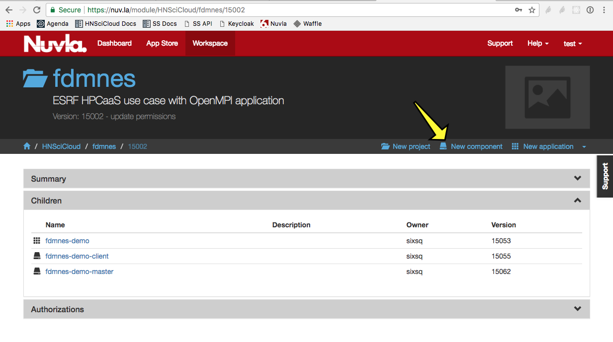
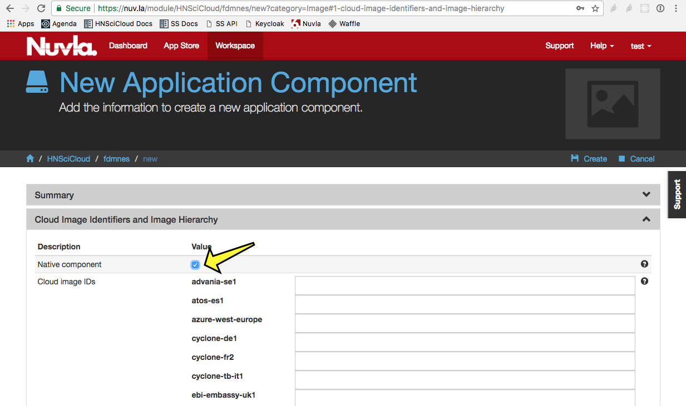
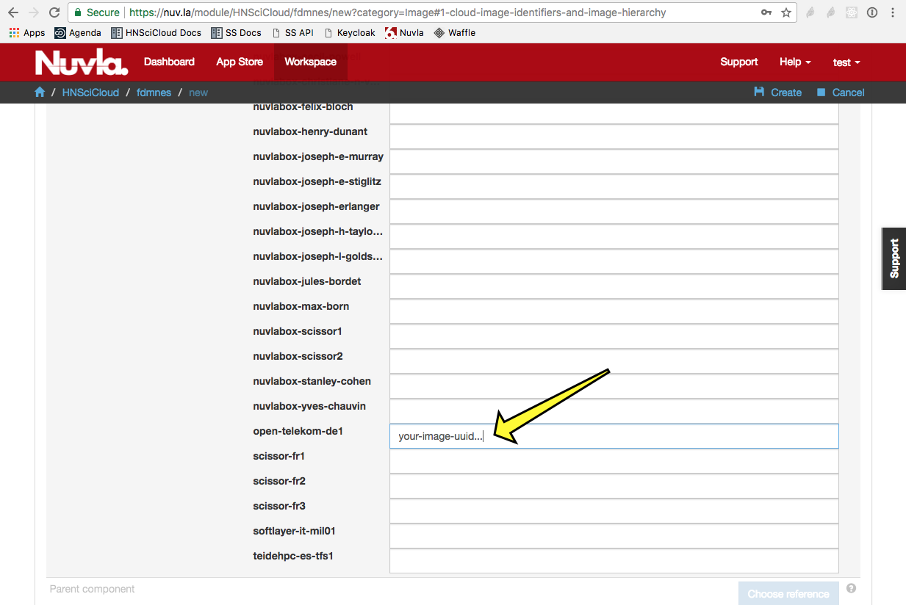
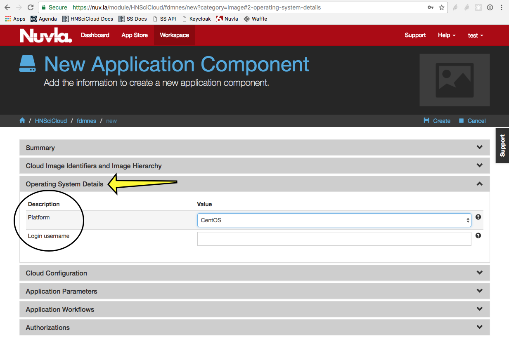
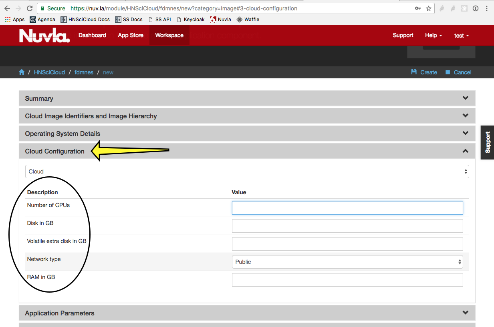

Binary VM Images
================

Uploading of binary VM images is strongly discouraged.  Instead, use
of the Nuvla features for creating `portable recipes`_ (optionally
with the `build feature`_) or the use of containers are preferred
solutions.

.. note:: From experience, **native base images provided by cloud
          providers are optimised for their cloud**. They tend to boot
          faster, are smaller and ultimately are more performant.
          Custom binary images tend to under perform compared to
          native images, and generally require adjustments, which can
          be time consuming.

Open Telkom Cloud (OTC)
-----------------------

Nonetheless, if you must use a binary VM image, you can upload the
image to OTC.  The documentation for making private images available
on OTC via the GUI is available from the OTC website:

 - `Uploading an External Image File
   <https://docs.otc.t-systems.com/en-us/usermanual/ims/en-us_topic_0030713183.html>`_
 - `Registering the Image File as a Private Image
   <https://docs.otc.t-systems.com/en-us/usermanual/ims/en-us_topic_0030713184.html>`_   
 - `Creating an ECS Using an Image
   <https://docs.otc.t-systems.com/en-us/usermanual/ims/en-us_topic_0030713200.html>`_ 

The API can also be used.  The documentation for this is:

 - `Uploading an Image via API
   <https://docs.otc.t-systems.com/en-us/api/ims/en-us_topic_0031615566.html>`_ 
 - `Registering an Image File as a Private Image via API
   <https://docs.otc.t-systems.com/en-us/api/ims/en-us_topic_0037131984.html>`_

You can then use this image directly from the OTC web browser
interface and the API.

Integration with Nuvla
----------------------

If you want to use this image from Nuvla, you must define it as a
`Native Image`_. This requires that `cloud-init`_ be installed in the
image (along with its Python dependency). Once defined as a native
image, it can be used like any other SlipStream component.

The detailed process is described below.  First, navigate to the
project (subdirectory) where you want to create your native component
(image) and click on the "New component" link.

To make this a native component (i.e. one which references a binary
image in the targeted cloud), check the "Native component" checkbox.
Provide the image identifier(s) for the cloud(s). The image shows an
example for OTC. 

                 

You will also want to configure the image's operating system details
and the minimum resources required for the image. 

As mentioned previously, the image must use `cloud-init`_ for the
contextualization.  In addition, it must also have a compatible
version (v2.6+, not v3.x) of python installed.  Some other
requirements for the images can be found in a `VMware binary image`_
KnowledgeBase article.  The article targets VMware, but the
requirements are more general.

.. _`portable recipes`: http://ssdocs.sixsq.com/en/latest/tutorials/ss/images.html

.. _`build feature`: http://ssdocs.sixsq.com/en/latest/tutorials/ss/faster-deployment.html 

.. _`Native Image`: http://ssdocs.sixsq.com/en/latest/tutorials/ss/images.html#native-images

.. _cloud-init: https://cloud-init.io

.. _`VMware binary image`: https://support.sixsq.com/solution/articles/5000632694-requirements-for-integrating-vmware-vcloud-with-slipstream
