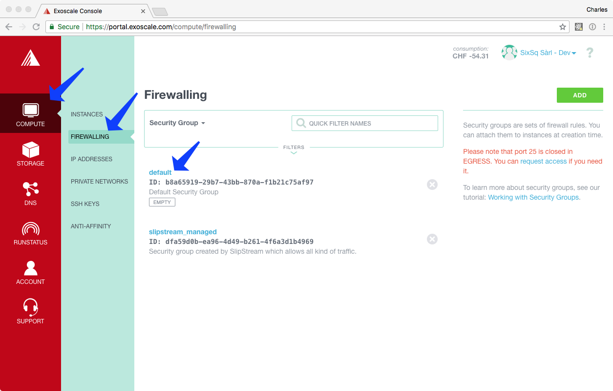
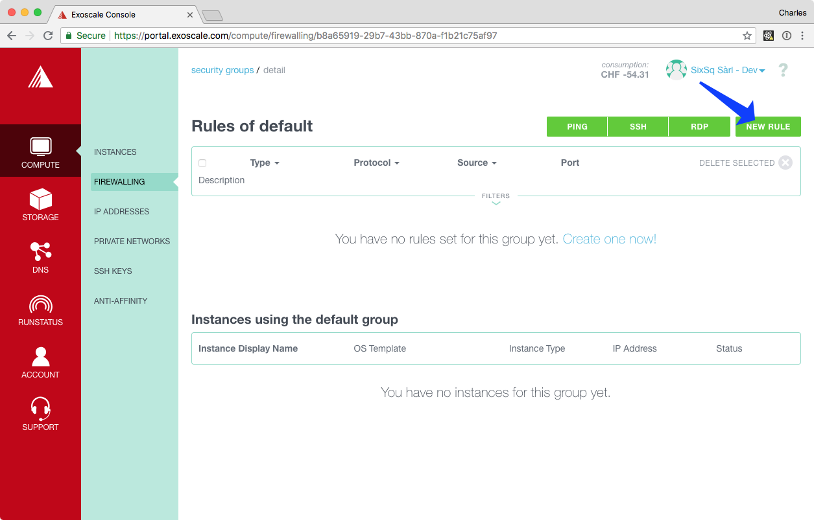
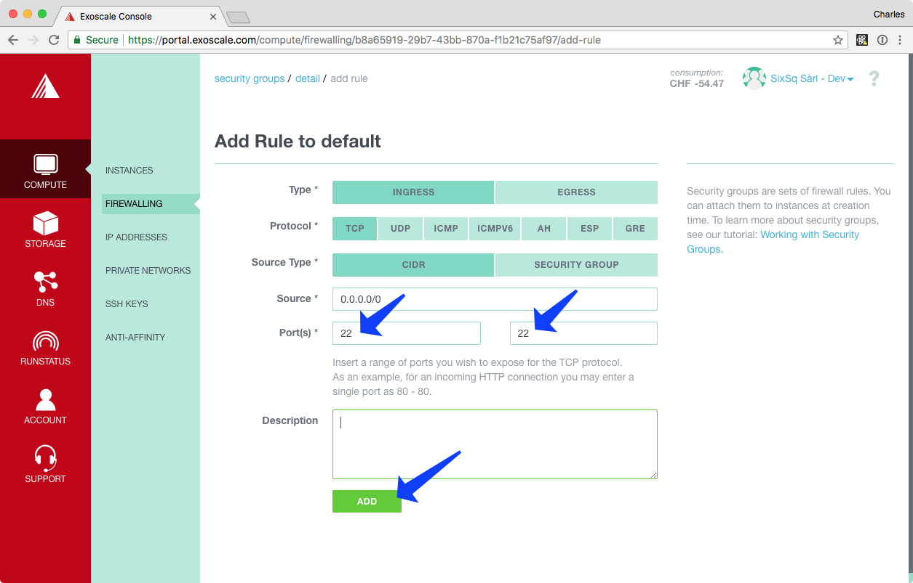
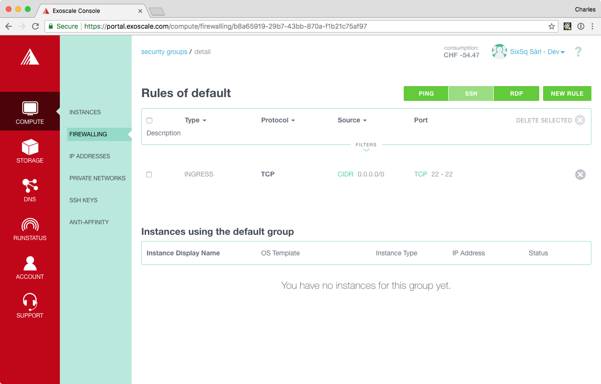
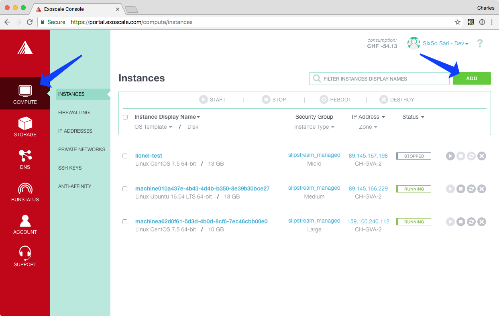
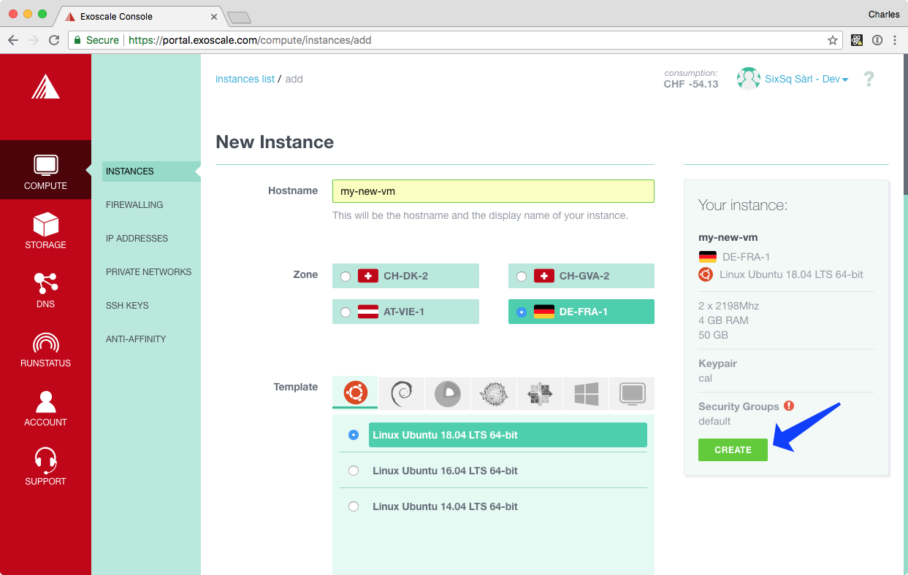
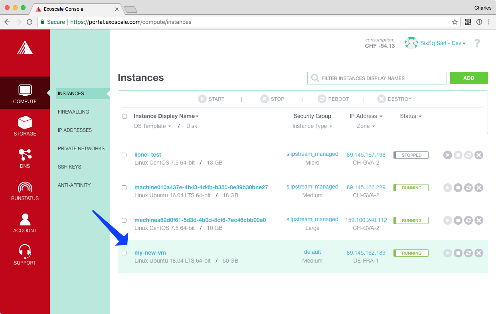
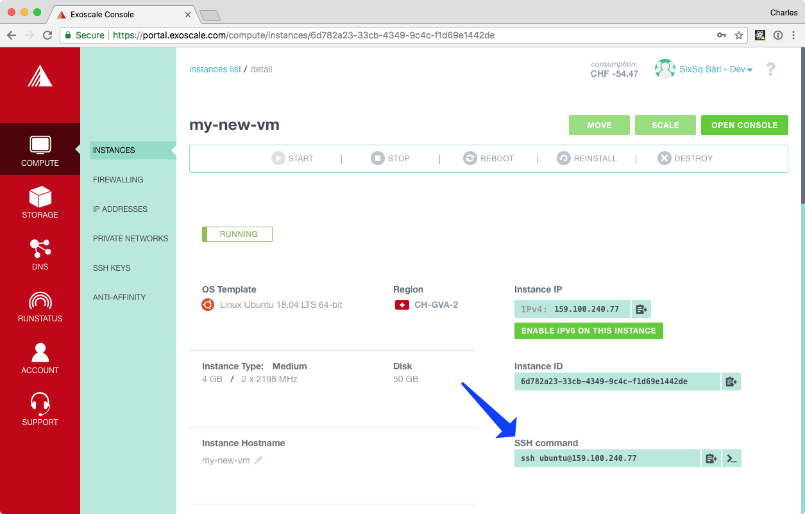
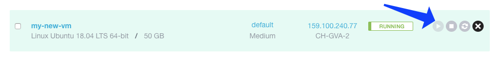

.. _exoscale-lifecycle:

Virtual Machine Lifecycle
=========================

The full lifecycle for Virtual Machines can be handled through the
`Exoscale portal`_.  Log into the portal to view and control your
resources.

Security Groups
---------------

Your account will initially be configured with an empty default
security group.  This essentially creates a firewall for your virtual
machines that blocks access on all ports.  This is a secure but not
very useful default.

At least allow access to the SSH port to the security group so that
you can log into your virtual machines.  The following steps will
allow input connections on port 22 (SSH):

 - Navigate to the "COMPUTE" and then "FIREWALLING" panel.
 - Click on "default".
 - Click on "NEW RULE".
 - Add port range 22-22.
 - Click "ADD".

At the end of this, you should see a single rule allowing inbound
access on port 22 (SSH).  Any changes that you make to the security
group are applied in real time to the machines that use the group.

.. note::

   This could be accomplished more quickly by using the "SSH" button
   on the security group page.  Using the dialog allows you to see the
   process for other, less common ports.

Starting Virtual Machines
-------------------------

Once you have logged into the `Exoscale portal`_, you can start new
virtual machine instances by doing the following:

 - Navigate to the "COMPUTE" tab and then the "INSTANCES" panel,
 - Click the "ADD" button,
 - Fill in the form with the VM characteristics, and then
 - Click on the "CREATE" button.

You will then see your new machine in the list of virtual machine
instances. 

.. note::

   Be sure that you have imported an SSH public key, so that you can
   access your instance via SSH.

Exoscale supports a variety of Linux operating systems and
Windows. Exoscale has four geographic regions: Geneva, Zurich, Vienna,
and Frankfurt.  The **Geneva** and **Frankfurt** regions are the
primary ones for the HNSciCloud project.

Accessing Virtual Machines
--------------------------

You can follow the deployment progress of your machine from the list
of instances.  You can get the details for a particular machine by
clicking on the machine name in the list.  You should see a page
similar to the following screenshot.

The command to use to access the machine can be found on this
page. The command contains both the correct username and the machine's
IP address.

From the terminal, you should be able to do the following to access
the machine:

.. code-block:: sh
    
   ~> ssh ubuntu@159.100.240.77 
   Warning: Permanently added '159.100.240.77' (ECDSA) to the list of known hosts.
   Welcome to Ubuntu 18.04 LTS (GNU/Linux 4.15.0-20-generic x86_64)
   
   ...
   
   To run a command as administrator (user "root"), use "sudo <command>".
   See "man sudo_root" for details.
   
   ubuntu@my-new-vm:~$ 

Either you will be able to log directly into a "root" account or you
can use the command ``sudo su -`` to access it.  With the "root" account
you have full control to configure the machine with the software you
need.

Terminating Virtual Machines
----------------------------

Either from the Virtual Machine detail page or from the instance list,
you can control the state of the machine.  With the action button
"destroy" you can terminate the machine and free any resources.

The destroyed machine will disappear from the list of instances after
the resources have been freed.

.. warning::

   When you destroy a machine, the configuration of the machine and
   all data are lost.

You can stop and restart the machine as well.  A stopped machine will
retain its configuration and data.  You will only be charged for the
storage capacity of a stopped machine.

.. _`support@sixsq.com`: support@sixsq.com

.. _`Exoscale`: https://www.exoscale.com

.. _`Exoscale Portal`: https://portal.exoscale.com

