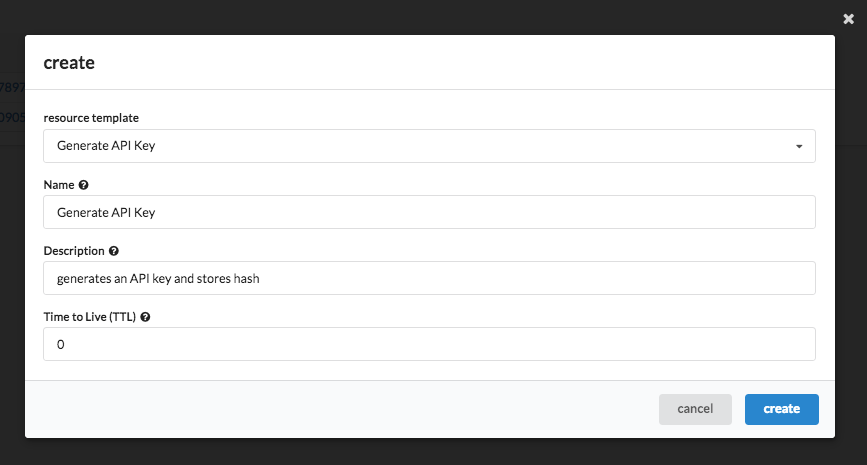
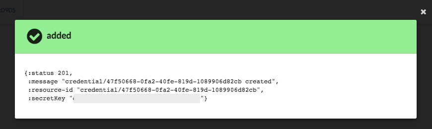

Create API Key/Secret
=====================

Nuvla supports the use of generated API key/secret pairs for
accessing the service.  Compared to other authentication methods,
they provide more control over
access granted to clients accessing Nuvla via the API and command
line.

The API key/secret pairs have the following advantages over using
other authentication mechanisms:

 - Many independent pairs can be created allowing fine-grained control
   over programmatic access by clients.
 - API key/secret pairs created with a predefined lifetime
   (time-to-live, TTL), disallow access after the TTL has expired.
 - Long-lived clients can use API key/secret pairs with an unlimited
   lifetime to simplify credential management.
 - **Any API key/secret can be revoked at any time and independently of
   any other credentials.**

The internal process for handling authentication when using API
key/secrets is the following:

 1. Create an API key/secret pair, saving the secret provided in the
    response.
 2. Use the API key/secret to authenticate against the Nuvla service.
 3. The server responds with a time-limited session cookie that must
    be used with subsequent requests to the server.
 4. When the session cookie expires, the client must use the API
    key/secret pair to re-authenticate with the server.

While the API key/secret can be revoked, the session cookie is an
**irrevocable access token** with limited lifetime. Consequently,
after an API key/secret has been revoked, there is a window of time
where active session cookies will still allow access.  **The maximum
lifetime of a session cookie is fixed at 24 hours.**

Creating an API Key/Secret
--------------------------

The easiest method to create an API Key/Secret is via the newer
browser interface to Nuvla.  The procedure to do this is:

 1. Navigate to the `Nuvla WebUI`_.
 2. Ensure that you are logged in.  Click on the login button in the
    upper right-hand corner if you are not.
 3. Navigate to the search panel for `Credentials`_.
 4. Click on the "search" button.
 5. Click on the "add" button.
 6. In the dialog, select "Generate API Key" if it isn't already
    selected.
 7. Change the values for "name", "description", and "TTL" if
    desired.
 8. Click on "create".
 9. Note the secret provided in the dialog.  You will not be able to
    recover this secret later. Your API key is the "resource-id" field and the secret the "secretKey".

Using the API Key/Secret
------------------------

You can use the API key/secret to log in via the `REST API
<http://ssapi.sixsq.com/#session-(cimi)>`_, `Python API
<https://slipstream.github.io/SlipStreamPythonAPI/>`_, `Clojure
API <http://slipstream.github.io/SlipStreamClojureAPI/>`_, and `Libcloud driver <https://slipstream.github.io/slipstream-libcloud-driver/>`_.

Revoking an API Key/Secret
--------------------------

When logged into Nuvla via the API, revoking an API key/secret
corresponds to deleting the credential.  This can be accomplished by
doing the following:

.. code-block:: bash

    $ ss-curl \
     -X DELETE \
     https://nuv.la/api/credential/05797630-c1e2-488b-96cd-2e44acc8e286

Once the credential is deleted/revoked, it can no longer be used to
authenticate with Nuvla.

.. _cURL: http://ssdocs.sixsq.com/en/latest/tutorials/ss/automating-slipstream.html#curl

.. _Nuvla WebUI: https://nuv.la/webui

.. _Credentials: https://nuv.la/webui/cimi/credential

