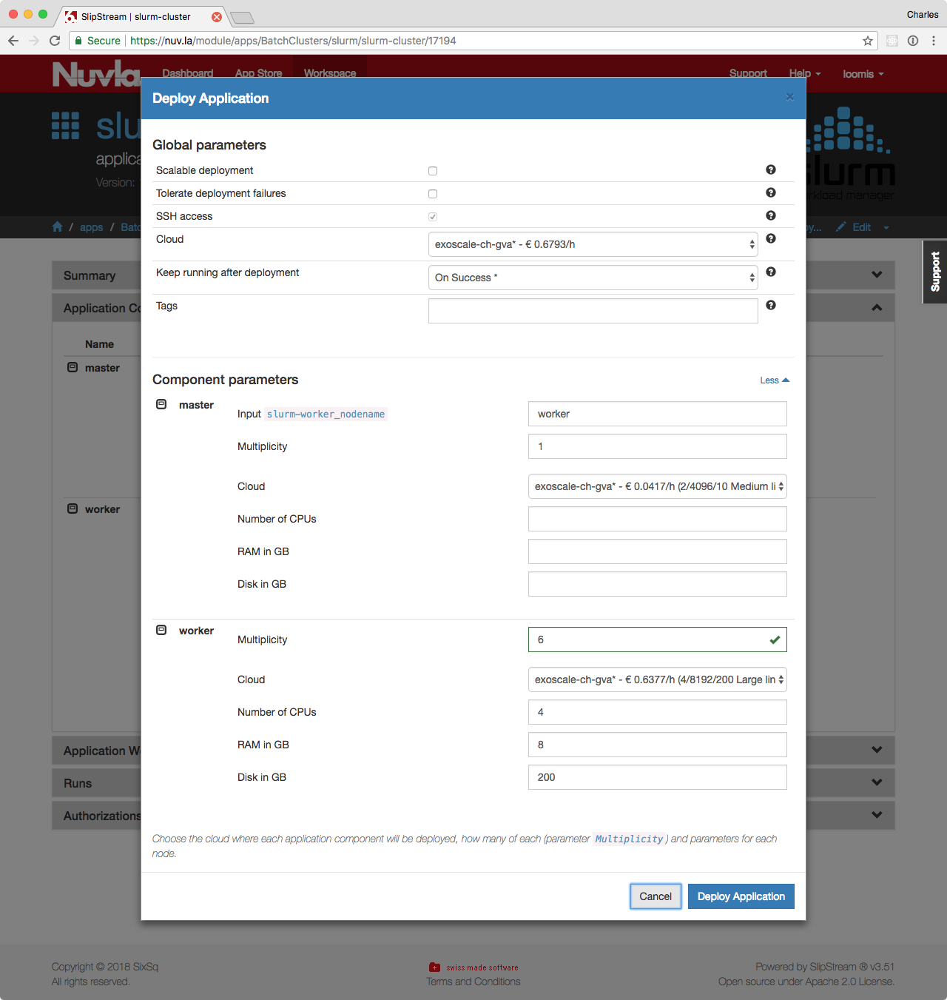

.. _batch:

Batch Clusters
==============

High Performance Computing (HPC) involves the execution of a
CPU-intensive application with a particular set of input parameters
and input data sets. Because of the large CPU requirements, these
applications normally use the Message Passing Interface (MPI) to
create a high-performance platform from a sizable number of discrete
machines.

These types of applications are naturally job or task-based and
historically have been run on batch systems such as Slurm_, or
HTCondor_.  These systems can be run within cloud infrastructures,
although they generally lead to a significant amount of incidental
complexity and service management overheads.

An example SlipStream application for a `Slurm cluster`_ is
provided. This example deploys a fully functioning Slurm cluster with
the following characteristics:

 - One master node and multiple workers (two by default).
 - The ``/home`` area exported by the master to all of the workers.
 - A single, default SLURM partition containing all nodes.
 - Common software packages (e.g. g++, OpenMPI) are installed.
 - The root account on the master can access all workers via SSH.
 - Parallel SSH has been installed to facilitate cluster management.

The cluster can be used from the ``tuser`` account and managed through
the ``root`` account on the master node.

Starting the Cluster
--------------------

To deploy the cluster, navigate to the "slurm-cluster" application
within Nuvla and click the ``Deploy...`` action. You can choose which
cloud infrastructure to use, the number of workers, and their size
from the deployment dialog.

You can also deploy this application from the command line using the
`SlipStream client`_.  Before using any of the SlipStream commands,
you will need to authenticate with Nuvla using the ``ss-login``
command::

  $ ss-login --username=<username> --password=<password>

On success, this will exit with a return code of 0 and store an
authentication token locally for the SlipStream client commands.  You
can use the ``ss-logout`` command to delete this authentication token.

You can now start a SLURM cluster with the ``ss-execute`` command::

  $ ss-execute \
      --parameters="worker:multiplicity=4,
                    worker:instance.type=Huge" \
      --keep-running=on-success \
      --wait=20 \
      --final-states=Done,Cancelled,Aborted,Ready \
      apps/BatchClusters/slurm/slurm-cluster

  ::: Waiting 20 min for Run https://nuv.la/run/1a90f7df-a8db-4fa8-b2d2-463afa296c5a to reach Done,Cancelled,Aborted,Ready
  [2018-19-24-13:19:59 UTC] State: Initializing
  [2018-20-24-13:20:20 UTC] State: Initializing
  [2018-20-24-13:20:50 UTC] State: Initializing
  [2018-21-24-13:21:21 UTC] State: Initializing
  [2018-21-24-13:21:51 UTC] State: Provisioning
  [2018-22-24-13:22:21 UTC] State: Provisioning
  [2018-22-24-13:22:52 UTC] State: Provisioning
  [2018-23-24-13:23:22 UTC] State: Provisioning
  [2018-23-24-13:23:53 UTC] State: Provisioning
  [2018-24-24-13:24:23 UTC] State: Executing
  [2018-24-24-13:24:54 UTC] State: Executing
  [2018-25-24-13:25:24 UTC] State: Executing
  [2018-25-24-13:25:55 UTC] State: Executing
  [2018-26-24-13:26:25 UTC] State: Executing
  [2018-26-24-13:26:56 UTC] State: Executing
  [2018-27-24-13:27:26 UTC] State: Executing
  [2018-27-24-13:27:57 UTC] State: Executing
  [2018-28-24-13:28:27 UTC] State: Executing
  [2018-28-24-13:28:57 UTC] State: Executing
  [2018-29-24-13:29:28 UTC] State: Executing
  [2018-29-24-13:29:58 UTC] State: SendingReports
  [2018-30-24-13:30:29 UTC] State: SendingReports
  OK - State: Ready. Run: https://nuv.la/run/1a90f7df-a8db-4fa8-b2d2-463afa296c5a
      
With the given options, the SLURM cluster will contain 4 workers and 1
master.  Each of the workers will be of the "Huge" flavor.  The
command will wait until the cluster reaches one of the given final
states.  It will also provide you with the deployment ("run")
identifier (the UUID in the "https://nuv.la/run/..." URL) that can be
used to terminate the cluster.

The example shows how to change the number of worker nodes in the
cluster with the **worker:multiplicity** parameter.  You can also
specify the flavor (instance type) of the machine with the
**worker:instance.type** parameter.  Supported values are: Micro,
Tiny, Small, Medium, Large, Extra-large, Huge, Mega, Titan, GPU-small,
and GPU-large.  Access to the GPU and larger machines must be
requested through support. You can also specify the disk size with
**worker:disk** and/or **master:disk**.

Use the ``--help`` option to find out how to set other options for the
``ss-execute`` command or the SLURM application description for other
parameters.

Accessing the Cluster
---------------------

Once the deployment is in the "Ready" state, you can log into the
master node to use the cluster.  You can find the IP address for the
master node from Nuvla in the deployment details page, or you can get
the IP address **after the deployment is ready** with the command::

  $ ss-get --run=1a90f7df-a8db-4fa8-b2d2-463afa296c5a master.1:hostname

  159.100.244.254

replacing the run ID with the one for your deployment.  The SSH key
from your user profile will have been added to the ``root`` and
``tuser`` accounts.

Managing the Cluster
--------------------

The SLURM cluster will have been deployed with common software
packages and a batch queue ready to run jobs.  Nonetheless, you may
want to adjust the node or SLURM configurations.  You might want to
consult the SLURM_ Documentation or `Administrator Quick Start`_ for
managing SLURM.

The ``root`` account on the master node can be used to manage the
cluster.  To facilitate this, parallel SSH has been installed and the
root account can access all workers via SSH. Two files have been
created in ``/root`` that list all hosts in the cluster
(``hosts-cluster``) and all workers (``hosts-workers``).

From the ``root`` account on the master, you can, for example, install
the package "bc" all nodes with the command::

  $ parallel-ssh --hosts=hosts-cluster apt install -y bc
  
  [1] 13:58:40 [SUCCESS] worker-1
  [2] 13:58:40 [SUCCESS] worker-2
  [3] 13:58:40 [SUCCESS] master

The command also allows you to see or capture the output from each
command.  There is also a ``parallel-scp`` command for distributing
files around the cluster. 

Running Jobs
------------

Generally, you will want to run your jobs from a non-privileged
account. The account ``tuser`` has been preconfigured for this.  You
might want to consult the SLURM_ Documentation or `User Quick Start`_
for information on using SLURM for running your applications.

The entire ``/home`` area is exported via NFS to all workers.
Consequently, all user accounts have a shared NFS home area across the
cluster.  Data and/or executables uploaded to the master node will be
visible across the cluster. 

Stopping the Cluster
--------------------

When your calculations have completed, you can release the resources
assigned to the cluster by either clicking the ``Terminate`` action
from the deployment detail page in the web application or using the
command line::

  $ ss-terminate 98f42dca-98e8-4265-875e-90ddf81d6fca

The command line will wait for the full termination of the run. 

.. warning:: **All** the resources, including local storage, will be
             released.  Be sure to copy your results off the master
             node to your preferred persistent storage.

.. _SlipStream Client: http://ssdocs.sixsq.com/en/latest/tutorials/ss/automating-slipstream.html#command-line-client

.. _SLURM: https://slurm.schedmd.com/overview.html

.. _HTCondor: https://research.cs.wisc.edu/htcondor/ 

.. _Slurm cluster: https://nuv.la/module/apps/BatchClusters/slurm/slurm-cluster

.. _Administrator Quick Start: https://slurm.schedmd.com/quickstart_admin.html

.. _User Quick Start: https://slurm.schedmd.com/quickstart.html

