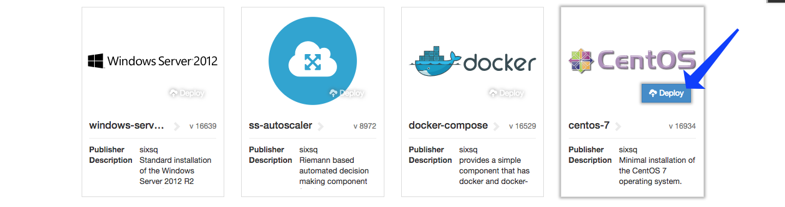
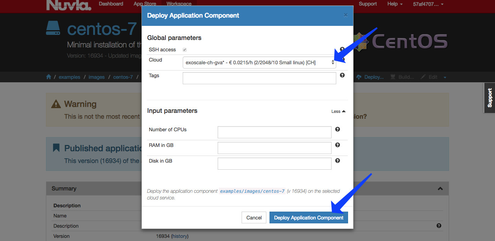
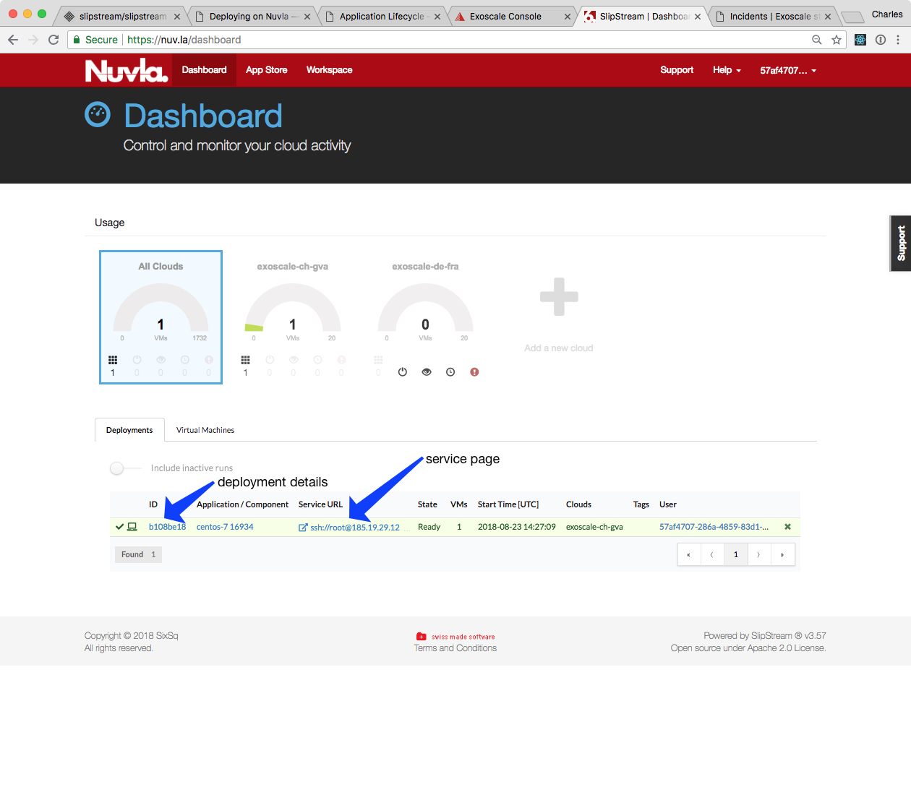
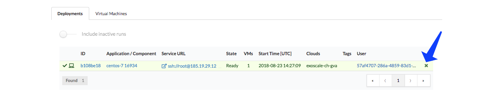
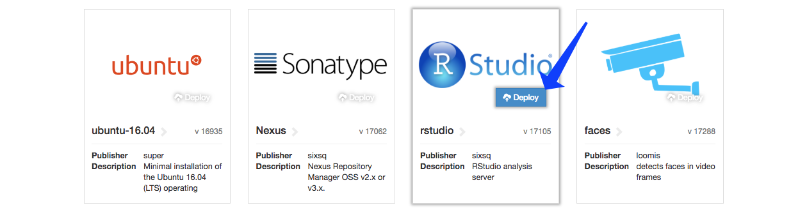
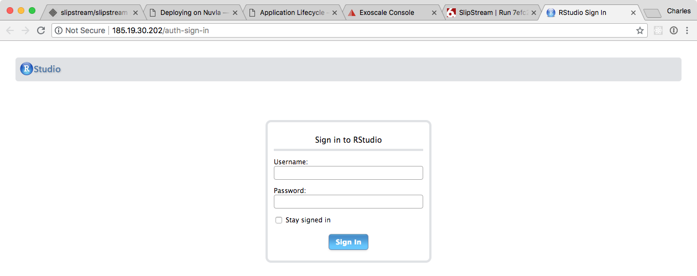
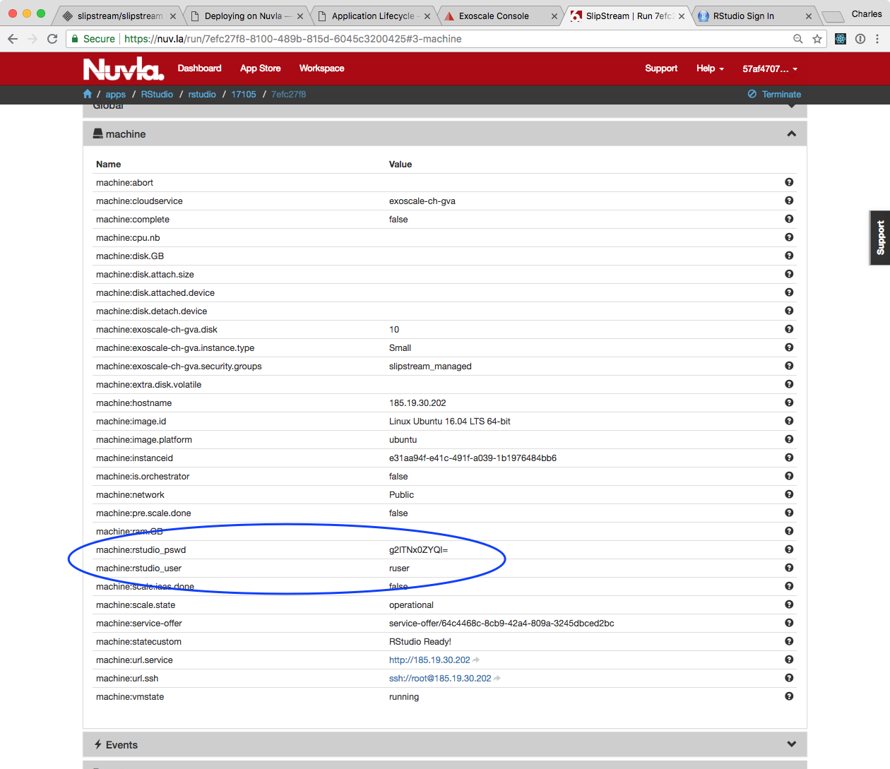
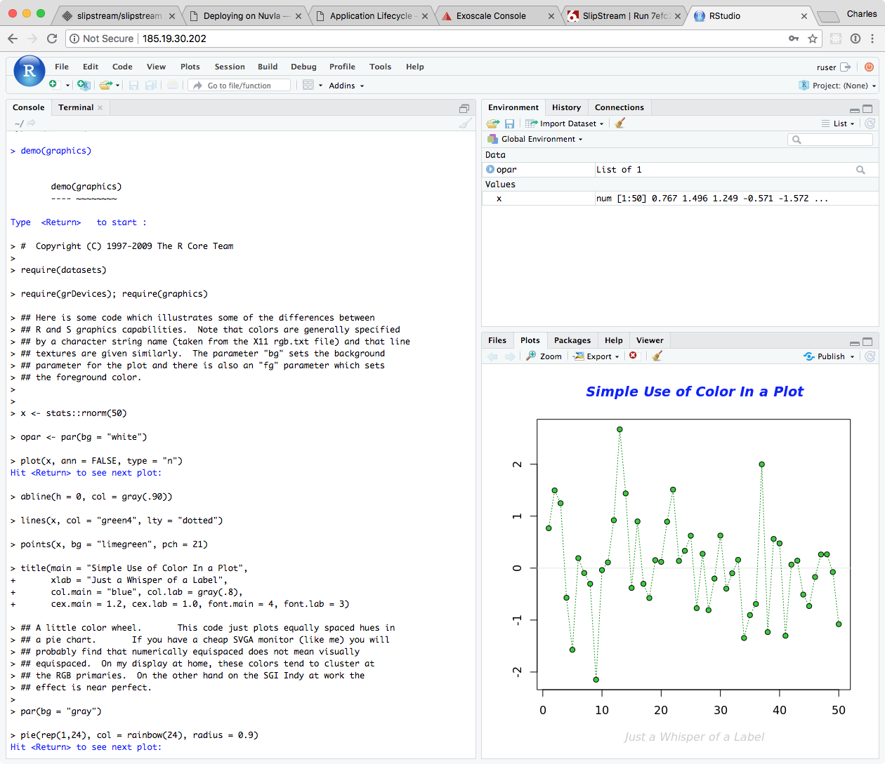
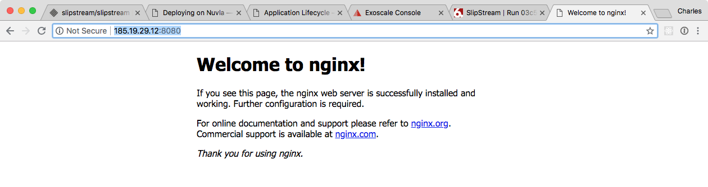

.. _nuvla-lifecycle:

Application Lifecycle
=====================

Jargon
------

Nuvla has some jargon associated with it, that it would be helpful to
know.

Image
    A reference to a virtual machine image in the supported clouds.
    Usually something like Ubuntu or CentOS.
Component
    A single machine service that references an image and defines a
    set of recipes to install and configure the necessary
    software. This is something like R-Studio or Wordpress.
Application
    A service that consists of multiple machines that is managed as a
    unit.  Examples of these are things like a SLURM batch cluster or
    a Docker Swarm cluster.

Generically, all these are called "modules".  

App Store
---------

The first place to look for interesting components (single virtual
machine services) and applications (multiple machine services) is the
`Nuvla App Store`_.

.. figure:: ../images/nuvlaAppStore.png
   :alt: Support Desk Diagram
   :width: 100%
   :align: center

Within the `Nuvla Workspace`_, there are other applications of
interest:

 - ``examples/images``: Minimal distributions of common operating
   systems. Usually used as the basis for other components.
 - ``apps``: Curated list of applications that can be used as examples
   for your own applications.
 - ``HNSciCloud``: `This`_ workspace contains several prearranged
   components and applications to facilitate the testing and
   evaluation process, including for example:

    - ``HNSciCloud/Benchmarking``: Both generic and
      HNSciCloud-specific benchmarks for evaluating the
      system. Relevant for Test Cases 2.2, 5.1 and 11.4.3.
    - ``HNSciCloud/Images``: A subset of ``examples/images``,
      containing only the HNSciCloud specific operating systems.
    - ``HNSciCloud/VMProvisioningPersonalisation``: An App for testing
      the provisioning and contextualization of a VM, according to
      Test Case 2.5.
    - ``HNSciCloud/S3EndpointTest-Exoscale_OTC``: An App for testing
      S3 in both Exoscale and OTC, according to Test Case 2.3.
    - ``HNSciCloud/HDF5_IO``: An App for verifying HDF5 compliance
      with the VMs' local storage in the cloud, according to Test Case
      4.1.

Other application definitions will appear over time.  If you have
specific needs, contact SixSq support to request new ones.

Deploying an Image
------------------

The simplest thing to deploy is an image.

Look through the App Store and find the Ubuntu or CentOS image then
click on the "deploy" button.

In the deployment dialog, choose the cloud/region you want to use.
You can also provide tags or change the requested resources by
clicking on "More".  When you're ready, click on the "Deploy
Application Component" button.

Follow the progress from the dashboard or deployment detail page.

Once the machine is in the "Running" state, you can log into the
machine via SSH. This can be done via the "Service URL" or manually
from a terminal.

Terminate the machine by clicking on the "cross" icon in the Dashboard
or the "Terminate" action on the deployment detail page.

           

Deploying a Component
---------------------

We will continue by deploying a component. The example we will use is
an R-Studio server.  R-Studio is a web application that provides easy
use of the R statistical language.

Find the R-Studio application in the App Store.  Click on "deploy" and
follow the same process as before.  You can follow the status as you
did for the image deployment.

While waiting for the component to start, you might want to look at
the `component definition
<https://nuv.la/module/apps/RStudio/rstudio>`_ to see how a component
is defined.  Once it is in the "Running" state, you can bring up the
R-Studio interface by clicking on the "Service URL".

Each instance gets its own randomly generated password.  To find it,
look at the deployment detail page, open the "Parameters" section, and
then find the values for "rstudio-user" and "rstudio-password".

Use the username and password to log in.  You can see if it is working
by trying the ``demo(graphics)`` command in the R console.

You can terminate the machine on the Dashboard page or the deployment
detail page, as before. 

Deploying an Application
------------------------

For SlipStream an "application" consists of a deployment with multiple
virtual machines.  To assist with the lifecycle management of
applications, Nuvla will deploy one "orchestrator" machine per cloud. 

To deploy, the example application:

 - Ensure that you are logged into Nuvla.
 - Navigate to the `Docker Swarm
   <https://nuv.la/module/apps/Containers/docker-swarm/swarm>`_
   application or choose this application from the App Store.
 - Click on the `Deploy` action.
 - Click on the `Deploy Application` button in the dialog.

You should not need to change anything in the deployment dialog,
although, you may add tags to your deployment.

You will again be redirected to the Nuvla Dashboard at the end of the
process.  This application will run a Docker Swarm cluster with one
Master and one Worker by default; you can change the number of workers
in the deployment dialog if you want.  This will also take a few
minutes to complete.

If you have time, you can log into the master node with SSH and run a
container on this swarm.  You might want to try to run the nginx
webserver:

.. code-block:: sh

    # deploy nginx
    docker service create --name my-swarm-nginx -d -p 8080:80 nginx

    # show status
    docker service ps my-swarm-nginx 

Using the IP address of the master or any worker should show the nginx
welcome page.

You can use the same methods to terminate the Swarm cluster when you
are finished with it.

.. _`Nuvla App Store`:  https://nuv.la/appstore
.. _`This`: https://nuv.la/module/HNSciCloud
.. _`Nuvla Workspace`: https://nuv.la/module

.. _`Nuvla`: https://nuv.la

.. _`https://nuv.la/webui/login`: https://nuv.la/webui/login

.. _`SixSq's Federated Identity Portal`: https://fed-id.nuv.la/auth

.. _`Keycloak`: http://www.keycloak.org/

.. _`simpleSAMLphp`: https://simplesamlphp.org/

.. _`support@sixsq.com`: support@sixsq.com

.. _`here`: ../administrator/index.html

.. _`Remote Machine Access`: http://ssdocs.sixsq.com/en/latest/tutorials/ss/appendix.html?highlight=Remote%20Machine%20access#remote-machine-access
