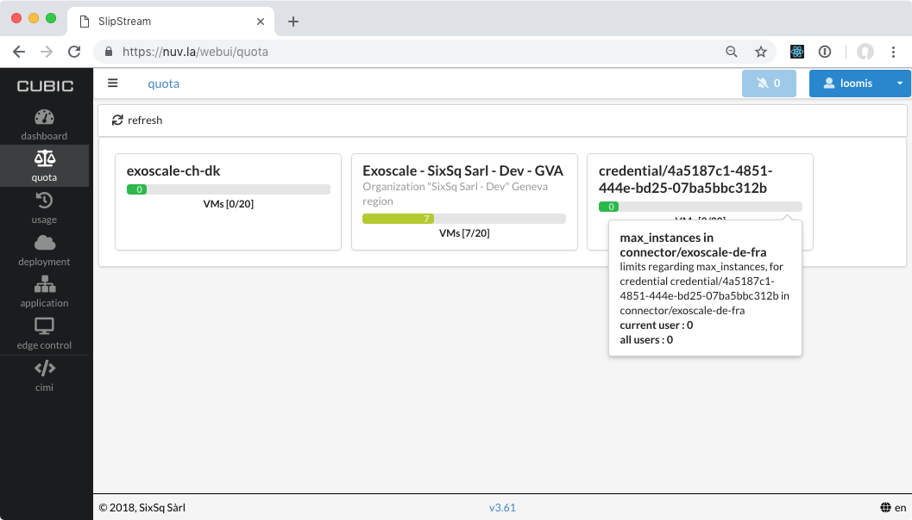

.. _quota:

Quota
=====

Nuvla protects users from overuse by applying a quota mechanism.  A
user's current quotas and quota status can be found on the `"Quota"
page <https://nuv.la/webui/quota>`_ of the new browser
interface. Hovering over a Quota indicator will provide more details.

When deploying new workloads, Nuvla checks if the requested deployment
will exceeds the quota. Only if this is not the case, will the
deployment be accepted.

.. note:: Users can request changes to their quotas by asking their
          group or organization managers, who will then authorize it
          and pass it along to support.

More details on this feature and how to access it from the API can be
found in the `Quota API documentation`_.

.. _`Quota API documentation`: https://ssapi.sixsq.com/#quota-(cimi)
