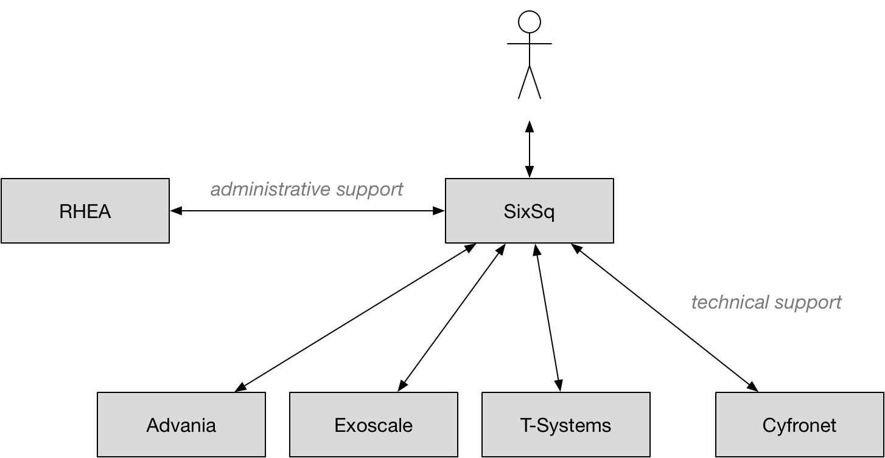

.. _support:

Support
=======

All members of the consortium are committed to providing **timely,
high-quality support** to users of the system.  SixSq will acts as a
gateway, providing first level support itself and coordinating
interactions with the other consortium members. The diagram provides
an overview of the support infrastructure.

SixSq manages its support, including the support for HNSciCloud,
through Freshdesk. The support services are offered in English, but
may also be available in the local languages of the partners
(e.g. French or German).

Users can submit support tickets via:

- Email (support@sixsq.com),
- Freshdesk_, and
- Phone (+41 22 544 17 33).

A knowledge base is integrated into the Freshdesk system. A `dedicated
section of the knowledge base
<http://support.sixsq.com/solution/categories/12000002171>`_ is
maintained for HNSciCloud.

The consortium provides 8x5 support with a 1-hour response time. Users
can set the incident priority level when submitting their tickets to
ensure that they are dealt with in the appropriate time frame.
Escalation of urgent or unsolved issues is possible.

.. _Freshdesk: https://support.sixsq.com/helpdesk
