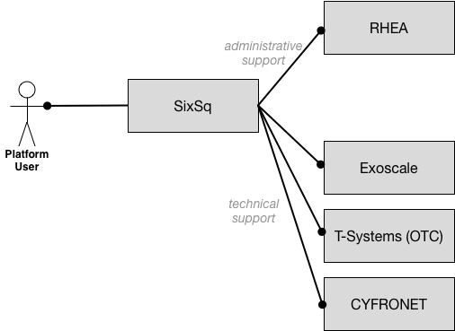

Support
=======

All members of the consortium are committed to providing timely,
high-quality support to users of the system.  To simplify the
procedures for users, SixSq will act as a gateway, providing first
level support itself and coordinating interactions with the other
consortium members. The diagram provides an overview of the support
infrastructure.

SixSq manages its support, including the support for HNSciCloud,
through Freshdesk. Users can submit support tickets via:

- Email (support@sixsq.com),
- Freshdesk (https://support.sixsq.com/helpdesk), and
- Phone (+41 22 544 17 33).

A knowledge base is integrated into the Freshdesk system. A `dedicated
section of the knowledge base
<http://support.sixsq.com/solution/categories/12000002171>`_ will be
maintained for HNSciCloud.

For Phase 2, the consortium will provide 8x5 support with a 1-hour
response time.  In order for users to receive the response time
corresponding to their incident priority level, users will be able to
assign the priority level to their incidents, which will then be
assessed by our support service staff. Automatic escalation will be
enabled inside our support service, such that incidents reaching their
SLA limits are automatically flagged and escalation triggered if
necessary. This is particularly important when resolving complex
issues involving several partners.

The support services will be offered in English by either native
speakers or minimum “B2” level. Support may also be available in the
local languages of the partners (e.g. French or German).
