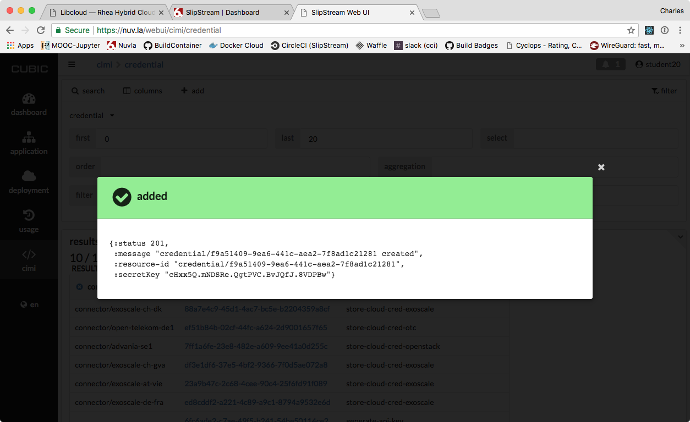

.. _libcloud:

Libcloud
========

From your Dashbord, identify the Centos-libcloud component you have
previously deployed (see Section :ref:`libcloud-deploy`) and **click
on its `Service URL` link at the top of the page**.  This will log you
into your virtual machine via SSH.

.. warning:: If you've not configured your browser to open SSH links
   automatically, you will need to open a terminal (or SSH client) and
   log in manually, using the information in the link and your SSH
   public key.

 
Using the Libcloud Compute Driver for SlipStream
------------------------------------------------

For the browser-based interfaces to Nuvla and Onedata services, you
can directly use the credentials for your Identity Provider in the
eduGAIN and Elixir AAI federations.

**For API and command line interface access to Nuvla, the use of
revocable API key/secret pairs are required.**

Generating API Key/Secret on Nuvla
^^^^^^^^^^^^^^^^^^^^^^^^^^^^^^^^^^

We will use the new "CUBIC" interface to Nuvla to generate an API
key/secret pair.

 - Navigate to the `CIMI credential page
   <https://nuv.la/webui/cimi/credential>`_.
 - Click on "search" to show the list of available credentials.
 - Click on "add" to create a new credential.
 - For the "resource template" select "Generate API key", if it isn't
   already selected.
 - Provide optional name and description, if you'd like.
 - Leave the TTL at zero.
 - Click on the `create` button.

.. note:: The ttl parameter for the API key/secret lifetime (TTL) is
   optional.  If not provided, the credential will not expire (but can
   still be revoked at anytime.)  The TTL value is in seconds, so the
   above time corresponds to 1 day.

This should bring up a success dialog that looks similar to the
following screenshot.

**From this dialog, you will need the values of the "resource-id" and
"secretKey" fields.**

.. warning: This secret is not stored on the server and cannot be
   recovered!  Be sure to store the secret somewhere safe.

Configure Terminal with API Key/Secret
^^^^^^^^^^^^^^^^^^^^^^^^^^^^^^^^^^^^^^

Store KEY and SECRET as environment variables in your terminal
session.

Copy the secret (secretKey) that is returned from the server and export it::

  $ export SECRET=<...>

The `key` is the value of `resource-id` (without the `credential\ ` prefix).
Example::

  $ export KEY=05797630-c1e2-488b-96cd-2e44acc8e286

We will use these values when starting a machine via Libcloud with
Nuvla.

Using Libcloud for Nuvla deployment
^^^^^^^^^^^^^^^^^^^^^^^^^^^^^^^^^^^

Do the following from the SSH session that you opened on your
`Centos-libcloud` machine to start a new virtual machine using your
API key/secret credentials.

We will deploy a WordPress instance via the Libcloud API.

- You will need the latest version of the `slipstream-libcloud-driver`::

    pip install slipstream-libcloud-driver

- Open a python session::

  $ python

- Import convenience modules::

    import os
    from pprint import pprint as pp

- require modules for the slipstream driver::

    import slipstream.libcloud.compute_driver
    from libcloud.compute.providers import get_driver

- create the driver itself::

    slipstream_driver = get_driver('slipstream')

- Log into Nuvla using API key and secret::

    # KEY and SECRET are taken from the environment

    ss = slipstream_driver(os.environ["KEY"],
                           os.environ["SECRET"],
                           ex_login_method='api-key')

- Optionally check you can list available images from App Store::

    pp(ss.list_images(ex_path='examples/images'))

- Complete application (node) deployment (WordPress server)::

     # Get the WordPress image
     image = ss.get_image('apps/WordPress/wordpress')

- Set WordPress Title.  You may want to change this to be convinced it
  is your instance::

     wordpress_title = 'WordPress deployed by SlipStream through Libcloud'

-  Create the dict of parameters to (re)define::

     parameters = dict(wordpress_title=wordpress_title)

-  Create the Node. After this the node should also be visible in the
   web browser interface::

     node = ss.create_node(image=image, ex_parameters=parameters)

- Wait the node to be ready::

     ss.ex_wait_node_in_state(node)

- Update the node::

     node = ss.ex_get_node(node.id)

-  Print the WordPress URL.  Visit the URL to ensure that the service
   is accessible::

     print node.extra.get('service_url')

- Destroy the node (i.e terminate a deployment)::

     ss.destroy_node(node)

Using Libcloud Directly on Exoscale
-----------------------------------

One of the benefits of the Libcloud API is that the same code can be
reused for different cloud providers.  Here we will use the same
process to deploy on Exoscale. 

- Open a python session::

  $ python

- Import convenience modules::

    import os
    from pprint import pprint as pp

- Require module for the driver::

    from libcloud.compute.providers import get_driver

- Set variables for expected deployment::

    location_name = 'ch-gva-2'
    image_name = 'Linux CentOS 7.4 64-bit 10G Disk (2018-01-08-d617dd)'
    size_name = 'Micro'
    deployment_name='libcloud-example'

- Set your Exoscale Key and Secret.  **Note that these are NOT the
  same key and secret that you used for Nuvla.** Normally, you'd use
  the `SlipStream Exoscale instructions
  <http://ssdocs.sixsq.com/en/latest/tutorials/ss/prerequisites.html#exoscale>`_
  to find the correct values.  However, your instructor will give you
  the correct values for the training. Set these variables in the
  shell::

    key=....
    secret=...

- create the driver::

    exoscale_driver = get_driver('exoscale')

- Log into Exoscale using API key and secret::

    exo = exoscale_driver(key,secret)

- Get location::

     locations = {l.name: l for l in exo.list_locations()}
     location = locations.get(location_name)

- Get image::

    images = {i.extra['displaytext']: i for i in exo.list_images(location=location)}
    image = images.get(image_name)

- Specify expected size::

     sizes = {s.name: s for s in exo.list_sizes()}
     size = sizes.get(size_name)

- Deploy the node::

   # Last parameter is optional, but is set here to allow SSH connectivity to the instance
   node = exo.create_node(name=deployment_name, size=size, image=image, location=location, ex_security_groups=['slipstream_managed'] )

At this stage you may check the instance from Exoscale portal

.. figure:: ../../images/libcloud-exo.png
   :alt: Libcloud on Exoscale
   :width: 100%
   :align: center

- Display some results::

   pp(node)
   pp(node.public_ips)
   pp(node.extra['password'])

- Display help message for SSH connection to the running instance::

     msg =""" SSH command :
     $ ssh centos@{}
     # NB : password is {}"""

     print msg.format(node.public_ips[0], node.extra['password'])

- Destroy the node (i.e terminate the deployment)::

     exo.destroy_node(node)
