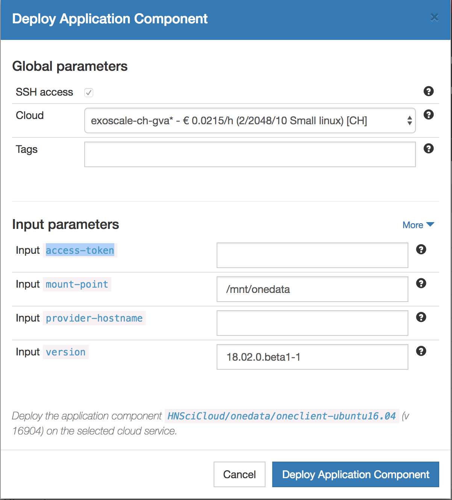

.. _onedata:

Managing Data with Onedata
==========================

Managing Files via Web Interface
--------------------------------

All files in Onedata are organized in spaces. The Web User interface
allows for uploading and downloading files, creating access tokens,
managing access rights, sharing spaces, and joining other users'
spaces.

Login to Onezone
^^^^^^^^^^^^^^^^

The Onezone web interface is already deployed at
https://onezone.rhea-hn.com. You will use your **standard federated
identity** to log into the service, **not your student identity**.

Select Your Federated Login
^^^^^^^^^^^^^^^^^^^^^^^^^^^

.. figure:: ../../images/onedata_rhea_onezone_login.png
   :alt: Onezone login
   :width: 80%
   :align: center

Join a Space
^^^^^^^^^^^^

A training space has been created called "space-load".  In the
lefthand menu under the "DATA SPACE MANAGEMENT" section, click on the
"join a space" link.

.. figure:: ../../images/op-join1.png
   :alt: Joining a Onedata Space
   :width: 80%
   :align: center

To join the space, you will need a token.  A token has been generated
for you and associated with your student username.  You can find your
token in the credentials file you have been given.  Copy the token and
paste it into the form that appeared. 

.. figure:: ../../images/op-join2.png
   :alt: Join Space Dialog
   :width: 80%
   :align: center

Select Your Storage Provider
^^^^^^^^^^^^^^^^^^^^^^^^^^^^

Onedata enables access to federated storage resources via distributed
Oneprovider services, deployed close to actual storage resources in
order to enable efficient local access and replication when necessary
between the sites. Try to always to connect to the Oneprovider
instance, which hosts the data on the storage which is closest to
where the computation will be performed.

.. figure:: ../../images/onezone.png
   :alt: Onezone web interface
   :width: 100%
   :align: center

Press **Go to your files** button in the popup. The Oneprovider
hostname is displayed in the popup, along with the provider name and
storage quota dedicated to this space:

.. figure:: ../../images/gotofile.png
   :alt: Go to files
   :width: 100%
   :align: center

You will be redirected to the Oneprovider page, where the URL starts
with https://op-exo.hn.nuv.la.

Adding or Modifying Files
^^^^^^^^^^^^^^^^^^^^^^^^^

On the Oneprovider interface:

 - Click on the "Data" tab on the left.
 - Select the "space-load" space in the dropdown list of spaces.

You should then see an interface similar to the following screenshot.

.. figure:: ../../images/empty-op.png
   :alt: Oneprovider
   :width: 100%
   :align: center

This panel will allow you to manipulate files in the space from the
browser.

 - You can upload a file to a folder, by opening that folder and then
   dragging and dropping the file into the browser window.
 - You can also upload a file by selecting a file after clicking on
   the "upload" icon.
 - Opening (usually downloading) a file simply requires double
   clicking on the file.
 - You can also create directories or files via the associated icons. 

.. note: Make sure that the popups for this browser window are not
         blocked, and unblock them if necessary.

From the web interface,

 - Create a directory with a unique name.
 - Add one or more files to this directory.
 - Download one and ensure that it has the correct contents.

We will next verify that these files can be accessed from a virtual
machine with Oneclient.

.. _posix:

Access Files on a VM via POSIX
------------------------------

Files can also be accessed directly via the POSIX protocol from a
Virtual Machine (or another client).  Running the Oneclient process
provides this functionality. 

.. _access-token:

Create an Access Token
^^^^^^^^^^^^^^^^^^^^^^

Oneclient requires an access token to interact with the data stored in
a space.  You can generate such a token from the Onezone service.

If you're currently viewing the Oneprovider interface, you can return
to Onezone by clicking on the "Providers" link in the left menu.

On the Onezone interface, you should see a menu that resembles the
following screenshot.  Open the "ACCESS TOKENS" section, if
necessary. 

.. figure:: ../../images/onedata_rhea_onezone_token.png
   :alt: Onezone token
   :width: 80%
   :align: center

Click on the "Create new access token" action to create a new token.
The token will be needed to access spaces via Oneclient.

.. _oneclient:

Deploying a OneClient Application
^^^^^^^^^^^^^^^^^^^^^^^^^^^^^^^^^

From Nuvla, go to the page containing the `Oneclient component
<https://nuv.la/module/HNSciCloud/onedata/oneclient-ubuntu16.04>`_. This
will run Oneclient on an Ubuntu 16.04 virtual machine.  The component
expects four input parameters. 

#. **access-token**: Paste the access token you had created in Onezone
   (see :ref:`access-token`) here.
#. **mount point**: The location where data coming from the spaces
   will be mounted. You can keep the default value.
#. **provider-hostname**: The Endpoint URL of your Oneprovider
   instance. Here, use the value: ``op-exo.hn.nuv.la``.
#. **version**: The Oneclient software version. Use the default value.

As usual, you can optionally set tags for the deployment.  When you've
provided all of the information, **click the "Deploy Application
Component" button**. 

SSH Connection to the VM
^^^^^^^^^^^^^^^^^^^^^^^^

#. From the Nuvla dashboard, wait for the OneClient deployment to be
   ready.

#. Log into the virtual machine via SSH either by clicking on the
   `Service URL` for the deployment or by logging in manually. The
   username for this image is "root". 

#. Browse the directory which was set as ``mount point`` for
   Onedata. If you didn't change the default it will be
   ``/mnt/onedata``. 

   In this directory, you should find a ``space-load`` folder which
   corresponds to the ``space-load`` space in Onedata.

#. Read files from Oneclient::

       $ ls -lh /mnt/onedata/space-load/

   It should contain the files you uploaded from the web
   interface. There will likely be other files there because the other
   students are also using the same space.

#. Creating files from Oneclient

   Either::

       $ touch /mnt/onedata/space-load/studentXX-test.txt

   Or::

       $ echo Grenoble > /mnt/onedata/space-load/studentXX-test.txt

   After refreshing your Oneprovider web page, you should see your new
   files in the web interface as well. 
