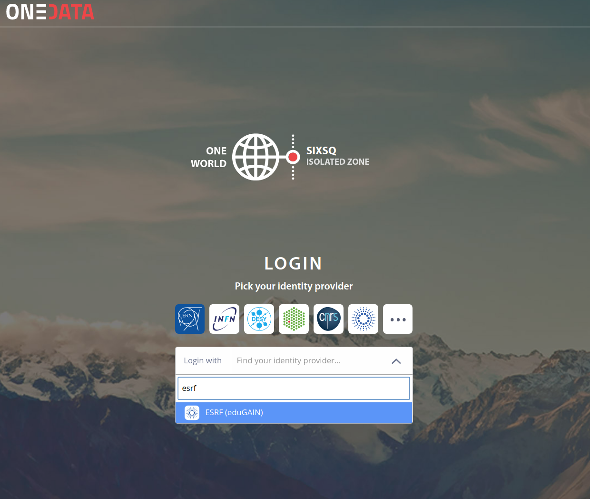
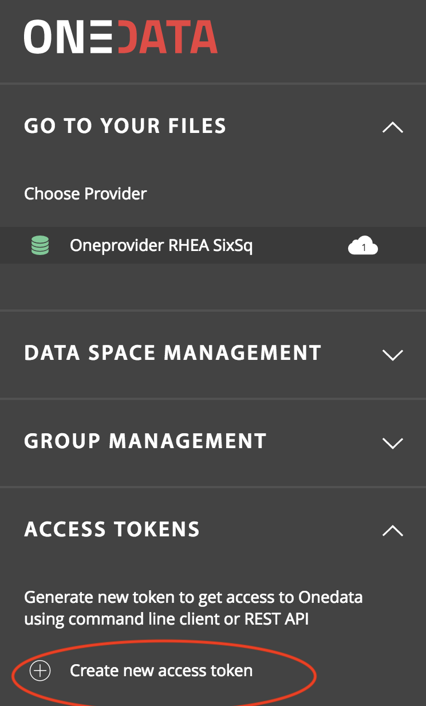
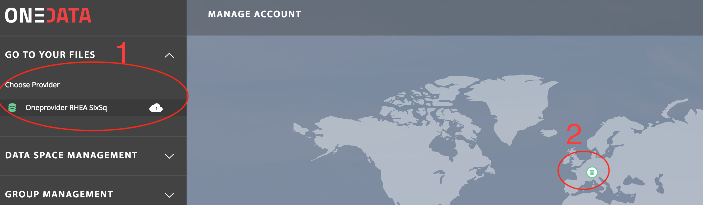
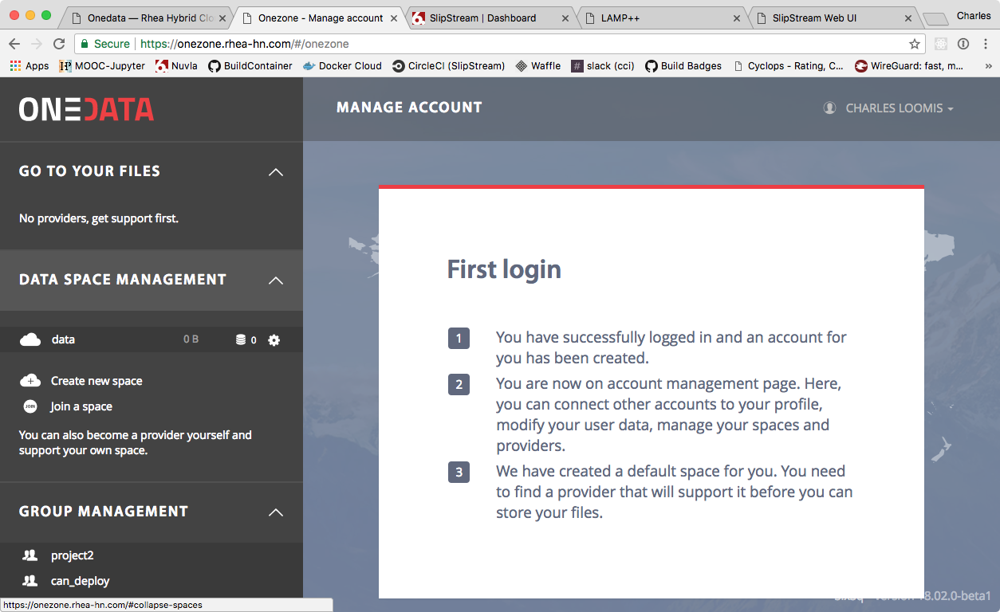
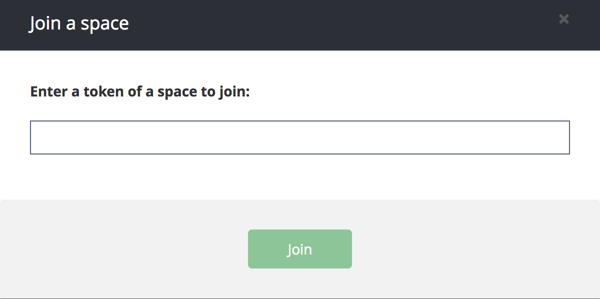
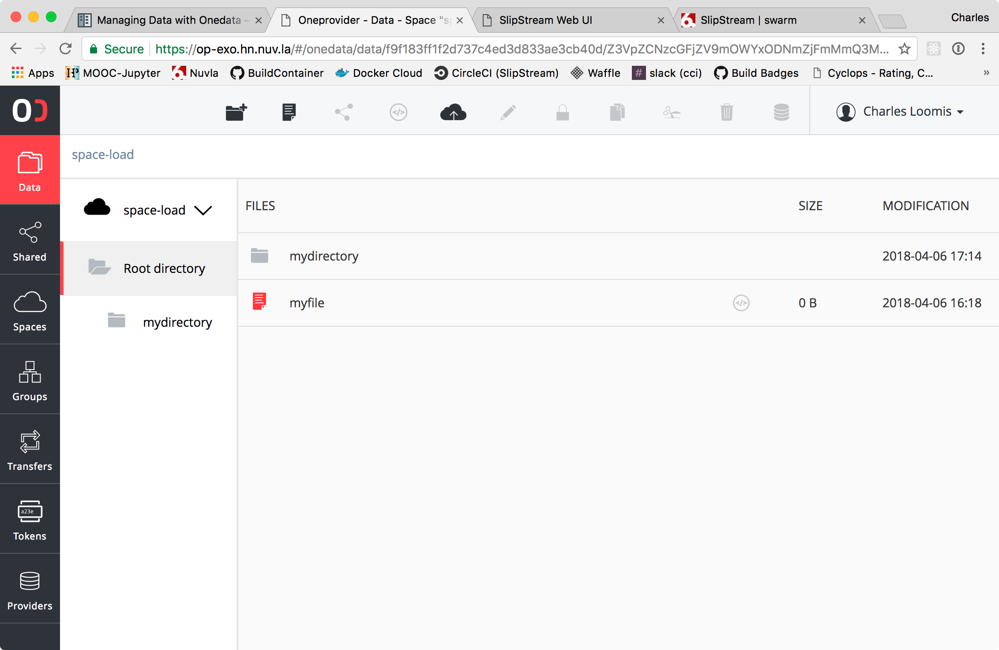

.. _onedata:

Onedata
========

Managing files via Web interface
--------------------------------

All files in Onedata are organized in spaces. The Web User interface allows for uploading and downloading files, creating access tokens, managing access rights, sharing spaces and joining other users spaces.

Onezone Web interface is already deployed at https://onezone.rhea-hn.com

Login to Onezone
----------------

Select your federated Login
^^^^^^^^^^^^^^^^^^^^^^^^^^^

.. _access-token:

Create an access token
^^^^^^^^^^^^^^^^^^^^^^

This token will be needed when using access via OneClient (see :ref:`posix`)

Select your storage provider
^^^^^^^^^^^^^^^^^^^^^^^^^^^^

Onedata enables access to federated storage resources via distributed Oneprovider services, deployed close to actual storage resources in order to enable efficient local access and replication when necessary between the sites. Try to always to connect to the Oneprovider instance, which hosts the data on the storage which is closed to where the computation will be performed.

Navigate to your files
^^^^^^^^^^^^^^^^^^^^^^

Press **Go to your files** button in the popup. The Oneprovider hostname is displayed in the popup, along with the provider name and storage quota dedicated to this space:

.. figure:: ../../images/gotofile.png
   :alt: Go to files
   :width: 100%
   :align: center

You will be redirected to the Oneprovider page, where URL starts with https://op-exo.hn.nuv.la

Joining a space
^^^^^^^^^^^^^^^

A training space has been created. Go to the space menu and click on the "Join" button

You have been provided with an invitation Token to be copy pasted here

In order to upload a file simply open the folder in which the file should be placed and drag the file into the browser window:

Opening or downloading a file simply requires double clicking on the file in the file window.

*Make sure that the popups for this browser window are not blocked, and unblock them if necessary.*

From this Web interface you can create some directories and files.
Additionally you may use the Upload button

.. _posix:

Access files on a VM via POSIX
------------------------------

Files can also be accessed directly via POSIX protocol on a Virtual Machine.

.. _oneclient:

Deploying a OneClient application
^^^^^^^^^^^^^^^^^^^^^^^^^^^^^^^^^

After log in to Nuvla, visit the URL where the component is defined :

https://nuv.la/module/HNSciCloud/onedata/oneclient-ubuntu16.04

It is setup a OneClient instance onto an Ubuntu system

It is expecting 4 input parameters

  .. figure:: ../../images/oneclient-params.png
     :alt: OneClient deployment parameters
     :width: 100%
     :align: center

1. access-token

Copy paste the Access Token you had created in OneZone (see :ref:`access-token`)

2. mount point

It is the location where data coming coming from OneProvider spaces will be mounted. You can keep the default

3. provider-hostname

This the Endpoint URL of your OneProvider instance
Here we will set the value : `op-exo.hn.nuv.la`

4. Version : The OneClient version is set to a default value which we will not touch

- Optionally set a tag value of your choice (e.g "training") in the Tags field

- Hit the "Deploy Application Component" button

SSH connection to the VM
^^^^^^^^^^^^^^^^^^^^^^^^

#. From the Nuvla dashboard, wait for the OneClient deployment to be ready

#. Click on its Service URL column (the value starts with ssh://...)

   Assuming you added your SSH public key to your Nuvla profile (see :ref:`ssh`),
   you should be redirected to the Centos 7 VM as user ``root``.
   The VM is already running an instance of Oneclient process to provide POSIX access to your data.

#. Browse the directory which was set as ``mount point`` parameter when :ref:`oneclient`

   If you haven't changed the default it should be::

     $ ls /mnt/onedata

   You should find a ``space-load`` folder which was provided by your Onezone admin

#. Read files from Oneclient::

   $ ls -lh /mnt/onedata/space-load/

   It should reflect the files you uploaded from the web interface

#. Creating files from Oneclient

   Either::

      $ touch /mnt/onedata/space-load/somefile

   Or::

     $ echo Grenoble > /mnt/onedata/space-load/file.txt

   After refreshing your Oneprovider web page, you should see your new files in the web interface.
