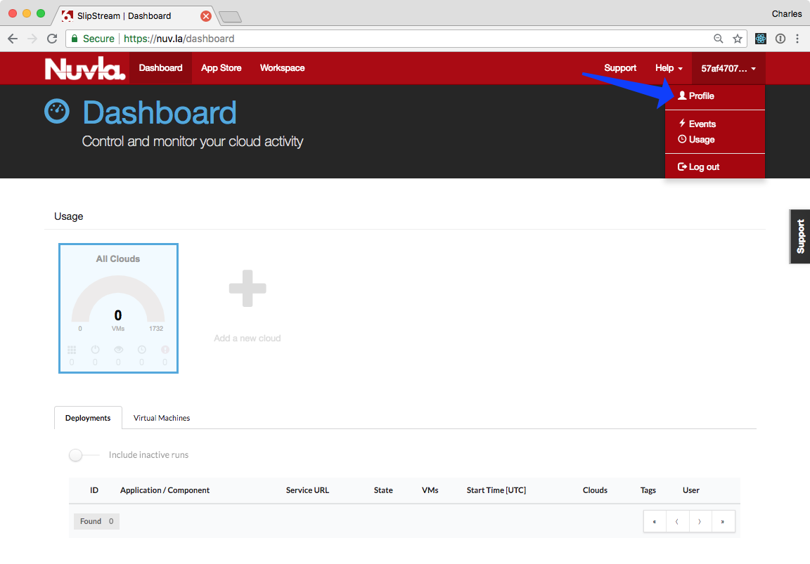
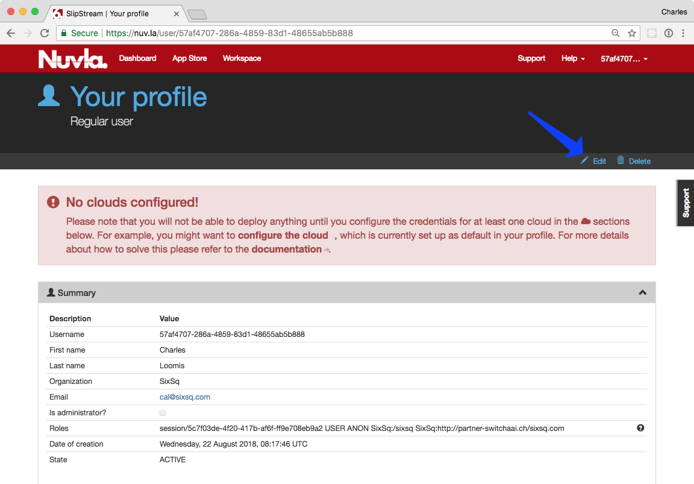
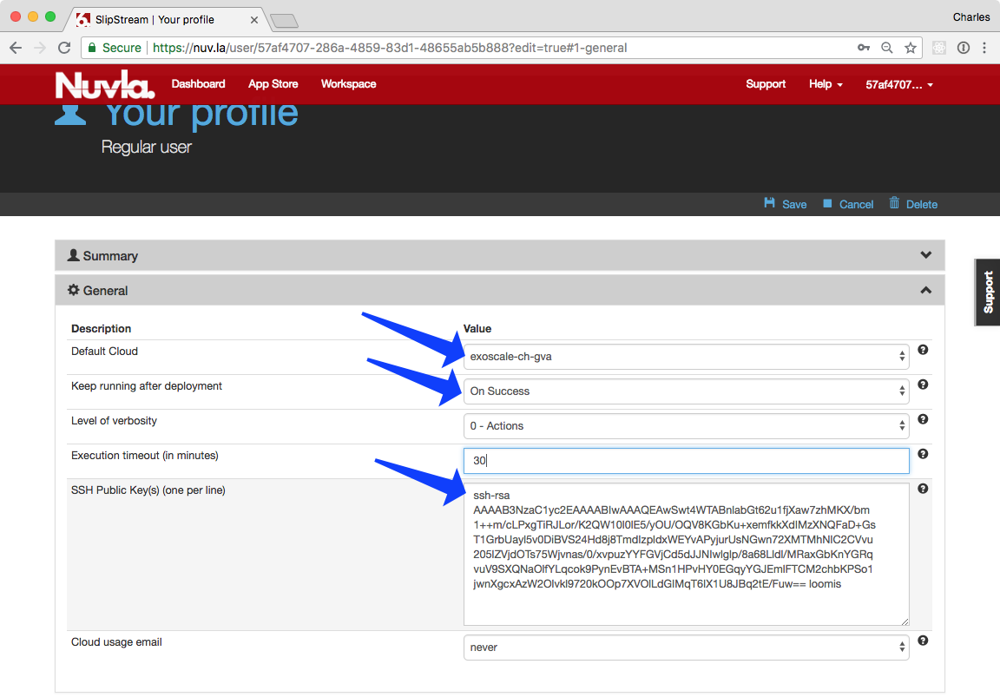

Nuvla & Cloud Accounts
======================

To follow this training, you must have accounts on Nuvla and Exoscale.
You will create both accounts and configure them so that they can work
together.

Exoscale Account
----------------

Register with Exoscale to create an account there.  You will have been
given a voucher code that will allow you to create an account with 30€
of credit.  This is more than enough to follow the training.

**The account you create belongs to you.** You are welcome to continue
using the account (and any remaining credit) after the training. When
the credit is gone, you can add more credit with a credit card.

Follow the :ref:`voucher-redemption` instructions for creating an
account with the voucher code you received.

.. warning::
   
   On the last step, choose **"for personal projects"**, not "for team
   projects".

The process requires email validation, so you will need access to your
mail client. After the email validation, you should be able to log
into the `Exoscale portal <https://portal.exoscale.ch>`_ with the
email address and password you provided.

When you are logged into the Exoscale portal, do the
:ref:`exoscale-ssh-config` to allow you to access your virtual
machines via SSH.

Nuvla Account
-------------

You will register with Nuvla using your federated identity from
KIT. Follow the :ref:`nuvla-registration` instructions to create your
account.

.. note::
   
   When you log in for the first time, will be redirected to the App
   Store page of Nuvla and offered a tutorial.  You can click away the
   tutorial dialog, as we'll not be using that here.

General Fields
~~~~~~~~~~~~~~

There are three general user profile fields that you may want to
change.  Open your user profile, click on the "Edit" action, and then
open the "General" section by clicking on the header.

 - Change the default cloud to "exoscale-ch-gva" (or another cloud for
   which you will have credentials).
 - Verify the "Keep running" parameter is set to "On Success".
 - Copy your SSH public key into the corresponding textbox.

Afterwards, be sure to click on the ``Save`` action!

.. warning::

   Be sure to copy the full contents of your public SSH key as a
   **single line of text**!

Cloud Credentials
~~~~~~~~~~~~~~~~~

You must provide your cloud credentials to Nuvla, so that it can act
on your behalf when provisioning cloud resources.

To learn where to find your Exoscale API key and secret and how to
configure your user profile see the `main SlipStream
documentation`_.

For this tutorial, add credentials for the **exoscale-ch-gva** and
**exoscale-de-fra** regions. The API key and secret will be the same
for all Exoscale regions.

.. _`main SlipStream documentation`: https://ssdocs.sixsq.com/en/latest/tutorials/ss/prerequisites.html#exoscale
