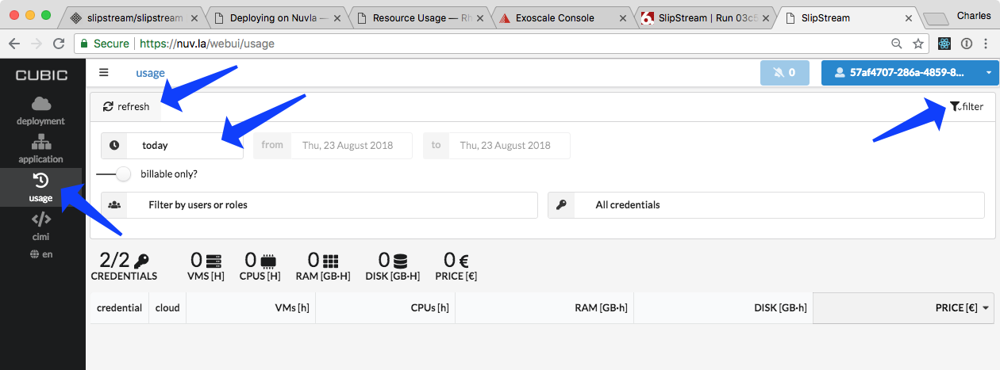
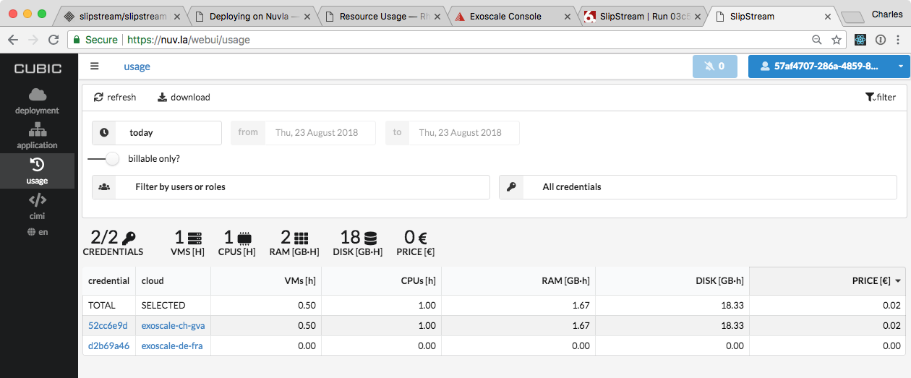

Resource Usage
==============

Nuvla has the ability to track your current usage of resource and to
maintain a history of this.  To see what resources you've consumed
during the tutorial, go to the address https://nuv.la/webui.  This is
a prototype of a new browser interface for Nuvla.

To see your consumation,

 - Click on the "usage" icon on the left.
 - Open the filter via the button in the upper right corner.
 - Change the time period to "today".
 - Click on "refresh" to see your usage.

The result should look something like the following screenshot.
Remember to shutdown applications and virtual machines that you're not
using.

