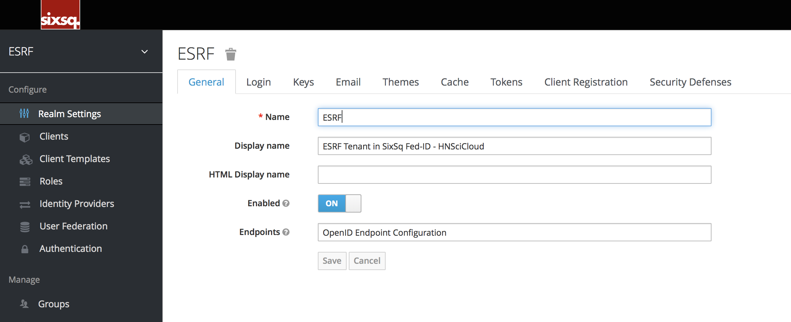
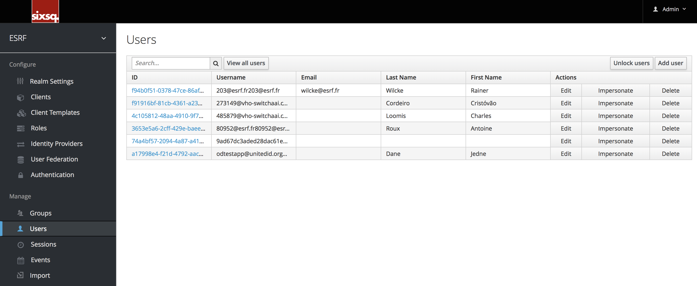

KeyCloak administration
=======================

Users
-----

If you need to manage a specific user, click on `Users` in the
lefthand menu bar.

This menu option brings you to the user list page.  In the search box
you can type in a full name, last name, or email address you want to
search for in the user database.

Add a user
^^^^^^^^^^

On the right side of the user list, you should see an `Add User`
button. Click that to start creating your new user.

When viewing a user if you go to the Credentials tab you can manage a
user’s credentials.

Blacklisting and whitelisting
^^^^^^^^^^^^^^^^^^^^^^^^^^^^^

See :ref:`blacklisting` and :ref:`whitelisting`

Blocking a user
^^^^^^^^^^^^^^^

See :ref:`block`

Managing groups and roles
^^^^^^^^^^^^^^^^^^^^^^^^^

See :ref:`groups` and :ref:`roles`
