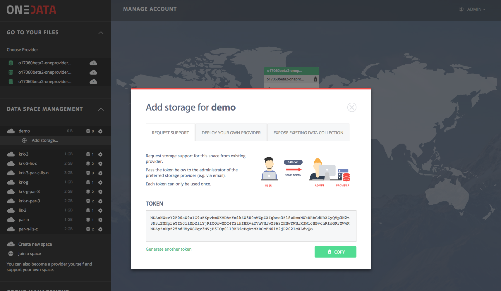
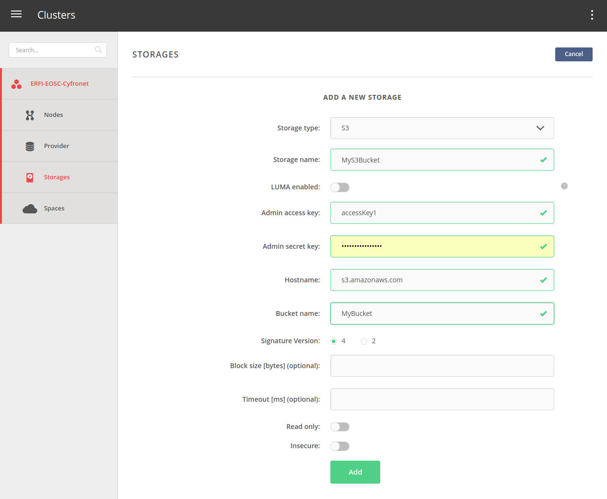
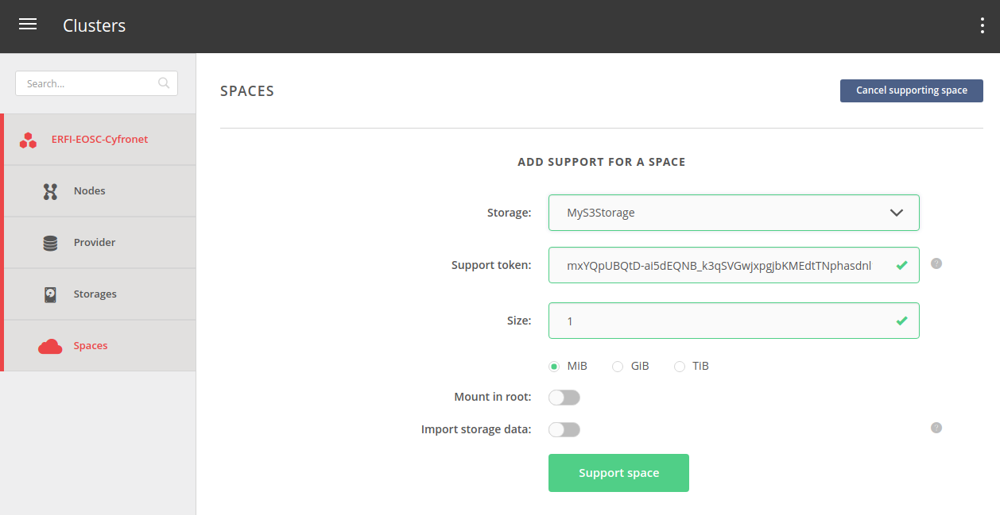

Onedata management
==================

  .. figure:: ../../images/oneprovider-slide.png
     :alt: Oneprovider architecture
     :width: 100%
     :align: center

Oneprovider implements drivers for storages such as NFS, GlusterFS, Ceph, Openstack SWIFT and S3.

In order to function properly, Oneprovider needs to register with a Onezone service,
which requires a public IP address and specific ports opened to the world (see `Firewall setup`_).

We have set a sample Onezone deployment at: https://onezone.rhea-hn.com

Once logged in, we will add a new space and later support it with a storage from the Oneprovider instance.

Create a space
--------------

#. In the Onezone Web Interface unfold Data space management tab located on the left menubar.
#. Click Create new space button.
#. Provide new space name in the text edit field and confirm.

.. figure:: ../../images/onedata_spacestabhome.png
    :alt: Creating new space
    :width: 10%
    :align: center

Create space support token
--------------------------

#. Click on the newly created space on the left to unfold options
#. Click `Add storage` button
#. Copy the generated token from the popup window

Add storage to the Oneprovider
------------------------------

#. Open Oneprovider Onepanel administration interface: https://op-exo.hn.nuv.la:9443
#. Login as user `admin` with the provided password
#. Click on `Storage` tab on the left
#. Press `Add storage` button in the top right
#. Select type of storage `S3`
#. Fill in the provided S3 bucket credentials
#. Set `LUMA enabled` radio button to Off
#. Set `Signature` version to 4
#. Set `Read only` button to Off
#. Set `Insecure` radio button to On
#. Press `Add` button

Support the user space
----------------------

#. Click on the `Spaces` tab on the left
#. Select storage name to the on assigned in the previous step
#. Paste the support token created in the Onezone to `Support token` field
#. Select support size and units - this will be the maximum amount of data occupied by this space on this storage
#. Set `Mount in root` radio button to Off
#. Set `Import storage data` radio button to Off
#. Press `Support space`

Check the space support settings
--------------------------------

#. Click on `Spaces` tab on the left
#. Select the newly support space from the list

Check the space storage space in Onezone
----------------------------------------

#. Open Onezone interface in the browser: https://onezone.rhea-hn.com, or refresh if necessary
#. Click on the supported space on the left
#. Check the available storage

.. _`Firewall setup`: https://onedata.org/docs/doc/administering_onedata/firewall_setup.html

