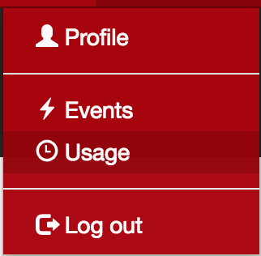
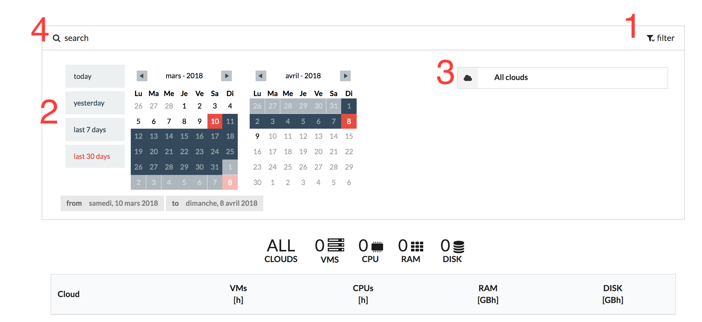

Usage monitoring in Nuvla
=========================

Resource monitoring via WebUI interface
---------------------------------------

In Nuvla open the Usage page

Get usage information for a given cloud, for a given period
-----------------------------------------------------------

1. Hit the filter icon
2. Choose period in calendar

    Either pre-defined or custom

3. Choose cloud provider(s)
4. Hit the search icon

Deploy a component and notice its impact on usage
--------------------------------------------------
